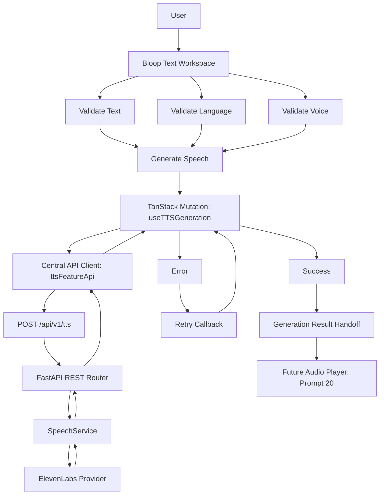

# ADR-022: Speech Generation UX, Loading/Error States & API Integration

## Status
**Approved** (Implemented in Prompt 19)

---

## Context
Bloop requires a robust, responsive speech-generation workflow connecting the text authoring workspace to the backend synthesis pipeline. The generation experience must coordinate pre-flight client-side validation, duplicate request prevention, indeterminate loading feedback, safe error normalization with retry strategies, and clean handoff of synthesized audio metadata to the audio player and download layers.

Crucially, provider boundaries must be strictly preserved: the client browser communicates exclusively with FastAPI via HTTPS, with zero provider credentials or secrets exposed to the frontend bundle. Additionally, generation progress must be indeterminate without fabricating simulated percentage counters.

---

## Decision

### 1. TanStack Query Mutation Layer (`useTTSGeneration`)
We encapsulate speech synthesis inside a specialized mutation hook (`useTTSGeneration`):
- Coordinates asynchronous lifecycle states (`idle` $\rightarrow$ `ready` $\rightarrow$ `submitting` $\rightarrow$ `generating` $\rightarrow$ `success` or `error`).
- Enforces duplicate request protection: while `isPending` is true, subsequent click events are safely dropped.
- Automatically invalidates `['history']` queries on success so new speech records appear immediately in history and favorites.
- Provides a `retry()` callback that re-evaluates and dispatches with the current validated workspace inputs.

### 2. Provider Isolation & Direct API Boundary
The frontend communicates exclusively with FastAPI endpoints:
- Primary synthesis endpoint: `POST /api/v1/tts`.
- Client requests pass user text, selected language, dynamic `voice_id`, and optional parameters.
- Provider secrets (`ELEVENLABS_API_KEY`) and internal provider SDKs remain 100% isolated on the backend server.
- The frontend never connects directly to external provider APIs or infers provider-specific audio URLs.

### 3. Indeterminate Loading Feedback (No Fake Progress)
Because HTTP speech synthesis requests are transactional, the UI renders indeterminate progress spinners and pulsing status badges (`GenerationStatus`):
- Displays active voice name and target locale.
- Marked with accessible attributes: `role="status"`, `aria-live="polite"`, `aria-busy="true"`.
- Strictly prohibits simulated percentage counters (e.g. "47% complete") to maintain truthful UX feedback.

### 4. Normalized Error Handling & Safe Retry Strategy
All network and HTTP exceptions are routed through `getFriendlyTTSErrorMessage` and `isRetryableTTSError`:
- Maps domain and HTTP error codes (`401`, `403`, `429`, `503`, `PROVIDER_TIMEOUT`, `VOICE_LANGUAGE_MISMATCH`) to friendly messages.
- Sanitizes errors to prevent leakage of internal stack traces, API keys, or database details.
- Allows user-triggered retries for transient failures (network, timeout, 5xx), while blocking retries for non-recoverable states (auth, validation, 429).
- Error dismissals cleanly clear error states without losing the user's drafted text.

### 5. Content Preservation & Text Divergence Detection
- User text, selected language, and selected voice are fully preserved across both success and failure states.
- If the user modifies text in the workspace after a successful synthesis, `GenerationSuccess` detects text divergence and displays an advisory notice indicating the existing audio corresponds to the previous text revision.

### 6. Clean Prompt 20 Handoff
Synthesized audio responses (`TTSResponse`) are captured in standard contracts (`audio_url`, `download_url`, `duration_seconds`, `audio_format`) and surfaced in an accessible result container with a `Play Preview` callback ready for Prompt 20 (Audio Player & Download UX).

---

## Architecture Flow

---

## Consequences

### Positive
- **Provider Decoupling**: Complete isolation of ElevenLabs behind FastAPI; frontend remains agnostic to vendor-specific APIs.
- **Resilience**: Transient failures are easily retried with current validated state without discarding user content.
- **Truthful UX**: Eliminates deceptive simulated progress bars and protects private user text from accidental logging.
- **Accessibility**: ARIA live regions and busy flags provide clear assistive technology announcements during synthesis.

### Negative / Trade-offs
- Indeterminate loading does not convey remaining duration for exceptionally long synthesis tasks.
