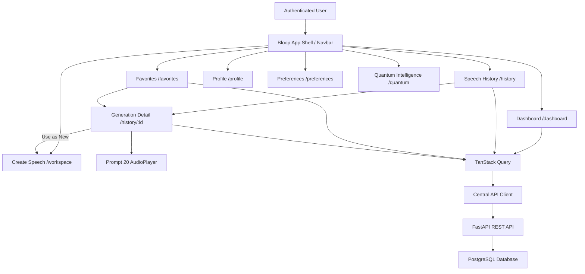

# ADR-024: Bloop Dashboard, Speech History, Favorites, and Navigation Experience

## Status
**Accepted**

## Context
Following Prompt 14 (Authentication & JWT Sessions), Prompt 15 (User Profiles, Preferences & Speech History), Prompt 16 (Favorites & Search Filtering), Prompt 18 (Bloop Text Workspace), Prompt 19 (Speech Generation UX & State Management), and Prompt 20 (Audio Player & Delivery Pipeline), Bloop required a unified, complete, and navigable authenticated workspace.

Prior to Prompt 21, the authenticated interface suffered from fragmented routing, an incomplete dashboard that lacked recent speech generations and favorites previews, missing feature hooks in `features/history` and `features/favorites`, custom audio buttons in history detail views that bypassed Prompt 20's audio architecture, and lingering cache security issues on session logout.

## Decision

### 1. Unified Authenticated Application Shell & Routing
We established `/dashboard` (with `/app` and `/app/*` aliases) as the primary default authenticated landing page:
- `/` redirects authenticated users to `/dashboard`.
- `/app`, `/app/dashboard`, `/app/create`, `/app/workspace`, `/app/history`, `/app/favorites`, `/app/profile`, `/app/preferences`, and `/app/quantum` provide full backwards-compatible URL namespaces.
- Navigation active states handle nested sub-routes cleanly (e.g. `/history/:id` highlights the History section).
- Mobile navigation is responsive with accessible drawer, hamburger toggle, escape-key support, and focus rings.

### 2. Dashboard as Central Creator Hub
The Dashboard was architected to answer three core creator questions without duplicating the full history page:
1. **What can I do?** Clear hero greeting and "Create Speech" primary CTA.
2. **What did I generate recently?** A focused list of the latest 3–4 speech generations with instant inline playback, "Use as New", and favorite toggling.
3. **What can I access quickly?** Bookmarked favorite generations, dynamic voice count, and quick navigation launchpad.
4. **Quantum Failure Isolation:** Quantum Intelligence is visually separated and gracefully isolated; if quantum algorithms encounter simulator bottlenecks or failures, TTS, history, favorites, and dashboard continue operating reliably.

### 3. Server-State Architecture & Cache Consistency
All speech generations and favorites remain server-backed user data queried via FastAPI REST endpoints:
```
React UI ➔ Feature Hooks (useSpeechHistory, useFavorites) ➔ TanStack Query ➔ Central API Client ➔ FastAPI ➔ PostgreSQL
```
- Query keys are standardized:
  - `['history', filterParams]`
  - `['favorites', filterParams]`
  - `['generation-detail', id]`
  - `['languages']`
  - `['voices']`
- After a favorite toggle or generation deletion mutation, queries `['history']`, `['favorites']`, and `['generation-detail']` are systematically invalidated to guarantee synchronized views across all tabs and components.

### 4. Generation Reopening ("Use as New Text")
When a user selects "Use as New" on any card or detail page:
1. Source text, language code, and voice ID are loaded into `useWorkspaceStore`.
2. The user is navigated to `/workspace` ("Create Speech").
3. The persisted historical generation remains strictly immutable.

### 5. Prompt 20 AudioPlayer Integration
The generation detail view (`HistoryDetailPage.tsx`) and modals directly embed Prompt 20's `AudioPlayer`, passing a normalized `AudioSource`. No duplicated player logic, audio controls, or range request handlers were created.

### 6. Session Logout Cache Isolation
To prevent sensitive historical audio and text from persisting across user sessions on shared workstations:
- Logging out calls `queryClient.clear()`.
- Active audio playback is halted via `useAudioStore.getState().stopAudio()`.
- JWT tokens are removed from `localStorage`.
- Zustand auth state is cleanly reset.

## Architecture Diagram



## Consequences

### Positive
- One cohesive, seamless workspace from login to generation to history to replay.
- Direct reuse of Prompt 20's audio pipeline and player controls.
- Safe plain-text rendering preventing XSS across all generated texts.
- Zero cache leakage across browser sessions upon logout.
- Fully decoupled Quantum Lab preserving core TTS stability.

### Negative / Trade-offs
- Multiple invalidations (`history` + `favorites`) trigger dual refetches after favorite toggling, slightly increasing network traffic for guaranteed UI consistency.
