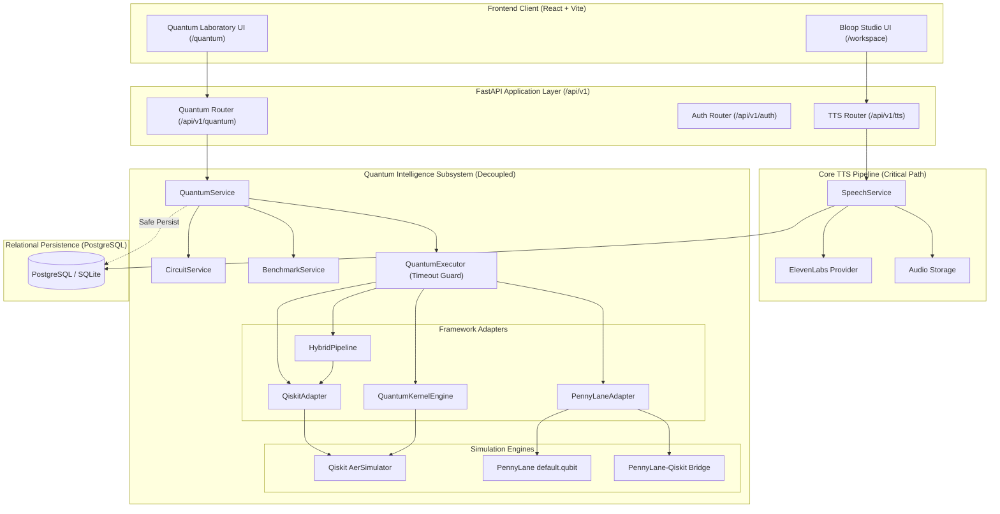

# ADR-024: Quantum Computing Foundation and Hybrid Quantum-Classical Architecture

## Status
**Accepted**

## Context
Bloop provides high-fidelity, multilingual AI Text-to-Speech (TTS) synthesis powered by ElevenLabs. In addition to speech generation, Bloop explores advanced research extensions in **Quantum Intelligence** — including quantum feature encoding, variational quantum classifiers, quantum state fidelity, and quantum emotion modeling.

However, quantum computing hardware and simulators introduce distinct computational characteristics:
- Simulation runtimes scale exponentially with qubit count ($O(2^n)$ statevector dimension).
- Quantum runtimes can exhibit stochastic variance, latency, or dependency failures.
- Quantum software libraries (Qiskit, PennyLane) evolve rapidly with breaking API revisions across major versions.
- Real quantum hardware is resource-constrained, expensive, and non-deterministic.

Therefore, Bloop requires a resilient, modular **Quantum Computing Foundation Layer** that enables research and experimentation without ever endangering the reliability, uptime, or performance of core Text-to-Speech synthesis.

---

## Decisions

### 1. Strict Isolation and Decoupling from Core TTS
Quantum computing is defined as an **optional, decoupled intelligence and experimentation subsystem**:
- **Critical TTS Path**: `React UI ➔ FastAPI ➔ SpeechService ➔ ElevenLabsProvider ➔ Audio Stream ➔ Browser Player`.
- **Quantum Path**: `React Quantum Lab ➔ FastAPI Quantum API ➔ QuantumService ➔ QuantumExecutor ➔ Qiskit / PennyLane / Aer ➔ Normalized Result`.
- If any quantum simulator, circuit execution, or package throws an exception, times out, or is globally disabled (`QUANTUM_ENABLED=false`), **TTS generation, audio playback, user authentication, language catalogs, voice selection, history, favorites, and the dashboard continue functioning with 100% reliability**.

### 2. Coexistence of Qiskit and PennyLane
Rather than restricting Bloop to a single quantum framework, the platform provides a unified domain abstraction (`QuantumBackend`) supporting complementary frameworks:
- **Qiskit (2.3+)**: Utilized for explicit gate-level circuit composition (H, X, Y, Z, S, T, CX, CZ, SWAP, RX, RY, RZ), circuit depth calculation, ASCII circuit diagram rendering, OpenQASM 2.0 export, and high-performance Aer simulation.
- **PennyLane (0.45+)**: Utilized for differentiable quantum circuits, parameterized variational ansatzes, and hybrid quantum-classical neural networks (QNN).
- **PennyLane-Qiskit (0.45+)**: Provides an interoperability bridge allowing PennyLane QNodes to execute directly on Qiskit Aer simulation devices (`qiskit.aer`).
- **Qiskit Machine Learning (0.9+)**: Utilized for quantum kernel statevector methods (`FidelityStatevectorKernel` with `zz_feature_map`).

### 3. Simulation-First Architecture with Qiskit Aer
- Bloop operates in a **simulation-first** mode using `qiskit_aer.AerSimulator` and PennyLane `default.qubit`.
- Access to physical quantum hardware (e.g., IBM Quantum Runtime, cloud QPUs) is strictly optional and never required for local development, CI/CD testing, or production deployment.
- Aer simulation supports both ideal statevector execution and configurable depolarizing quantum noise models to realistically simulate decoherence and gate noise.

### 4. Hybrid Quantum-Classical Pipeline
All quantum intelligence tasks follow a standardized hybrid dataflow:
```text
Classical Input (Text / Numerical Data)
        ↓
Classical Feature Preparation (Tokenization / Heuristics / Scikit-Learn)
        ↓
Bounded Normalization (MinMaxScaler projecting to [0, π])
        ↓
Quantum State Encoding (Ry Angle Embedding / ZZFeatureMap)
        ↓
Parameterized Quantum Circuit (Entanglement & Variational Layers)
        ↓
Quantum Measurement (Counts / Probabilities / Expectation Values)
        ↓
Classical Post-Processing (Decision Head / Metric Aggregation)
        ↓
Normalized JSON-Safe Insight
```

### 5. Empirical Benchmarking without False Quantum Advantage Claims
- Hybrid classifiers are always evaluated using strict train/test data separation via `train_test_split`.
- Every quantum model is benchmarked side-by-side against an equivalent classical baseline (e.g., Logistic Regression).
- Metrics reported include Accuracy, Precision, Recall, F1 score, training runtime, and inference runtime.
- The platform adheres to an **Honest Analysis Principle**: no claims of quantum supremacy or commercial superiority are made unless supported by measured empirical data.

### 6. Resource Limits and DoS Protection
To prevent compute exhaustion on backend servers, strict bounds are enforced via `QuantumLimits`:
- `QUANTUM_MAX_QUBITS`: Hard limit on allowable qubits (default: 8, configured via environment). Requests exceeding this limit are immediately rejected with HTTP 422 `QUBIT_LIMIT_EXCEEDED`.
- `QUANTUM_MAX_SHOTS`: Hard limit on shot counts (default: 8192, minimum: 100). Requests exceeding this limit are rejected with HTTP 422 `SHOT_LIMIT_EXCEEDED`.
- `QUANTUM_MAX_EXECUTION_TIME`: Hard wall-clock execution timeout (default: 30 seconds) enforced via `ThreadPoolExecutor`. Runaway simulations raise `QUANTUM_EXECUTION_TIMEOUT`.
- Rate limiting: Dedicated per-minute quota on `/api/v1/quantum/*` routes.

### 7. Security and Safe Serialization
- **Zero Arbitrary Code Execution**: Users cannot submit raw Python, `eval()`, `exec()`, or unstructured scripts. All circuits must be defined via structured, validated gate specifications (`GateOperation`) or standard presets (`bell_state`, `single_qubit_h`, `single_qubit_x`, `ghz_state`).
- **Normalized JSON-Safe Outputs**: Framework-internal objects (Qiskit `Result`, PennyLane tensors, NumPy `int64`/`float64`) are converted into standard Python dictionaries and lists before leaving the service layer.
- **Multi-Tenant Ownership Isolation**: Quantum experiment audit logs in PostgreSQL (`quantum_experiments`) are strictly partitioned by `user_id`. Users can only query their own experiment history and detail records.

---

## Architecture Diagram



---

## Consequences

### Positive
- Complete architectural isolation: zero risk of quantum simulation bugs affecting core voice synthesis.
- Simulation-first approach guarantees 100% pass rate in local and CI environments without quantum hardware dependencies.
- Multi-framework flexibility leverages the strengths of both Qiskit (gate fidelity, noise simulation) and PennyLane (differentiability, hybrid ML).
- Enforced hard resource limits prevent denial-of-service or compute exhaustion.
- JSON-safe normalization prevents serialization bugs and framework leakage to client tiers.
- Honest, empirical benchmarking prevents misleading performance claims.

### Negative / Trade-offs
- Multiple quantum dependencies (`qiskit`, `qiskit-aer`, `pennylane`, `scikit-learn`) increase Python virtual environment size.
- Classical simulation of multi-qubit systems is CPU/memory intensive for qubit registers $n > 8$, justifying strict limit enforcement.
