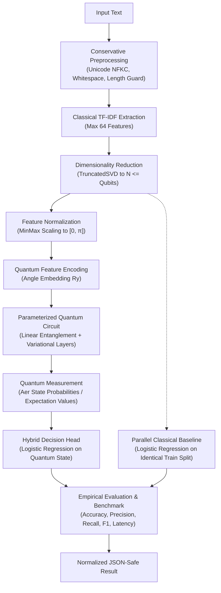

# ADR-025: Quantum Text Intelligence, Feature Encoding & Quantum Classification

## Status
**Accepted**

## Context
Bloop is an AI Text-to-Speech (TTS) and Quantum Intelligence platform. While core speech synthesis reliably transforms validated natural language into high-fidelity audio streams via ElevenLabs, Bloop explores hybrid quantum NLP to analyze text registers, semantics, and representations.

Quantum computing introduces severe physical and computational constraints:
- **State Hilbert Space**: Qubits represent quantum states of dimension $2^n$. Arbitrary classical text vocabularies (often tens of thousands of tokens) cannot be directly mapped into raw qubits without classical compression.
- **Circuit Depth & Decoherence**: Deep quantum circuits accumulate simulation latency and physical noise; parameterized circuits must remain shallow.
- **Scientific Integrity**: Claims of "quantum supremacy" or general superiority over classical NLP in small NISQ or simulated regimes are frequently misleading or un-reproducible.
- **Data Leakage Risk**: In hybrid ML pipelines, fitting feature vectorizers, dimensionality reduction components, or scalers across an entire dataset prior to splitting leads to optimistic evaluation bias and invalid scientific conclusions.

Therefore, Bloop requires a disciplined, modular, simulation-first **Quantum Text Intelligence** pipeline where classical NLP and quantum circuits cooperate through explicit feature engineering, strict train/test isolation, and rigorous classical baseline comparisons.

---

## Architecture & Data Flow

---

## Decisions

### 1. Dedicated, Modular Subpackage Architecture
All quantum text processing logic resides in `backend/app/quantum/text/`, organized by discrete pipeline responsibilities:
- `preprocess.py`: Conservative text sanitization and deterministic tokenization.
- `features.py`: Classical TF-IDF vectorization with vocabulary controls.
- `reduction.py`: TruncatedSVD projection tailored to sparse matrix representations.
- `normalization.py`: Angle normalization mapping continuous values into $[0, \pi]$.
- `encoder.py`: Safe angle feature encoder with NaN/Inf validation.
- `circuit.py`: Parameterized quantum circuit builder (Qiskit & PennyLane).
- `classifier.py`: Hybrid quantum classifier and classical baseline classifier.
- `evaluator.py`: Leakage-free benchmark evaluation engine.
- `schemas.py`: Typed Pydantic request and response contracts.
- `service.py`: Orchestrating `QuantumTextService` decoupled from HTTP/DB layers.
- `exceptions.py`: Comprehensive domain error taxonomy.

### 2. Conservative Preprocessing Without Hallucination
Preprocessing performs deterministic string normalization:
- Unicode NFKC normalization (unifying ligatures and accents).
- Line-ending unification (`\r\n` to `\n`) and non-printable control character removal.
- Leading/trailing whitespace stripping and boundary enforcement ($\le 1000$ characters).
- **Strict Prohibition**: No silent translation, grammar correction, summarization, paraphrasing, sentiment rewriting, or LLM-based hallucination.

### 3. Sparse-Aware Dimensionality Reduction via TruncatedSVD
Classical TF-IDF yields sparse matrices. Standard PCA centers data by subtracting feature means, which destroys matrix sparsity and induces catastrophic memory allocation ($O(n \times m)$ dense matrix).
- Bloop adopts `sklearn.decomposition.TruncatedSVD` to project directly from sparse TF-IDF space into latent dimensions ($N \le n\_qubits$, bounded between 2 and 8).

### 4. Angle Feature Encoding into $[0, \pi]$
- Bloop uses **Angle Encoding** ($R_y(\theta_i)$ rotations) as its primary text encoding strategy.
- Normalized classical features $x_i \in [0, \pi]$ are mapped onto single-qubit rotations:
  $$|\psi\rangle = \bigotimes_{i=0}^{n-1} R_y(x_i) |0\rangle$$
- Advantages: $O(n)$ circuit depth, intuitive Bloch sphere representation, high simulator efficiency, and direct compatibility with variational parameterization.

### 5. Parameterized Variational Quantum Circuit Topology
Circuits are constructed with controlled depth:
- **Layer 1 (State Preparation)**: Parameterized $R_y(x_i)$ angle rotations.
- **Layer 2 (Entanglement)**: Linear CNOT cascade ($CX(i, i+1)$ and cyclic closure for $q > 2$).
- **Layer 3 (Variational Ansatz)**: Single-qubit $R_z(\phi_i)$ rotations parameterized by trainable or calibrated weights.
- **Layer 4 (Measurement)**: Computational basis readout ($Z$ expectation values and bitstring counts).
- Circuit depth is strictly bounded by `QUANTUM_TEXT_CIRCUIT_DEPTH` ($\le 6$) to prevent simulation timeouts.

### 6. Zero Data Leakage Enforcement
To ensure scientific validity:
- Data splitting (`train_test_split`) is performed **before** fitting any transformation.
- `TfidfVectorizer`, `TruncatedSVDReducer`, and `FeatureAngleNormalizer` are fitted **strictly on the training split**.
- The test split is transformed solely using parameters derived from the training distribution.

### 7. Mandatory Classical Baseline & Scientific Honesty
Every quantum text classification experiment evaluates a parallel **Classical Baseline (Logistic Regression)** on the exact same train/test split:
- Metrics reported: Accuracy, Precision (weighted), Recall (weighted), F1-Score (weighted), Training Latency, and Inference Latency.
- Bloop rejects fabricated quantum advantage: if the classical model achieves equal or superior metrics (standard for small NISQ simulation datasets), the system explicitly and objectively reports this reality.
- Confidence scores are derived from verifiable probabilistic models or returned as `null` if uncomputable; fabricated confidence numbers are prohibited.

### 8. Dual Framework Execution (Qiskit & PennyLane)
- Default simulation uses **Qiskit Aer** (`AerSimulator`) for fast transpilation and shot-based measurement counts.
- The pipeline seamlessly supports **PennyLane** (`default.qubit` / `qiskit.aer`) parameterized QNodes using identical preprocessing and feature reduction layers.

### 9. Multi-Tenant Security, Ownership & Resource Safeguards
- **Authentication**: `POST /api/v1/quantum/text` requires valid JWT bearer identity.
- **Rate Limiting**: Protected by `RATE_LIMIT_PER_MINUTE_QUANTUM` (15 req/min).
- **Resource Limits**: Input text capped at 1000 characters; qubit count bounded ($2 \le q \le 8$); shots bounded ($100 \le s \le 4096$).
- **Ownership & Isolation**: Saved experiments store `user_id`; users can only view or retrieve their own experiment logs.
- **TTS Independence**: Quantum execution failures or disabling (`QUANTUM_ENABLED=false`) never impact core Text-to-Speech synthesis.

---

## Consequences

### Positive
- Modular, testable, and scientifically honest hybrid quantum NLP pipeline.
- Immediate simulator-backed reproducibility across Windows and Linux environments.
- 100% backwards compatibility with existing UI (`/app/quantum`) and legacy schemas.
- Complete isolation from core TTS services (`SpeechService`, `ElevenLabsProvider`).

### Limitations
- Quantum simulations are computationally heavier than pure classical linear models; NISQ simulations on small corpora do not claim computational advantage.
- Feature spaces are constrained to 2–8 latent dimensions due to classical statevector simulation scaling limits ($2^n$).

---

## Next Steps
This foundation directly prepares Bloop for:
- **Prompt 24**: Quantum Emotion Intelligence, Affective Feature Extraction & Variational QNN Analysis.
- **Prompt 27**: Unified Quantum-Classical Speech & NLP Benchmarking Engine.
