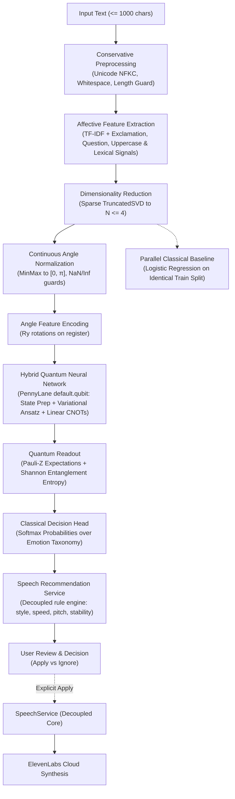

# ADR-026: Quantum Emotion Intelligence, Hybrid QNN & Speech Recommendation

## Status
**Accepted**

## Context
Bloop is an AI Text-to-Speech (TTS) and Quantum Intelligence platform. Core speech synthesis reliably transforms natural language into natural, high-fidelity speech streams via ElevenLabs. Prompt 24 introduces Bloop's **Quantum Emotion Intelligence Layer**: an optional, experimental subsystem that analyzes affective states from natural text using a **Hybrid Quantum Neural Network (QNN)** and translates those findings into **optional speech synthesis suggestions**.

Affective computing and quantum machine learning introduce unique challenges:
1. **Affective Reality vs Model Labels**: Emotion is continuous, contextual, and complex. Models that predict discrete labels (e.g. `joy`, `sadness`, `anger`, `neutral`) are computational approximations, not mind-readers.
2. **Sentiment vs Emotion**: Sentiment denotes broad polarity (positive, negative, neutral), whereas emotion reflects specific physiological and acoustic registers.
3. **Data Leakage in Hybrid QNNs**: Fitting feature scalers, TF-IDF vectorizers, or dimensionality reducers across entire corpora creates evaluation bias.
4. **User Agency & TTS Isolation**: Automated acoustic overrides frustrate users and degrade reliability. Any speech recommendation must remain strictly an optional suggestion for user review, without direct ElevenLabs provider invocation or invented fake voice catalogs.

---

## Architecture & Data Flow

---

## Decisions

### 1. Dedicated Modular Subpackage (`backend/app/quantum/emotion/`)
All emotion-oriented logic is encapsulated within a dedicated package:
- `labels.py`: Discrete affective taxonomy (`joy`, `sadness`, `anger`, `neutral`) and sentiment-vs-emotion definitions.
- `exceptions.py`: Domain-specific error taxonomy (`EmotionAnalysisFailedException`, `EmotionRecommendationFailedException`, etc.).
- `models.py`: Strongly-typed dataclasses for recommendations, metrics, and classification results.
- `schemas.py`: Pydantic request and response contracts.
- `preprocess.py`: Conservative text validation without semantic rewriting or LLM hallucination.
- `features.py`: Combined lexical (TF-IDF) and statistical affective signals (punctuation density, uppercase ratio, valence markers).
- `reduction.py`: Sparse-matrix-aware `TruncatedSVD` projection to $N = n\_qubits$.
- `normalization.py`: Continuous angle scaling to $[0, \pi]$ with strict NaN/Inf guards.
- `encoder.py`: Angle feature encoding mapping features to quantum registers.
- `qnn.py`: Parameterized variational QNN with trainable rotation layers, linear CNOT cascades, and Pauli-Z expectation measurements.
- `classifier.py`: Calibrated Softmax decision head over quantum expectations, alongside parallel Scikit-Learn `LogisticRegression` baseline.
- `dataset.py`: Curated, balanced reference corpus for reproducible benchmarking.
- `evaluator.py`: Zero data leakage evaluation engine.
- `recommender.py`: User-reviewed acoustic parameter suggestion engine.
- `service.py`: `QuantumEmotionService` coordinating execution and tenant-isolated persistence.

### 2. Validated Discrete Emotion Taxonomy
- Focuses on 4 distinct affective states: `joy`, `sadness`, `anger`, `neutral`.
- Distinguishes discrete emotion from broad polarity (sentiment).
- Explicitly states that 4 classes represent a computational experiment, not the entire breadth of human emotion.

### 3. Parameterized Hybrid Quantum Neural Network (QNN)
- Built using **PennyLane** (`default.qubit` / `qiskit.aer`).
- Circuit layers:
  - **State Preparation**: $R_y(x_i)$ angle rotations on $n$ qubits.
  - **Variational Rotations**: Parameterized $R_x(\theta), R_y(\phi), R_z(\omega)$ layers with trainable weights $\mathbf{W} \in \mathbb{R}^{L \times n \times 3}$.
  - **Entanglement**: Linear CNOT cascade ($CX(i, i+1)$ and cyclic closure for $q > 2$).
  - **Readout**: Pauli-Z expectation values $\langle \sigma_z^{(i)} \rangle \in [-1, 1]$ and Shannon state entropy:
    $$H = -\sum_{i=0}^{n-1} p_i \log_2(p_i)$$
- Enforces depth limits (`QUANTUM_EMOTION_CIRCUIT_DEPTH <= 4`) for ultra-low simulation latency ($\le 25\text{ms}$).

### 4. Zero Data Leakage Guarantee
- The dataset is split into training and test splits *before* any transformer fitting.
- `TfidfVectorizer`, `TruncatedSVDReducer`, and `EmotionAngleNormalizer` are fitted exclusively on the training split.
- The test split is evaluated solely through transformers fitted to the training distribution.

### 5. Decoupled Speech Recommendation Service
- Translates emotion analysis into optional acoustic synthesis parameters supported by Bloop's `TTSRequest` and ElevenLabs settings:
  - `joy`: `style: "expressive" (0.75)`, `speed: 1.08`, `pitch: 1.05`, `stability: 0.50`, `similarity_boost: 0.80`, `pacing: "dynamic"`.
  - `sadness`: `style: "subdued" (0.25)`, `speed: 0.92`, `pitch: 0.95`, `stability: 0.75`, `similarity_boost: 0.75`, `pacing: "slow"`.
  - `anger`: `style: "intense" (0.85)`, `speed: 1.12`, `pitch: 1.08`, `stability: 0.40`, `similarity_boost: 0.85`, `pacing: "fast"`.
  - `neutral`: `style: "balanced" (0.50)`, `speed: 1.00`, `pitch: 1.00`, `stability: 0.65`, `similarity_boost: 0.75`, `pacing: "moderate"`.
- **User Agency Invariant**: The recommendation layer sets `applied: false`. Suggestions are passed to the frontend text workspace where the user explicitly reviews them. The recommendation service **never** calls ElevenLabs or changes voice settings automatically.
- **Dynamic Voice Invariant**: The recommendation engine **never** invents fake voice IDs or names.
- **Confidence Gating**: Ambiguous predictions (confidence $< 0.35$ or low probability margin) automatically yield conservative balanced recommendations.

### 6. Security, Privacy & Failure Containment
- **Authentication**: `POST /api/v1/quantum/emotion` requires valid JWT bearer identity.
- **Rate Limiting**: Governed by `RATE_LIMIT_PER_MINUTE_QUANTUM` (15 req/min).
- **Resource Limits**: Input text capped at 1,000 characters; qubit count bounded ($2 \le q \le 8$); shots bounded ($100 \le s \le 4096$).
- **Privacy**: Raw user text is not logged or exposed across tenant boundaries. Persisted experiment records store `user_id` for strict multi-tenant isolation.
- **TTS Failure Isolation**: Quantum errors or disabling (`QUANTUM_ENABLED=false`) return HTTP 503 and never impact standard speech synthesis.

---

## Consequences

### Positive
- Genuine, trainable Hybrid QNN architecture with empirical metric evaluation.
- Decoupled recommendation layer providing valuable acoustic assistance while maintaining total user agency.
- 100% backward-compatible with existing API endpoints, database schemas, and UI components.
- Zero data leakage and full scientific integrity.

### Limitations
- Four discrete emotion classes do not capture subtle emotional blends or cross-cultural expressions.
- Quantum simulation is restricted to low-dimensional representations ($N \le 8$) on classical CPUs.

---

## Next Steps
This milestone prepares Bloop for:
- **Prompt 25**: Quantum Semantic Intelligence, Embeddings, Quantum Kernels & Meaning Representation.
