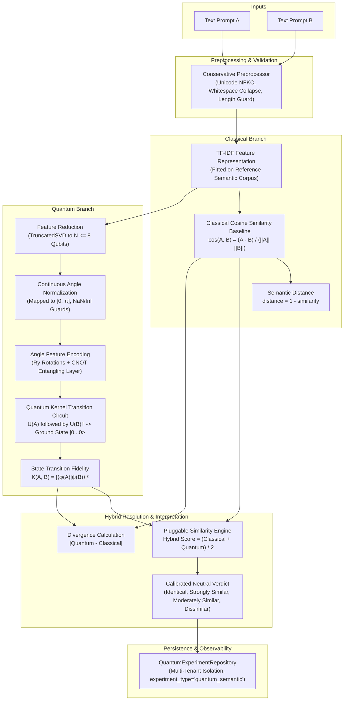

# ADR-027: Quantum Semantic Intelligence, Similarity Analysis & Classical Baseline

## Status
**Accepted**

## Context
Bloop is an AI Text-to-Speech (TTS) and Quantum Intelligence platform. Text-to-text semantic similarity analysis investigates how quantum-enhanced or quantum-inspired representations can participate in semantic comparison tasks while maintaining a transparent and reproducible **classical baseline**.

Prompt 25 introduces Bloop's **Quantum Semantic Intelligence subsystem** (`backend/app/quantum/semantic/`), supporting:
1. **Pairwise Semantic Similarity**: Quantifying semantic relatedness between two text snippets.
2. **Classical Semantic Baseline**: Reproducible TF-IDF vectorization and exact mathematical Cosine Similarity with finite zero-vector handling.
3. **Quantum-Compatible Feature Reduction**: Bounded `TruncatedSVD` projection mapping high-dimensional semantic spaces into low-dimensional qubit register allocations ($2 \le N \le 8$).
4. **Quantum Semantic Kernel**: Evaluating state transition fidelity $K(A, B) = |\langle\phi(A)|\psi(B)\rangle|^2$ via transition circuits on Qiskit Aer and PennyLane.
5. **Hybrid Similarity & Divergence**: Comparing classical and quantum metrics without marketing claims of quantum supremacy.
6. **Leakage-Free Benchmarking**: Curated dataset adapter evaluating Pearson correlation, Spearman correlation, MAE, and RMSE against human-calibrated labels without data leakage.
7. **Complete TTS Decoupling**: Complete isolation from core Text-to-Speech synthesis (`SpeechService` ➔ ElevenLabs).

---

## Architecture & Data Flow

---

## Decisions

### 1. Dedicated Semantic Subpackage (`backend/app/quantum/semantic/`)
All semantic intelligence logic is encapsulated within `backend/app/quantum/semantic/`:
- `models.py`: Domain enums (`SemanticMethod`, `SimilarityVerdict`) and dataclasses (`PairwiseSemanticResult`, `SemanticBenchmarkPair`, `SemanticBenchmarkMetrics`).
- `schemas.py`: Pydantic request and response schemas for pairwise analysis, similarity matrices, and empirical benchmarks.
- `exceptions.py`: Structured domain exceptions (`SemanticInputInvalidException`, `SemanticKernelFailedException`, etc.).
- `preprocess.py`: Conservative Unicode NFKC normalization and whitespace stripping.
- `features.py`: Abstract `SemanticRepresentationProvider` with `TfidfFeatureProvider` and `LexicalFeatureProvider`.
- `reduction.py`: `TruncatedSVD` projection mapping classical features to quantum register dimensions with deterministic pooling fallback.
- `normalization.py`: Angle scaling to $[0, \pi]$ with finite checks and zero-norm guards.
- `quantum_encoder.py`: Single-qubit $R_y(\theta)$ rotation encoder and Hermitian adjoint $U^\dagger(\theta)$ transition builder.
- `classical.py`: Classical Cosine Similarity baseline with robust zero-vector handling and semantic distance ($1 - \text{sim}$).
- `quantum_kernel.py`: State overlap transition fidelity calculation on Qiskit Aer and PennyLane simulators.
- `similarity.py`: Pluggable `SimilarityEngine` computing hybrid similarity, divergence, and calibrated research verdicts.
- `dataset.py`: `SemanticDatasetAdapter` with curated reference semantic pairs across similarity tiers.
- `evaluator.py`: Leakage-free benchmark evaluator computing MAE, RMSE, Pearson $r$, and Spearman $\rho$.
- `service.py`: Central `QuantumSemanticService` orchestrator managing execution, matrix bounds, and experiment persistence.

### 2. First-Class Classical Baseline
Classical Cosine Similarity is independently executable and serves as the scientific benchmark:
$$\cos(A, B) = \frac{\mathbf{a} \cdot \mathbf{b}}{\|\mathbf{a}\| \|\mathbf{b}\|}$$
- Safe zero-vector resolution: returns $1.0$ if texts are lexically identical; $0.0$ if orthogonal or empty.
- Distance metric: $\text{distance}(A, B) = 1.0 - \text{similarity}(A, B)$.

### 3. Quantum-Compatible Feature Reduction
High-dimensional semantic representations ($\approx 64$ dimensions) are reduced to target qubit register capacities ($2 \le N \le 8$) using `TruncatedSVD`. To guarantee **zero data leakage**, reducers are fit strictly on reference/training data before transforming evaluation texts.

### 4. Quantum Kernel State Overlap Fidelity
Quantum state similarity is measured via the transition probability to the ground state $|0\dots 0\rangle$:
$$K(x_A, x_B) = |\langle 0\dots 0 | U^\dagger(x_B) U(x_A) | 0\dots 0 \rangle|^2 = |\langle\phi(x_A) | \phi(x_B)\rangle|^2$$
Simulated via Qiskit Aer (`shots=1024`, default seed) and PennyLane `default.qubit`.

### 5. Neutral Interpretation Without Supremacy Claims
We explicitly reject fake quantum advantage claims:
- No artificial random offsets added to quantum scores.
- Thresholds are calibrated into neutral categories:
  - $\ge 0.95$: "Identical or Nearly Identical"
  - $\ge 0.75$: "Strongly Similar"
  - $\ge 0.45$: "Moderately Similar"
  - $< 0.45$: "Dissimilar"
- Divergence metric $|\text{sim}_{\text{quantum}} - \text{sim}_{\text{classical}}|$ objectively tracks representational variance between classical vector dot products and Hilbert space fidelities.

### 6. Resource Limits & Denial-of-Service Protection
- Maximum text length enforced by `settings.MAX_TEXT_CHARACTERS` (default 1000).
- Qubit registers clamped to $2 \le N \le 8$.
- Matrix analysis bounded to maximum 10 texts and $\le 20$ pairwise comparisons (`QUANTUM_SEMANTIC_MAX_PAIRS = 20`) to prevent quadratic simulation blowup.

### 7. Multi-Tenant Experiment Persistence
Experiments are logged via `QuantumExperimentRepository` under `experiment_type="quantum_semantic"` with `user_id` multi-tenant isolation, storing normalized, JSON-serializable execution metadata.

---

## Consequences

### Positive
- **Methodological Transparency**: Transparent side-by-side comparison between classical TF-IDF cosine similarity and quantum state fidelity.
- **Architectural Isolation**: Quantum semantic computations are strictly isolated; failure never cascades to ElevenLabs text-to-speech generation.
- **Scientific Honesty**: Zero data leakage in benchmark adapters; empirical metrics (MAE, RMSE, Pearson $r$, Spearman $\rho$) reflect genuine experimental measurements.
- **Modern Interactive UX**: Interactive React visualization with dual gauge meters, divergence tracking, preset benchmark pairs, and technical representation breakdowns.

### Limitations & Research Considerations
- **Simulated Classical Hardware**: Executing quantum circuits on classical CPUs incurs simulation latency ($O(2^N)$ statevector complexity) and does not represent fault-tolerant quantum hardware speedups.
- **Feature Capacity**: Compressing 64 classical features into 4 to 8 qubits via TruncatedSVD inherently loses granular lexical information.
- **Classical Superiority on Current Hardware**: On standard textual similarity tasks, classical TF-IDF and dense embeddings exhibit faster execution and competitive accuracy compared to simulated quantum kernels.
