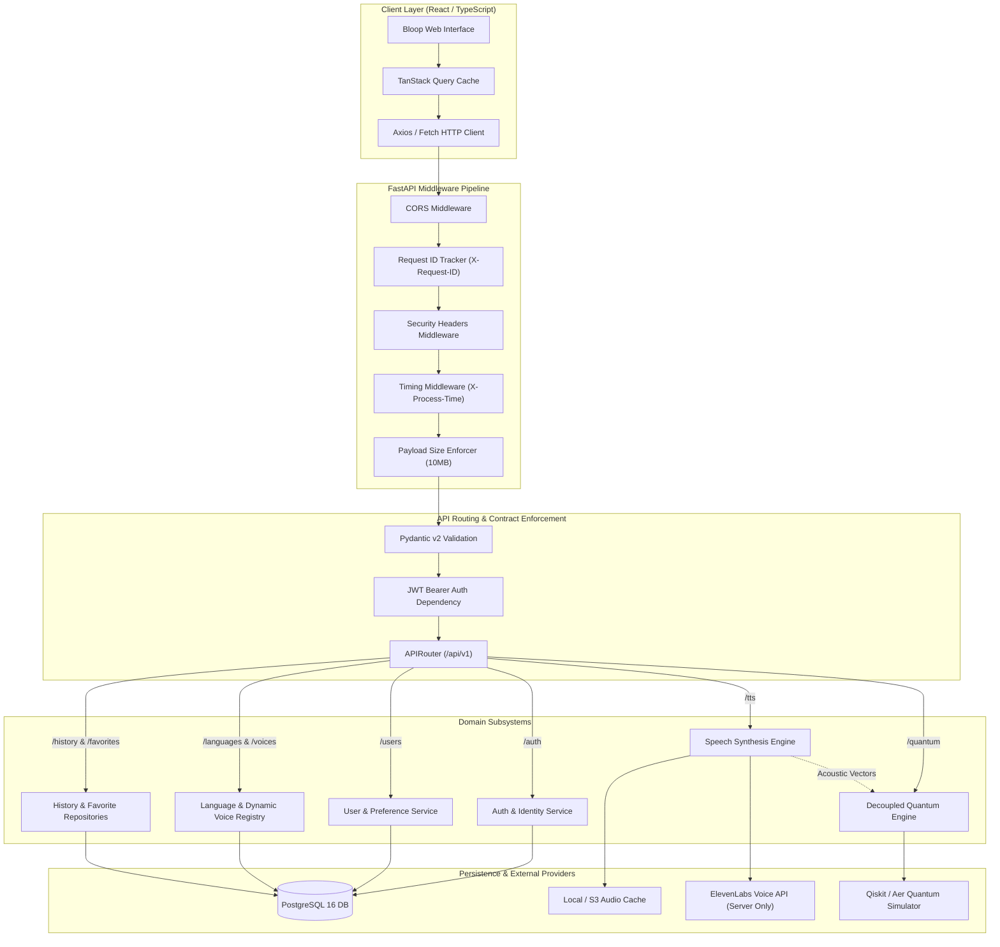
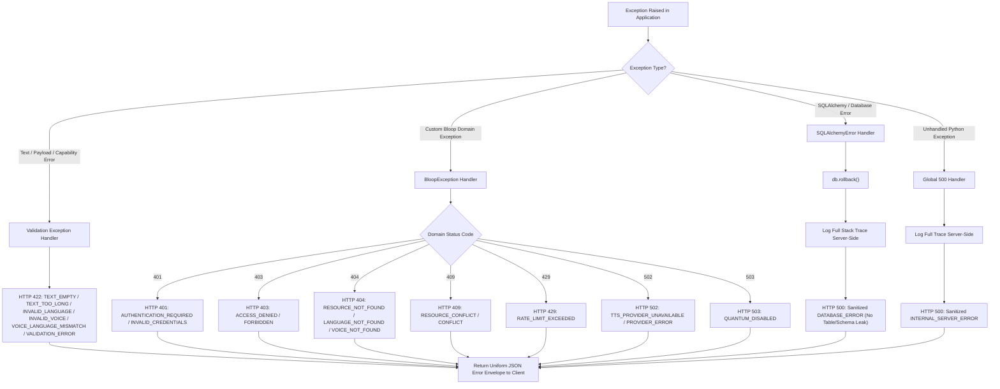
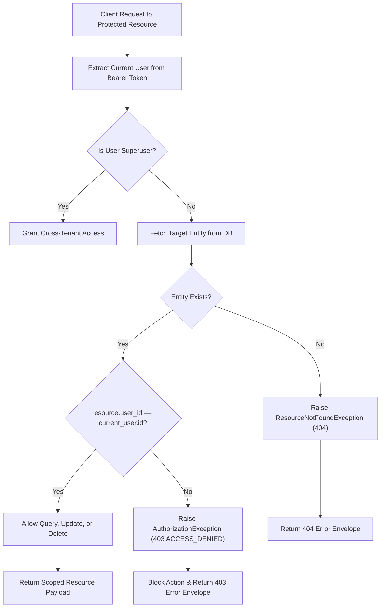

# Bloop REST API & Schema Contract Architecture Specification

## 1. Architectural Overview

The **Bloop API Contract Architecture** establishes a rigid, type-safe, and deterministic communication protocol between the React/TypeScript frontend application and the asynchronous FastAPI backend server. Operating over versioned `/api/v1` routes, this contract isolates clients from proprietary vendor SDKs, decouples quantum intelligence operations, strictly enforces resource ownership boundaries, and guarantees zero credential leakage.

---

## 2. End-to-End API Architecture



---

## 3. Request-Response Lifecycle

```mermaid
sequenceDiagram
    autonumber
    actor User as Client (React/TS)
    participant MW as Middleware Pipeline
    participant Dep as Dependencies (Auth / DB)
    participant End as API Endpoint Handler
    participant Svc as Domain Service
    participant Repo as SQLAlchemy Repository
    participant DB as PostgreSQL Database

    User->>MW: HTTP Request (Headers, JWT, Payload)
    MW->>MW: Generate/Sanitize X-Request-ID, Start Timer
    MW->>Dep: Inject Database Session & Validate JWT
    alt Invalid or Expired Token
        Dep-->>MW: Raise AuthenticationException
        MW-->>User: 401 Unauthorized (Error Envelope)
    else Authenticated
        Dep->>End: Pass CurrentUser & Session
        End->>End: Validate Pydantic Schema
        End->>Svc: Execute Business Logic
        Svc->>Repo: Query / Mutate Entity
        Repo->>DB: SQL Transaction (Atomic)
        DB-->>Repo: Database Result
        Repo-->>Svc: Domain Model
        Svc-->>End: Result Payload
        End-->>MW: Format ApiResponse[T] Envelope
        MW->>MW: Append Security & X-Process-Time Headers
        MW-->>User: HTTP 200/201 (Standard JSON Envelope)
    end
```

---

## 4. Error Flow & Production Sanitization



---

## 5. Resource Ownership Boundary



---

## 6. Architectural Guarantees Summary

1. **Zero Secret Exposure:** Vendor credentials (e.g. `ELEVENLABS_API_KEY`) and cryptographic keys (`JWT_SECRET_KEY`) never cross the API boundary.
2. **Provider Voice ID Abstraction:** Raw vendor voice IDs (e.g. ElevenLabs ID) are strictly isolated in `provider_voice_id` and never serialized to client responses.
3. **Dynamic Voice Registry:** Voices are resolved dynamically through database and capability discovery, ensuring zero proprietary voice names or IDs are hardcoded in frontend contracts.
4. **Authoritative Capability Validation:** The backend enforces Level 3 capability validation (language existence, voice existence, and voice-language compatibility) before any provider execution is initiated.
5. **Decoupled Quantum Engine:** Quantum analysis runs independently. If disabled, callers receive a graceful 503 while audio synthesis operates normally via fallback modulation.
6. **Tenant Isolation:** Multi-user isolation is enforced at the repository and route dependency level, preventing unauthorized access across user generation histories and favorites.
