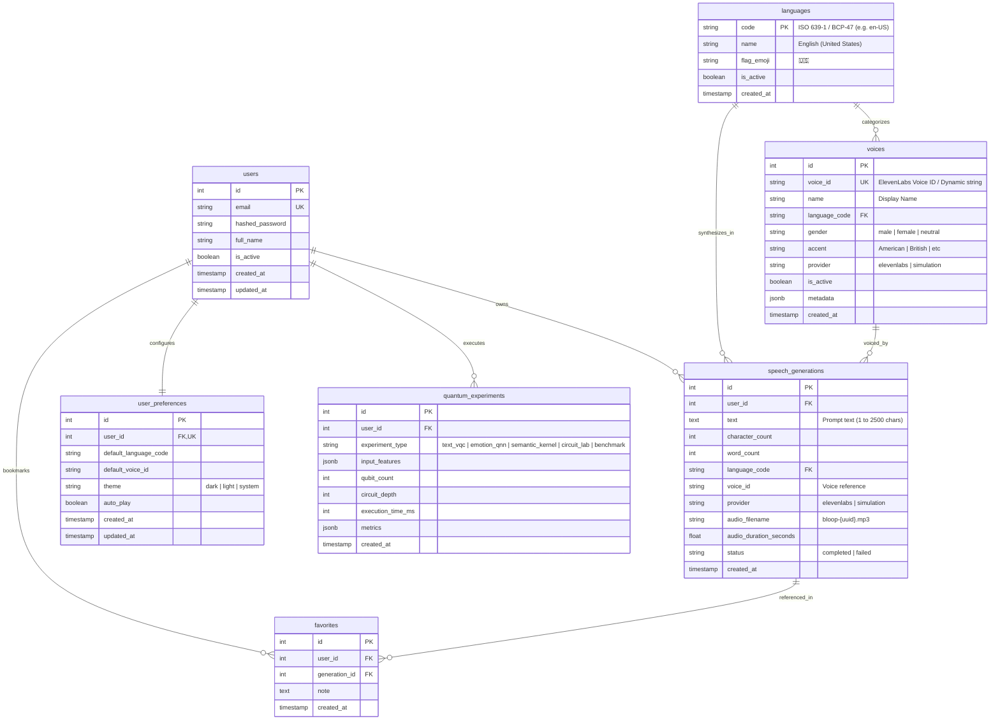

# Bloop — Database Architecture Specification

**Document Identifier:** BLOOP-DB-ARCH-V1  
**Project:** Bloop — AI Text-to-Speech & Quantum Intelligence Platform  
**Target Milestone:** Intermediate-Level Database Architecture  
**Status:** Approved Technical Design  
**Authority:** Bloop Master Prompt & Prompt 02  

---

## 1. Executive Database Overview

Bloop relies on **PostgreSQL 16** (managed on Render) as its authoritative primary relational database, accessed through **SQLAlchemy 2.0 ORM** and version-controlled using **Alembic**.

The database architecture is designed according to three fundamental invariants:
1. **Multi-Tenant User Isolation:** Every user-owned resource (`speech_generations`, `favorites`, `user_preferences`, `quantum_experiments`) enforces foreign-key ownership to `users.id`, with all database queries scoped by the authenticated user.
2. **Lean Metadata Storage:** Large binary audio streams are stored on server disk storage; PostgreSQL persists only relational metadata, character counts, durations, and audio file references.
3. **Dynamic Voice Registry:** Dynamic voice records (`voices`) are decoupled from hardcoded source code and stored in relational tables mapped to ISO language codes (`languages`).

---

## 2. Entity-Relationship Diagram (ERD)



---

## 3. Relational Table Specifications

### 3.1 `users` Table
Stores user credentials and profile state:
- `id` (SERIAL / INTEGER, Primary Key)
- `email` (VARCHAR(255), UNIQUE, NOT NULL, Indexed)
- `hashed_password` (VARCHAR(255), NOT NULL) — Bcrypt hash
- `full_name` (VARCHAR(120), NULLABLE)
- `is_active` (BOOLEAN, NOT NULL, DEFAULT TRUE)
- `created_at` (TIMESTAMP WITH TIME ZONE, NOT NULL, DEFAULT NOW())
- `updated_at` (TIMESTAMP WITH TIME ZONE, NOT NULL, DEFAULT NOW())

### 3.2 `languages` Table
Stores supported multilingual ISO locales:
- `code` (VARCHAR(16), Primary Key) — e.g. `en-US`, `es-ES`, `fr-FR`, `de-DE`, `hi-IN`
- `name` (VARCHAR(64), NOT NULL) — e.g. `English (United States)`
- `flag_emoji` (VARCHAR(8), NOT NULL) — e.g. `🇺🇸`
- `is_active` (BOOLEAN, NOT NULL, DEFAULT TRUE)
- `created_at` (TIMESTAMP WITH TIME ZONE, NOT NULL, DEFAULT NOW())

### 3.3 `voices` Table
Dynamic registry for speech voices:
- `id` (SERIAL / INTEGER, Primary Key)
- `voice_id` (VARCHAR(64), UNIQUE, NOT NULL, Indexed) — Raw ElevenLabs voice ID
- `name` (VARCHAR(100), NOT NULL)
- `language_code` (VARCHAR(16), NOT NULL, Foreign Key to `languages.code`)
- `gender` (VARCHAR(16), NOT NULL, DEFAULT 'neutral')
- `accent` (VARCHAR(64), NULLABLE)
- `provider` (VARCHAR(32), NOT NULL, DEFAULT 'elevenlabs')
- `is_active` (BOOLEAN, NOT NULL, DEFAULT TRUE)
- `metadata` (JSONB, DEFAULT '{}')
- `created_at` (TIMESTAMP WITH TIME ZONE, NOT NULL, DEFAULT NOW())

### 3.4 `speech_generations` Table
Authoritative audit log of generated speech:
- `id` (SERIAL / INTEGER, Primary Key)
- `user_id` (INTEGER, NOT NULL, Foreign Key to `users.id` ON DELETE CASCADE, Indexed)
- `text` (TEXT, NOT NULL) — Truncated or full generation text (1 to 2,500 chars)
- `character_count` (INTEGER, NOT NULL)
- `word_count` (INTEGER, NOT NULL)
- `language_code` (VARCHAR(16), NOT NULL, Foreign Key to `languages.code`)
- `voice_id` (VARCHAR(64), NOT NULL)
- `provider` (VARCHAR(32), NOT NULL, DEFAULT 'elevenlabs')
- `audio_filename` (VARCHAR(128), NOT NULL) — Reference to server-side MP3 file
- `audio_duration_seconds` (FLOAT, NOT NULL)
- `status` (VARCHAR(16), NOT NULL, DEFAULT 'completed')
- `created_at` (TIMESTAMP WITH TIME ZONE, NOT NULL, DEFAULT NOW(), Indexed)

### 3.5 `favorites` Table
User bookmarks for preferred generations:
- `id` (SERIAL / INTEGER, Primary Key)
- `user_id` (INTEGER, NOT NULL, Foreign Key to `users.id` ON DELETE CASCADE, Indexed)
- `generation_id` (INTEGER, NOT NULL, Foreign Key to `speech_generations.id` ON DELETE CASCADE)
- `note` (TEXT, NULLABLE)
- `created_at` (TIMESTAMP WITH TIME ZONE, NOT NULL, DEFAULT NOW())
- **Constraint:** `UNIQUE (user_id, generation_id)` — A user cannot favorite the same generation twice.

### 3.6 `user_preferences` Table
Individual UI and synthesis defaults:
- `id` (SERIAL / INTEGER, Primary Key)
- `user_id` (INTEGER, NOT NULL, UNIQUE, Foreign Key to `users.id` ON DELETE CASCADE)
- `default_language_code` (VARCHAR(16), NULLABLE)
- `default_voice_id` (VARCHAR(64), NULLABLE)
- `theme` (VARCHAR(16), NOT NULL, DEFAULT 'system')
- `auto_play` (BOOLEAN, NOT NULL, DEFAULT TRUE)
- `created_at` (TIMESTAMP WITH TIME ZONE, NOT NULL, DEFAULT NOW())
- `updated_at` (TIMESTAMP WITH TIME ZONE, NOT NULL, DEFAULT NOW())

### 3.7 `quantum_experiments` Table
Audit logs for quantum executions and benchmarks:
- `id` (SERIAL / INTEGER, Primary Key)
- `user_id` (INTEGER, NOT NULL, Foreign Key to `users.id` ON DELETE CASCADE, Indexed)
- `experiment_type` (VARCHAR(32), NOT NULL)
- `input_features` (JSONB, NOT NULL)
- `qubit_count` (INTEGER, NOT NULL)
- `circuit_depth` (INTEGER, NOT NULL)
- `execution_time_ms` (INTEGER, NOT NULL)
- `metrics` (JSONB, NOT NULL)
- `created_at` (TIMESTAMP WITH TIME ZONE, NOT NULL, DEFAULT NOW(), Indexed)

---

## 4. Indexing & Performance Strategy

To ensure sub-50ms queries on history searches, the following database indexes are established:

1. **User Ownership Indexes:**
   - `idx_generations_user_id ON speech_generations(user_id)`
   - `idx_favorites_user_id ON favorites(user_id)`
   - `idx_quantum_user_id ON quantum_experiments(user_id)`
2. **History Sorting & Pagination Compound Index:**
   - `idx_generations_user_created ON speech_generations(user_id, created_at DESC)`
3. **Multi-Parametric Filter Indexes:**
   - `idx_generations_user_lang ON speech_generations(user_id, language_code)`
   - `idx_generations_user_voice ON speech_generations(user_id, voice_id)`
4. **Voice Registry Index:**
   - `idx_voices_lang_active ON voices(language_code, is_active)`

---

## 5. Multi-Tenant Data Isolation Contract

To prevent cross-tenant information leaks:
- The database enforces strict foreign-key relationships to `users.id`.
- Repositories never expose methods that fetch by primary key without user ID verification:
  ```python
  # CORRECT: Enforces ownership at DB query boundary
  def get_favorite(self, favorite_id: int, user_id: int) -> Optional[Favorite]:
      stmt = select(Favorite).where(
          Favorite.id == favorite_id,
          Favorite.user_id == user_id
      )
      return self.db.scalars(stmt).first()

  # PROHIBITED: Insecure, allows IDOR attacks
  def get_favorite_insecure(self, favorite_id: int) -> Optional[Favorite]:
      return self.db.get(Favorite, favorite_id)
  ```

---

## 6. Alembic Migration Lifecycle

Database schema changes are managed exclusively through versioned Alembic migration scripts:
1. Developers generate migrations using `alembic revision --autogenerate -m "description"`.
2. Migrations are reviewed and committed to version control in `backend/alembic/versions/`.
3. In production, Render executes `alembic upgrade head` as a pre-deploy command before launching Uvicorn, guaranteeing schema synchronization with zero manual production database intervention.
