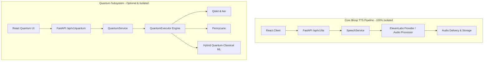
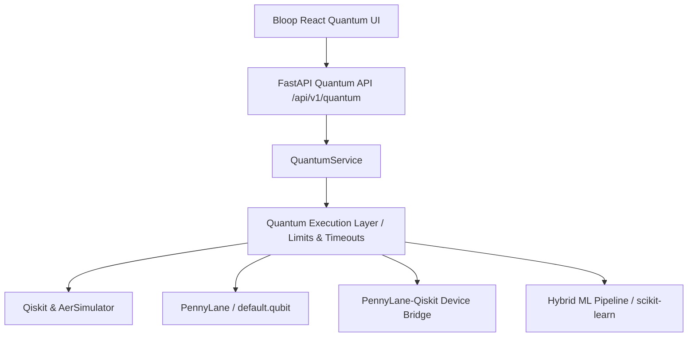

# ADR-024: Quantum Computing Foundation & Hybrid Quantum-Classical Architecture

## Status
**Accepted**

## Context
Bloop is an AI Text-to-Speech platform expanding to integrate Quantum Intelligence capabilities. As specified in Prompt 22, the platform requires an intermediate-level, practical, testable, deployable, and decoupled hybrid quantum-classical computing foundation.

Quantum computing introduces unique software engineering challenges:
1. **Simulation Overhead & Resource Consumption**: Simulating quantum state vectors scales exponentially ($2^n$ state amplitudes). Unrestricted qubit counts or shot budgets can cause CPU starvation or out-of-memory crashes.
2. **Framework Divergence**: Different quantum libraries excel at different paradigms:
   - **Qiskit & Qiskit Aer**: Industry standard for explicit gate synthesis, transpilation, noise modeling, and high-performance C++ simulator backends.
   - **PennyLane**: Leading framework for differentiable quantum programming, parameter-shift rule gradients, and hybrid quantum-classical machine learning.
   - **Qiskit Machine Learning**: Quantum kernels and neural network primitives.
3. **Availability & Failure Isolation**: Quantum simulation packages must never be a single point of failure for core voice synthesis and standard web services.

## Decisions

### 1. Complete Decoupling from Core Text-to-Speech (The Quantum Isolation Rule)
Quantum computing is designed strictly as an optional intelligence and experimentation subsystem. It is completely isolated from the critical Text-to-Speech synthesis path.

If any quantum framework fails, times out, or if `QUANTUM_ENABLED=false`, the core TTS pipeline, authentication, user preferences, voices, audio delivery, and history remain completely unaffected.

### 2. Multi-Framework Layered Architecture
Rather than coupling API routes to raw Qiskit or PennyLane instances, Bloop implements a clean layered architecture with a unified `QuantumBackend` abstraction:

- **Qiskit & Qiskit Aer**: Chosen for gate-level circuit composition, ASCII circuit diagrams, OpenQASM 2 export, and depolarizing noise simulation.
- **PennyLane**: Chosen for parameterized variational circuits, rotation angle embeddings, and differentiable quantum neural networks.
- **PennyLane-Qiskit**: Bridge device for cross-framework interoperability.

### 3. Simulation-First Principle (Zero Real Hardware Dependencies)
All executions run locally using simulators (`AerSimulator`, PennyLane `default.qubit` and `lightning.qubit`). No connection to real physical quantum processors (QPUs) or external cloud tokens (such as IBM Quantum Experience) is required.

### 4. Strict Resource Limits & Security
To prevent resource exhaustion and denial-of-service:
- `QUANTUM_MAX_QUBITS`: Hard upper bound (default: 8 qubits) enforced via `validate_qubits()`.
- `QUANTUM_MAX_SHOTS`: Hard upper bound (default: 8192 shots) enforced via `validate_shots()`.
- `QUANTUM_MAX_EXECUTION_TIME`: Hard wall-clock timeout (default: 30 seconds) executed inside guarded worker threads.
- **No Arbitrary Code Execution**: Endpoints accept strictly typed Pydantic models. No `eval()`, `exec()`, or raw Python code string execution is ever permitted.

### 5. Normalized, JSON-Safe Quantum Results
Framework outputs (Qiskit results, PennyLane tensors, NumPy scalars) are converted into `NormalizedQuantumResult`. Derived state probabilities ($P(s) = \frac{\text{count}(s)}{\text{total\_shots}}$) are calculated deterministically. Raw framework objects are never serialized over HTTP.

### 6. Honest Empirical Benchmarking (No Fabricated Quantum Advantage)
The hybrid machine learning engine uses scikit-learn's `train_test_split` (never evaluating solely on training data) and compares against a classical baseline (`LogisticRegression`). Quantum advantage is reported only when measured experimentally on test splits.

## Consequences

### Positive
- **High Reliability**: The critical TTS path is completely safeguarded against quantum package failures or timeouts.
- **Extensible Foundation**: Provides a modular base for Prompt 23 (Quantum Text Intelligence & Semantic Processing).
- **Security & Safety**: Full protection against DoS, memory leaks, and arbitrary code injection.
- **Developer Experience**: Simulation-first approach ensures automated tests run fast and deterministically in CI/CD without cloud credentials.

### Negative & Mitigations
- **Simulation Scaling Limit**: Classical simulation of circuits >25 qubits is computationally intractable on commodity servers. *Mitigation: Strictly capped at 8 qubits (`QUANTUM_MAX_QUBITS`), which is optimal for text style and emotion feature demonstrations.*
- **Package Footprint**: Quantum libraries add dependencies. *Mitigation: Dependencies are pinned in requirements, verified for compatibility, and isolated with graceful health reporting.*
