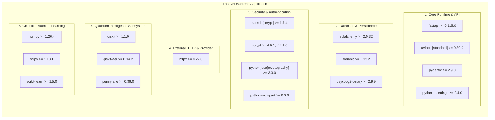
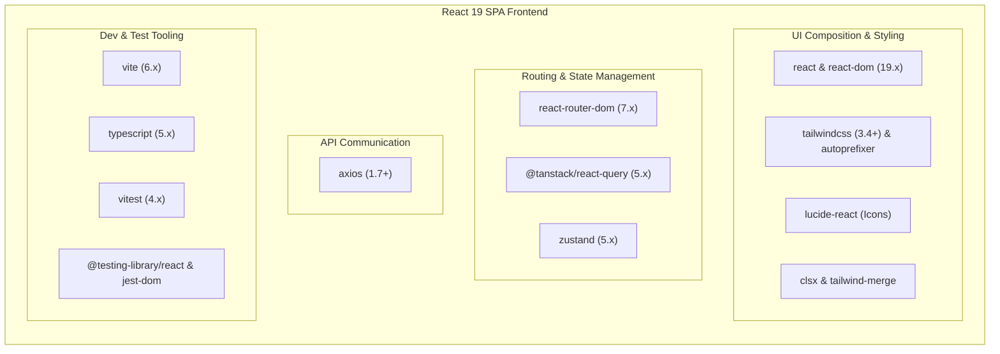
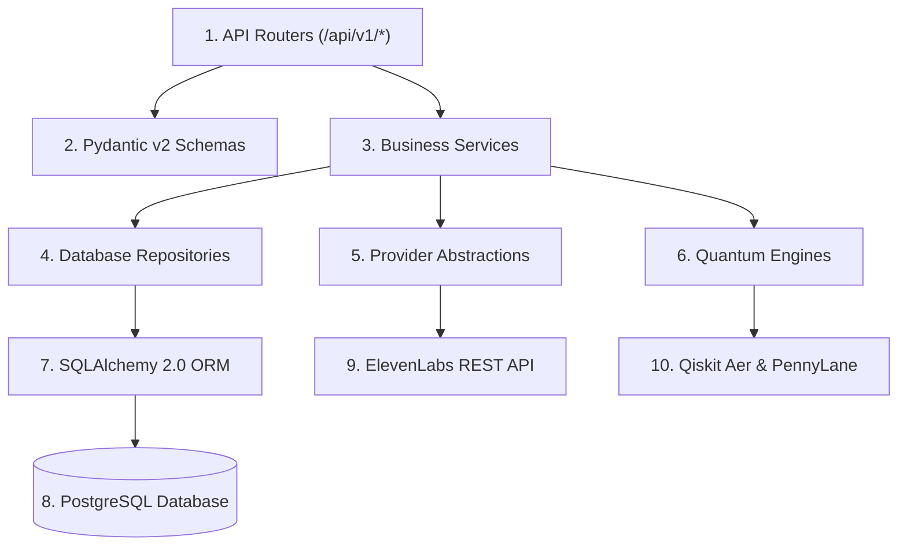
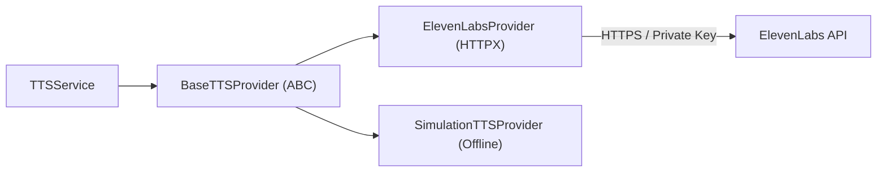

# Bloop — Dependency Strategy & Package Policy Specification

**Document Identifier:** BLOOP-DEP-STRAT-V1  
**Project:** Bloop — AI Text-to-Speech & Quantum Intelligence Platform  
**Target Milestone:** Elite Dependency Engineering & Package Control  
**Status:** Approved Technical Contract  
**Authority:** Bloop Master Prompt, Prompt 01, Prompt 02, and Prompt 03  

---

## 1. Core Dependency Philosophy: Architectural Minimalism

Bloop enforces a foundational engineering rule:
> **Minimum dependencies, maximum architectural capability.**

Every dependency introduced into the codebase must answer the following questions before acceptance:
1. *Why does Bloop need this dependency?*
2. *Can this capability be implemented cleanly using native standard libraries or the existing framework stack?*
3. *What is the maintenance, security, and bundle/container footprint impact of this dependency?*

If the answers do not demonstrate a clear architectural necessity, the dependency is **rejected**.

---

## 2. Python Backend Dependency Architecture

The backend dependencies are strictly partitioned into nine conceptual domains to guarantee clean separation of concerns and reproducible builds.



### 2.1 Dependency File Structure
- **`backend/requirements.txt`:** Contains strictly the production runtime dependencies necessary to run FastAPI, execute speech synthesis, interact with PostgreSQL, and perform in-process quantum simulations on Render.
- **`backend/requirements-dev.txt`:** Contains testing, linting, formatting, and developer productivity tools (Pytest, Mypy, Ruff, Black, Pip-Audit). References `requirements.txt` via `-r requirements.txt`.

### 2.2 Version Pinning & Upgrade Policy
1. **Compatible Release Constraints:** Production dependencies in `requirements.txt` specify minimum verified versions (`>= X.Y.Z`) combined with upper bound protections on major breaking changes (`< X+1.0.0`).
2. **Deterministic Locking:** For production deployment pipelines on Render, dependencies are resolved deterministically against verified Python 3.11+ wheels.
3. **Weekly Security Auditing:** Dependencies are scanned weekly using `pip-audit` to detect known Common Vulnerabilities and Exposures (CVEs).
4. **Deliberate Upgrades:** Dependencies are never upgraded blindly across the board. Every upgrade must pass the full automated Pytest test suite.

---

## 3. Frontend Dependency Architecture

The frontend dependencies are partitioned to prevent responsibility overlap:



### 3.1 Strict State Responsibility Contract

To prevent architectural degradation, state is classified into three non-overlapping tiers:

```
┌─────────────────────────────────────────────────────────────────────────────┐
│                         FRONTEND STATE ARCHITECTURE                         │
├─────────────────┬───────────────────────────────────────────────────────────┤
│ State Type      │ Tool & Responsibility                                     │
├─────────────────┼───────────────────────────────────────────────────────────┤
│ **Server State**│ **TanStack Query 5.x**                                    │
│                 │ Manages all data originating from backend REST endpoints: │
│                 │ • User profile & authentication identity                  │
│                 │ • Supported ISO language locales                          │
│                 │ • Dynamic voice registry listings                         │
│                 │ • Paginated speech generation history                     │
│                 │ • Bookmarked favorites and custom notes                   │
│                 │ • Quantum experiment and benchmark results                │
│                 │ *Handles caching, deduplication, invalidation, retries.*  │
├─────────────────┼───────────────────────────────────────────────────────────┤
│ **Client State**│ **Zustand 5.x**                                           │
│                 │ Manages ephemeral, client-only UI state:                  │
│                 │ • AudioPlayer playback state (play/pause, timestamp)      │
│                 │ • Audio scrubber position and volume level                │
│                 │ • Sidebar collapse/expand status                          │
│                 │ • Dark / Light theme toggle                               │
│                 │ • Active modal triggers (Dynamic Voice Ingestion modal)   │
│                 │ *Zustand stores NEVER duplicate TanStack Query data.*     │
├─────────────────┼───────────────────────────────────────────────────────────┤
│ **Component**   │ **React `useState` / `useRef`**                           │
│ **State**       │ Manages purely local, non-shared view state:              │
│                 │ • Workspace text input textarea contents                  │
│                 │ • Live character/word counter debouncing                  │
│                 │ • Local form field validation errors                      │
└─────────────────┴───────────────────────────────────────────────────────────┘
```

---

## 4. Backend Dependency Boundaries & Inward Flow

Dependencies must flow inward following Clean Architecture principles:



### Invariant Rules:
1. **API Routers** never invoke database queries directly or call the ElevenLabs API.
2. **Services** never accept raw FastAPI `Request` objects or return HTTP response objects.
3. **Repositories** never import third-party vendor SDKs or business services.
4. **Providers** isolate external vendor communication behind `BaseTTSProvider`.

---

## 5. ElevenLabs Dependency Strategy & Provider Abstraction

The ElevenLabs integration is mediated through a dedicated provider abstraction layer:



### Provider Architecture Rules:
1. **Abstract Base Class (`BaseTTSProvider`):** Exposes `synthesize()`, `is_configured()`, and `provider_name`.
2. **`ElevenLabsProvider`:** Manages an async `httpx.AsyncClient`. It attaches the server-side `ELEVENLABS_API_KEY` header and handles binary MPEG audio streams.
3. **`SimulationTTSProvider`:** Active when `ELEVENLABS_API_KEY` is not present. Generates a valid offline audio waveform, enabling 100% test pass rates and local development at zero cost.
4. **Dynamic Voice Configuration:** The voice registry starts empty/configurable. Voices are registered at runtime via UI modal, configuration file, or API. **No fabricated voice records exist in source code.**
5. **Secret Protection:** `ELEVENLABS_API_KEY` resides strictly on the backend server in `.env`. Client code never communicates directly with ElevenLabs.

---

## 6. Quantum Dependency Strategy & Isolation

Quantum Computing is an intelligence and educational laboratory layer, not a core requirement for speech synthesis:

```mermaid
flowchart TD
    subgraph CoreApplication [Core Bloop Platform]
        TTS[Text-to-Speech Engine]
        Auth[User Authentication]
        Hist[History & Favorites]
    end

    subgraph QuantumSubsystem [Quantum Intelligence Layer (Side-Car)]
        VQC[Qiskit Text VQC]
        QNN[PennyLane Emotion QNN]
        Kernel[Quantum Semantic Kernel]
        Circuit[Qiskit Aer Circuit Lab]
        Benchmark[Empirical Benchmark]
    end

    TTS -.->|Optional Speech Modifiers| QNN
```

### Quantum Isolation Invariants:
1. **The Decoupled Architecture Invariant:** Core TTS operations (`POST /api/v1/tts`, user login, history lookups) never import or invoke quantum modules.
2. **Fault Isolation:** Quantum simulations execute inside isolated try-except enclosures. If an algorithm encounters a timeout or decoherence error, an isolated `QUANTUM_EXECUTION_ERROR` is returned without affecting core server health.
3. **In-Process Software Simulation:** All quantum execution relies on local software simulators (`qiskit-aer` and PennyLane `default.qubit`). No expensive external quantum cloud hardware accounts are required.
4. **Computational Bounds:** Simulation execution is strictly restricted to $\le 8$ qubits, $\le 1024$ shots, and a 15-second timeout to prevent CPU or memory exhaustion.

---

## 7. Prohibited Dependencies Checklist

To preserve intermediate-level architectural clarity and deployability, the following dependencies are **strictly prohibited**:

| Prohibited Dependency | Reason for Prohibition | Approved Alternative |
| :--- | :--- | :--- |
| **Microservices / gRPC** | Unnecessary distributed complexity; network latency; multiple deployments. | Modular monolithic FastAPI backend on Render. |
| **Kafka / RabbitMQ** | Operational overhead; requires heavy broker cluster infrastructure. | In-process Python `asyncio` event loop. |
| **Celery + Redis** | Requires deploying separate Redis and Celery worker containers. | Asynchronous FastAPI request handlers with bounded execution limits. |
| **Kubernetes / Docker Swarm** | Excessive operational maintenance and infrastructure cost. | PaaS container management on Render and Vercel Edge. |
| **AWS Cloud Quantum (Braket)**| Unpredictable queue latencies and high financial costs. | Fast local in-process simulation with Qiskit Aer and PennyLane. |
| **Redux / MobX** | Over-engineered boilerplate and state duplication. | TanStack Query for server state + Zustand for UI state. |
| **Raw SQL String Queries** | High risk of SQL injection and lack of type safety. | SQLAlchemy 2.0 ORM with Alembic schema migrations. |
