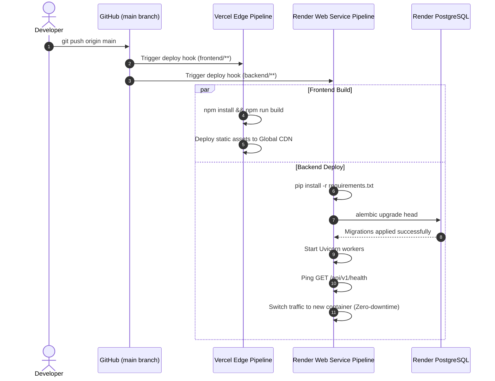

# Bloop — Cloud Deployment Architecture Specification

**Document Identifier:** BLOOP-DEPLOY-ARCH-V1  
**Project:** Bloop — AI Text-to-Speech & Quantum Intelligence Platform  
**Target Milestone:** Intermediate-Level Cloud Deployment Architecture  
**Status:** Approved Technical Design  
**Authority:** Bloop Master Prompt, Prompt 02, and Prompt 03  

---

## 1. Executive Deployment Overview

Bloop is engineered for continuous deployment from a single GitHub repository to modern Platform-as-a-Service (PaaS) providers:
- **Frontend SPA:** Hosted on **Vercel's Global Edge Network** for sub-100ms static asset delivery (Detailed runbook: [Vercel Deployment Guide](../deployment/vercel.md)).
- **Backend API:** Hosted as a containerized Python Web Service on **Render** (Detailed runbook: [Render Deployment Guide](../deployment/render.md)).
- **Relational Database:** Hosted on **Render Managed PostgreSQL 16**.
- **External Speech Synthesis:** Commercial cloud API integration with **ElevenLabs**.

```
                             ┌─────────────────────────┐
                             │       GitHub Repo       │
                             │  (Single Monorepo Root) │
                             └────────────┬────────────┘
                                          │
                        ┌─────────────────┴─────────────────┐
                        │ Push to main                      │ Push to main
                        ▼                                   ▼
             ┌─────────────────────┐             ┌─────────────────────┐
             │     Vercel Edge     │             │     Render Cloud    │
             │  React 19 + Vite    │             │  FastAPI + Uvicorn  │
             │  Static Edge CDN    │             │  Python Web Service │
             └──────────┬──────────┘             └──────────┬──────────┘
                        │                                   │
                        │ HTTPS REST / JSON                 │
                        │ Bearer Authorization              │
                        └─────────────────►─────────────────┤
                                                            │
                                              ┌─────────────┴─────────────┐
                                              ▼                           ▼
                                   ┌─────────────────────┐     ┌─────────────────────┐
                                   │  Render PostgreSQL  │     │ ElevenLabs Cloud API│
                                   │ Managed Database 16 │     │ External AI Voice   │
                                   └─────────────────────┘     └─────────────────────┘
```

---

## 2. Platform Responsibilities & Blueprint Contracts

### 2.1 Backend Web Service (Render)
- **Environment:** Python 3.11+ running under Uvicorn ASGI server.
- **Root Directory:** `backend`
- **Build Command:** `pip install -r requirements.txt`
- **Pre-Deploy Command:** `alembic upgrade head` (Automated schema migration before process startup).
- **Start Command:** `uvicorn app.main:app --host 0.0.0.0 --port $PORT --workers 2`
- **Health Check Probe:** Configured to probe `GET /api/v1/health` with 30s interval.

### 2.2 Frontend Edge SPA (Vercel)
- **Framework Preset:** Vite
- **Root Directory:** `frontend`
- **Build Command:** `npm run build`
- **Output Directory:** `dist`
- **Routing Rewrite (`vercel.json`):** Ensures all non-asset requests route to `index.html` for client-side React Router execution:
  ```json
  {
    "rewrites": [
      { "source": "/(.*)", "destination": "/index.html" }
    ]
  }
  ```

### 2.3 Managed Relational Database (Render PostgreSQL)
- **Engine:** PostgreSQL 16
- **Connection Security:** Enforced TLS 1.3 encryption.
- **Binding:** Render automatically populates the `DATABASE_URL` environment variable in the backend service.

---

## 3. Environment Matrix & Secret Isolation

```
┌─────────────────────────────────────────────────────────────────────────────┐
│                       ENVIRONMENT CONFIGURATION MATRIX                      │
├───────────────────────┬──────────────────────────┬──────────────────────────┤
│ Variable Name         │ Local Development        │ Production (Render/Vercel)│
├───────────────────────┼──────────────────────────┼──────────────────────────┤
│ `ENVIRONMENT`         │ `development`            │ `production`             │
│ `PORT`                │ `8000`                   │ Render assigned ($PORT)  │
│ `DATABASE_URL`        │ `sqlite:///./bloop.db`   │ `postgres://user:pass...`│
│ `SECRET_KEY`          │ Local dev secret string  │ High-entropy 64-char hex │
│ `ELEVENLABS_API_KEY`  │ Optional dev key/empty   │ Server-side production key│
│ `ALLOWED_ORIGINS`     │ `http://localhost:5173`  │ `https://bloop.vercel.app`│
│ `VITE_API_BASE_URL`   │ `http://localhost:8000`  │ `https://bloop.onrender...`│
└───────────────────────┴──────────────────────────┴──────────────────────────┘
```

### Security Boundary:
- `ELEVENLABS_API_KEY`, `DATABASE_URL`, and `SECRET_KEY` exist exclusively in server environment settings.
- The compiled Vercel frontend bundle contains **zero API secrets**.

---

## 4. Cross-Origin Resource Sharing (CORS) Architecture

To block unauthorized cross-site requests while supporting legitimate frontend traffic:
1. The backend reads `ALLOWED_ORIGINS` as a comma-separated list of trusted origins.
2. In production, wildcard origins (`*`) are strictly prohibited.
3. Requests originating from unlisted origins are rejected with `HTTP 403 Forbidden` on preflight `OPTIONS` requests:
   ```python
   app.add_middleware(
       CORSMiddleware,
       allow_origins=settings.parsed_allowed_origins,
       allow_credentials=True,
       allow_methods=["GET", "POST", "PUT", "DELETE", "OPTIONS"],
       allow_headers=["Authorization", "Content-Type", "Range"],
       expose_headers=["Content-Range", "Accept-Ranges", "Content-Disposition"],
   )
   ```

---

## 5. Continuous Deployment (CI/CD) Workflow



---

## 6. Single-Service Deployability Verification Checklist

Before deploying, verify that the architecture adheres to the single-service deployment rules:
- [x] **No Microservice Overhead:** The application requires only one backend service container.
- [x] **No External Queue Brokers:** Does not depend on Celery, Redis, or RabbitMQ clusters.
- [x] **In-Process Quantum:** Qiskit Aer and PennyLane run inside the Python backend process.
- [x] **Zero-Downtime Health Probes:** `/api/v1/health` confirms operational status before Render shifts traffic.
- [x] **Static SPA Portability:** Frontend contains no Node.js server dependencies and runs cleanly on static edge hosting.
