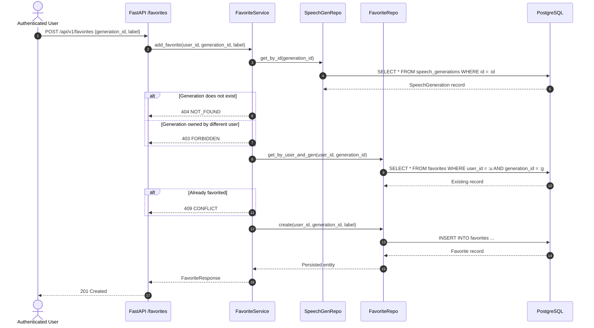

# Favorites Architecture

## 1. Domain Concept & Design Principle

In Bloop, a **Favorite** represents an authenticated user's intentional bookmark or saved reference to an existing speech generation.

```text
User (1)
  │
  ├──< (N) SpeechGeneration (Canonical Content Entity)
  │             │
  │             └──< (1) Favorite (Reference Entity)
  │                       │
  └──< (N) Favorite ───────┘
```

### Core Design Principles:
1. **Reference, Not Duplicate**: A favorite record does not duplicate speech text, audio filenames, provider IDs, or audio metadata. It holds foreign keys referencing the owning `User` and the target `SpeechGeneration`.
2. **Strict Dual Ownership**: A user can only bookmark speech generations that they own (`SpeechGeneration.user_id == User.id`). Cross-user bookmarking attempts are denied at the service layer with HTTP 403 `FORBIDDEN`.
3. **Database Uniqueness**: A composite unique constraint `uq_user_generation_favorite(user_id, generation_id)` guarantees at the database level that a user cannot bookmark the same speech generation more than once. Concurrent duplicate requests yield HTTP 409 `CONFLICT`.
4. **Cascade vs. Independent Deletion**:
   - **Generation Deletion**: Deleting a `SpeechGeneration` triggers a cascading delete (`ondelete="CASCADE"`) on its associated `Favorite` rows, preventing orphaned bookmark references.
   - **Favorite Removal**: Removing a `Favorite` simply deletes the bookmark link. The underlying `SpeechGeneration` and its physical audio file on disk remain completely untouched.

---

## 2. Relational Model Schema

```sql
CREATE TABLE favorites (
    id SERIAL PRIMARY KEY,
    user_id INTEGER NOT NULL REFERENCES users(id) ON DELETE CASCADE,
    generation_id INTEGER NOT NULL REFERENCES speech_generations(id) ON DELETE CASCADE,
    label VARCHAR(100),
    created_at TIMESTAMP WITH TIME ZONE NOT NULL DEFAULT NOW(),
    CONSTRAINT uq_user_generation_favorite UNIQUE (user_id, generation_id)
);

CREATE INDEX ix_favorites_user_id ON favorites(user_id);
CREATE INDEX ix_favorites_generation_id ON favorites(generation_id);
CREATE INDEX ix_favorites_user_created ON favorites(user_id, created_at DESC);
```

---

## 3. Transactional Lifecycle & State Machine


