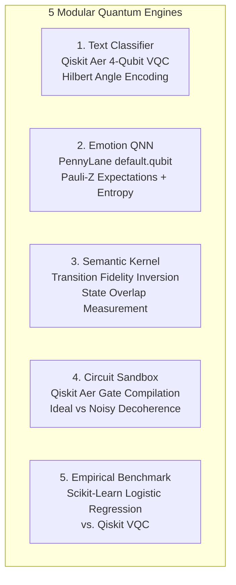
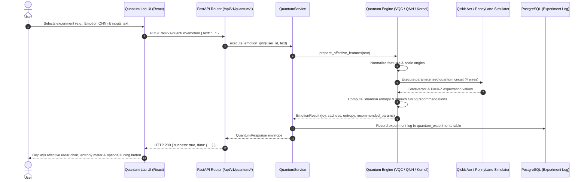

# Bloop — Quantum Intelligence Architecture Specification

**Document Identifier:** BLOOP-QUANTUM-ARCH-V1  
**Project:** Bloop — AI Text-to-Speech & Quantum Intelligence Platform  
**Target Milestone:** Intermediate-Level Quantum Subsystem Specification  
**Status:** Approved Technical Design  
**Authority:** Bloop Master Prompt & Prompt 02  

---

## 1. Executive Overview & The Decoupled Invariant

The **Bloop Quantum Intelligence Subsystem** is an educational, research-oriented computational engine built using **Qiskit Aer** and **PennyLane**. It provides five interactive modules for quantum feature encoding, affective emotion classification, semantic kernel similarity, circuit sandbox experimentation, and classical-vs-quantum empirical benchmarking.

```
                    ┌───────────────┐
                    │ Bloop Backend │
                    └───────┬───────┘
                            │
              ┌─────────────┴─────────────┐
              │                           │
              ▼                           ▼
        Speech Domain              Quantum Domain (Side-Car)
              │                           │
              ▼                           ▼
        ElevenLabs                 Qiskit / PennyLane
```

### The Decoupled Architecture Invariant:
1. **100% Core TTS Independence:** Text-to-Speech synthesis never requires quantum computation. The quantum subsystem operates purely as an optional side-car intelligence layer.
2. **Fault Containment:** Any failure in Qiskit simulation, PennyLane gradients, or NumPy matrix operations is intercepted inside `QuantumService` and returned as an isolated `QUANTUM_EXECUTION_ERROR`. Core speech endpoints never experience downtime or performance degradation from quantum activity.
3. **Empirical Honesty:** The system strictly avoids fabricated or premature claims of "quantum supremacy." All benchmarks measure real wall-clock latency, F1-scores, and accuracy against classical Scikit-Learn baselines.

---

## 2. Directory Structure

All quantum software components reside in an isolated backend package:

```text
backend/app/quantum/
├── __init__.py             # Subsystem export definitions & facade
├── config.py               # QuantumConfig & resource boundaries
├── exceptions.py           # Domain exception mappings
│
├── text/                   # Quantum Text Intelligence & NLP (Prompt 23)
│   ├── __init__.py         # Exports: QuantumTextService, Preprocessor, Reducer, etc.
│   ├── preprocess.py       # Conservative Unicode NFKC normalization & validation
│   ├── features.py         # Classical TF-IDF vectorizer (vocab <= 64)
│   ├── reduction.py        # TruncatedSVD dimensionality reduction (2 <= N <= 8)
│   ├── normalization.py    # Continuous angle feature scaling into [0, pi]
│   ├── encoder.py          # AngleFeatureEncoder with NaN/Inf validation
│   ├── circuit.py          # Parameterized circuit builder (state prep + variational)
│   ├── classifier.py       # Hybrid classifier (Qiskit/PennyLane) & classical baseline
│   ├── evaluator.py        # Leakage-free benchmark evaluation engine
│   ├── schemas.py          # Pydantic schemas for text intelligence
│   ├── service.py          # QuantumTextService orchestrator & persistence
│   └── exceptions.py       # Comprehensive text domain error taxonomy
│
├── emotion/                # Quantum Emotion Intelligence & Speech Recommendation (Prompt 24)
│   ├── __init__.py         # Exports: QuantumEmotionService, Recommender, etc.
│   ├── labels.py           # Validated affective taxonomy (joy, sadness, anger, neutral)
│   ├── preprocess.py       # Conservative text validation & deterministic tokenization
│   ├── features.py         # Affective feature extraction (TF-IDF + statistical signals)
│   ├── reduction.py        # TruncatedSVD dimensionality reduction to N <= 4
│   ├── normalization.py    # Continuous angle scaling [0, pi] with NaN/Inf guards
│   ├── encoder.py          # AngleFeatureEncoder on quantum register
│   ├── qnn.py              # Trainable Hybrid QNN (PennyLane: state prep + variational + CNOTs)
│   ├── classifier.py       # Hybrid decision head & parallel Logistic Regression baseline
│   ├── dataset.py          # Curated affective reference corpus
│   ├── evaluator.py        # Zero data leakage benchmark evaluator
│   ├── recommender.py      # SpeechRecommendationService (isolated from ElevenLabs)
│   ├── schemas.py          # Pydantic schemas for emotion analysis & recommendations
│   ├── service.py          # QuantumEmotionService orchestrator & persistence
│   └── exceptions.py       # Comprehensive emotion domain error taxonomy
│
├── semantic/               # Quantum Semantic Intelligence & Similarity (Prompt 25)
│   ├── __init__.py         # Exports: QuantumSemanticService, ClassicalSimilarityEngine, etc.
│   ├── models.py           # SemanticMethod, SimilarityVerdict, PairwiseSemanticResult
│   ├── schemas.py          # Pydantic schemas for pairwise, matrix, and benchmark
│   ├── preprocess.py       # Conservative Unicode NFKC normalization & validation
│   ├── features.py         # SemanticRepresentationProvider (TF-IDF & Lexical)
│   ├── reduction.py        # TruncatedSVD dimensionality reduction to N <= 8
│   ├── normalization.py    # Continuous angle normalization into [0, pi]
│   ├── quantum_encoder.py  # AngleFeatureEncoder (Ry rotations + CNOT entanglers)
│   ├── classical.py        # Classical Cosine Similarity baseline & distance
│   ├── quantum_kernel.py   # QuantumKernelEngine (Qiskit transition & PennyLane overlap)
│   ├── similarity.py       # Pluggable SimilarityEngine (Classical, Quantum, Hybrid)
│   ├── dataset.py          # SemanticDatasetAdapter with reference evaluation pairs
│   ├── evaluator.py        # Zero data leakage benchmark evaluator (MAE, RMSE, Pearson r)
│   ├── service.py          # QuantumSemanticService orchestrator & experiment persistence
│   └── exceptions.py       # Comprehensive semantic domain error taxonomy
│
├── domain/                 # Framework-agnostic quantum entities
│   ├── models.py           # ExperimentType, QuantumFramework, ExecutionStatus, GateType
│   ├── result.py           # NormalizedQuantumResult schema & derivations
│   └── experiment.py       # QuantumExperimentData domain entity
│
├── circuits/               # Fundamental circuit builders & utilities
│   ├── basic.py            # Bell state, single-qubit H, single-qubit X, GHZ builders
│   ├── gates.py            # Gate specifications & boundary validation
│   ├── measurement.py      # Classical register and measurement attachers
│   └── utilities.py        # Depth, gate count, ASCII render, OpenQASM 2 export
│
├── qiskit/                 # Qiskit & Aer simulator adapters
│   ├── adapter.py          # QiskitAdapter implementing QuantumBackend
│   ├── simulator.py        # AerSimulator builder with depolarizing noise models
│   └── converters.py       # Qiskit counts to NormalizedQuantumResult
│
├── pennylane/              # PennyLane differentiable circuit adapters
│   ├── adapter.py          # PennyLaneAdapter with default.qubit & qiskit.aer devices
│   └── circuits.py         # Angle embedding, strongly entangling, variational layers
│
├── hybrid/                 # Classical-quantum ML integration & Hybrid Speech Intelligence (Prompt 27)
│   ├── __init__.py         # Re-exports for backward compatibility & new engines
│   ├── models.py           # BenchmarkCategory, FusionMethod, SpeechRecommendationDTO, etc.
│   ├── schemas.py          # Pydantic schemas for hybrid analysis, recommendations & benchmarks
│   ├── classical.py        # ClassicalTextBaseline, ClassicalEmotionBaseline, ClassicalSemanticBaseline
│   ├── quantum.py          # Adapters for text, emotion, and semantic services
│   ├── fusion.py           # Mathematical fusion engine (Score, Feature, Decision)
│   ├── recommendation.py   # HybridSpeechRecommender (decoupled voice parameter mapping)
│   ├── speech_bridge.py    # SpeechCapabilityBridge (validates with CapabilityService)
│   ├── benchmark.py        # Multi-category benchmark runner (Types A, B, C, D, E)
│   ├── service.py          # HybridIntelligenceService orchestrator
│   └── exceptions.py       # Domain error taxonomy
│
├── services/               # Application-level service coordinators
│   ├── quantum_service.py  # Central QuantumService with health & persistence
│   ├── circuit_service.py  # CircuitService for composition & presets
│   └── benchmark_service.py # BenchmarkService for classical vs quantum evaluation
│
└── execution/              # Execution engine & safeguards
    ├── backend.py          # QuantumBackend abstract interface
    ├── executor.py         # QuantumExecutor with ThreadPool timeout guard
    └── limits.py           # Hard bounds: validate_qubits, validate_shots
```

---

## 3. The Five Modular Quantum Engines



### 3.1 Quantum Text Intelligence & Hybrid Classification (`backend/app/quantum/text/`)
- **Input:** Natural language text ($1 \le \text{length} \le 1,000$ characters).
- **Conservative Preprocessing (`preprocess.py`):** Unicode NFKC normalization, newline standardization, control character scrubbing, deterministic regex tokenization. Strictly no text rewriting or LLM hallucination.
- **Classical Feature Extraction (`features.py`):** Scikit-Learn `TfidfVectorizer` (max 64 features) fitted strictly on training data.
- **Dimensionality Reduction (`reduction.py`):** `TruncatedSVD` projection from sparse TF-IDF space into target quantum dimension ($N \le n\_qubits$, $2 \le N \le 8$), avoiding dense memory bloat.
- **Angle Normalization (`normalization.py` & `encoder.py`):** MinMax scaling of reduced features onto $[0, \pi]$ rotation angles, with strict NaN/Inf bounds checking and zero-padding/truncation to register width.
- **Parameterized Circuit & Simulation (`circuit.py`):** Multi-framework execution (Qiskit Aer and PennyLane). Layer 1: $R_y(\theta_i)$ state preparation; Layer 2: linear entangling CNOT cascade; Layer 3: parameterized $R_z(\phi_i)$ variational ansatz; Layer 4: computational basis measurement.
- **Leakage-Free Benchmark & Evaluation (`evaluator.py`):** Train/test split performed prior to fitting transformers. Trains parallel Scikit-Learn Logistic Regression classical baseline on identical split. Reports objective metrics: Accuracy, Precision, Recall, F1, training latency, inference latency, and agreement with zero fabricated quantum supremacy claims.
- **Legacy Backward Compatibility (`text_classifier.py`):** Legacy `QuantumTextClassifier` delegates directly to `QuantumTextService` to support older test fixtures.

### 3.2 Quantum Emotion Intelligence & Speech Recommendation (`backend/app/quantum/emotion/`)
- **Input:** Natural language text ($1 \le \text{length} \le 1,000$ characters).
- **Conservative Preprocessing (`preprocess.py`):** Unicode NFKC normalization, whitespace/control-character sanitization, deterministic tokenization. Zero text rewriting or hallucination.
- **Affective Feature Extraction (`features.py`):** Combined lexical signals (TF-IDF, max 32 features) and statistical affective markers (exclamation density, question density, uppercase ratio, valence keyword matches).
- **Dimensionality Reduction (`reduction.py`):** Sparse-matrix-aware `TruncatedSVD` projection to target quantum register width ($N \le n\_qubits$, default 4).
- **Continuous Angle Normalization (`normalization.py` & `encoder.py`):** MinMax scaling of reduced features onto $[0, \pi]$ rotation angles with strict NaN/Inf guards.
- **Trainable Hybrid QNN (`qnn.py`):** PennyLane parameterized variational circuit (`default.qubit` / `qiskit.aer`). Features $R_y(x_i)$ angle state preparation, parameterized variational rotation layers $R_x(\theta), R_y(\phi), R_z(\omega)$ with trainable weight tensor $\mathbf{W}$, linear CNOT entanglement cascades, and Pauli-Z expectation measurements $\langle \sigma_z^{(i)} \rangle \in [-1, 1]$.
- **Entanglement Entropy:** Computes Shannon state entropy $H = -\sum p_i \log_2(p_i)$ to measure superposition dispersion.
- **Hybrid Decision Head & Baseline (`classifier.py`):** Classical calibrated linear decision head with Softmax over discrete affective classes (`joy`, `sadness`, `anger`, `neutral`), evaluated alongside a parallel Scikit-Learn `LogisticRegression` classical baseline with zero data leakage.
- **Decoupled Speech Recommendation (`recommender.py`):** Translates predicted affective state into suggested speech synthesis parameters (`style`, `speed`, `pitch`, `stability`, `similarity_boost`, `pacing`). User explicitly retains control (`applied: false`); recommendation engine never calls ElevenLabs or invents fake voice IDs.
- **Legacy Backward Compatibility (`emotion_qnn.py`):** Legacy `QuantumEmotionAnalyzer` delegates directly to `QuantumEmotionService`.

### 3.3 Quantum Semantic Kernel (`semantic_kernel.py`)
- **Objective:** Evaluates semantic state overlap between two text inputs (Text A and Text B).
- **Fidelity Formulation:** Encodes Text A into state $|\phi(A)\rangle$ via unitary $U(A)$ and Text B into state $|\psi(B)\rangle$ via unitary $U(B)$.
- **Inversion Circuit:** Compiles the transition circuit:
  $$|\Psi\rangle = U^\dagger(B) U(A) |0\rangle^{\otimes n}$$
- **Fidelity Score:** Measures the probability of observing the all-zeros state $|00\dots0\rangle$:
  $$F(A, B) = |\langle 0| U^\dagger(B) U(A) |0\rangle|^2 \in [0.0, 1.0]$$

### 3.4 Interactive Quantum Circuit Lab (`circuit_lab.py`)
- **Capabilities:** Allows users to construct arbitrary quantum circuits from a verified gate library:
  - Single-qubit gates: `H`, `X`, `Y`, `Z`, `Rx`, `Ry`, `Rz`.
  - Two-qubit entangling gates: `CNOT`, `CZ`, `SWAP`.
- **Validation Guardrails:** Strictly restricts circuits to $\le 8$ qubits, $\le 30$ gates depth, and $\le 1024$ measurement shots.
- **Noise Simulation:** Optionally introduces a depolarizing error channel ($\lambda = 0.05$) to demonstrate physical NISQ hardware decoherence alongside ideal simulation.
- **Output:** Returns measurement probability distributions, ASCII circuit diagrams, and OpenQASM 2.0 representations.

### 3.5 Classical vs Quantum Empirical Benchmark (`benchmarks.py`)
- **Controlled Comparison:** Evaluates Scikit-Learn Logistic Regression alongside Qiskit VQC on identical synthetic feature datasets.
- **Tracked Metrics:** Accuracy, Precision, Recall, F1-score, and wall-clock execution time (ms).
- **Objective Reporting:** Emphasizes that classical algorithms currently exhibit faster training latency and high accuracy on low-dimensional data, providing an educational comparison without bias.

---

## 4. Complete Quantum Data Flow



---

## 5. Optional Hybrid Intelligence Flow

When users utilize Quantum Emotion analysis, the resulting speech recommendations can optionally inform the core TTS workspace without enforcing a rigid pipeline:

```
User Prompt Text
       │
       ├─────────────────────────────────┐
       ▼                                 ▼
Core TTS Workspace             Quantum Emotion QNN
(Default Voice & Speed)        (Affective State & Entropy)
       │                                 │
       │                        Suggested Modifiers:
       │                        • Speed: 1.08x
       │                        • Pitch / Stability: +10%
       │                                 │
       │    [User Clicks "Apply"]        │
       ◄─────────────────────────────────┘
       │
POST /api/v1/tts
(With applied modifiers)
       │
       ▼
ElevenLabs Synthesis (High-Fidelity Audio)
```

---

---

## 6. Quantum Semantic Intelligence & Similarity Subsystem (Prompt 25)

The **Quantum Semantic Intelligence Subsystem** (`backend/app/quantum/semantic/`) provides reproducible text-to-text semantic similarity analysis, pairing a first-class classical baseline with quantum kernel state fidelity estimation:

### Mathematical Foundations:
1. **Classical Cosine Similarity Baseline:**
   $$\cos(A, B) = \frac{\mathbf{a} \cdot \mathbf{b}}{\|\mathbf{a}\| \|\mathbf{b}\|}$$
   Calculated on sublinear TF-IDF vectors fitted strictly on a reference corpus, preventing data leakage.
2. **Quantum Feature Reduction:**
   Projects high-dimensional semantic features into low-dimensional qubit allocations ($2 \le N \le 8$) via `TruncatedSVD`.
3. **Continuous Angle Normalization:**
   Maps coordinates into $[0, \pi]$ rotation angles for single-qubit $R_y(\theta_i)$ rotations:
   $$\theta_i = \pi \cdot \frac{x_i - \min(\mathbf{x})}{\max(\mathbf{x}) - \min(\mathbf{x}) + \epsilon}$$
4. **Quantum Kernel State Fidelity:**
   Evaluates state transition probability to the computational ground state $|0\dots 0\rangle$:
   $$K(A, B) = |\langle 0\dots 0 | U^\dagger(x_B) U(x_A) | 0\dots 0 \rangle|^2 = |\langle\phi(A)|\psi(B)\rangle|^2$$
5. **Hybrid Similarity & Divergence:**
   $$\text{sim}_{\text{hybrid}} = \frac{\cos(A, B) + K(A, B)}{2}$$
   $$\text{divergence} = |K(A, B) - \cos(A, B)|$$
   $$\text{distance} = 1.0 - \text{sim}_{\text{hybrid}}$$

### Endpoints:
- `POST /api/v1/quantum/semantic`: Pairwise semantic similarity analysis.
- `POST /api/v1/quantum/semantic/matrix`: Bounded pairwise similarity matrix ($\le 10$ texts, $\le 20$ pairs).
- `POST /api/v1/quantum/semantic/benchmark`: Leakage-free benchmark evaluating MAE, RMSE, Pearson $r$, and Spearman $\rho$.

---

## 7. Quantum Circuit & Noise Laboratory Subsystem (Prompt 26)

The **Quantum Circuit & Noise Laboratory** (`backend/app/quantum/laboratory/`) provides an isolated experimental and research environment for bounded circuit construction, physical noise modeling, comparative evaluation, and parameter robustness sweeps:

### Architecture & Operational Modes:
1. **Mode A (Ideal Simulation):**
   Noise-free execution on Qiskit AerSimulator producing discrete basis state counts, normalized probabilities, Shannon entropy ($H = -\sum p \log_2 p$), dominant state detection, and exact statevectors for registers $N \le 6$.
2. **Mode B (Noisy Simulation):**
   Injects physical decoherence channels via Qiskit Aer `NoiseModel`:
   - Depolarizing noise (1-qubit and 2-qubit channels)
   - Pauli bit-flip ($X$), phase-flip ($Z$), and bit-phase-flip ($Y$) channels
   - Thermal relaxation with $T_1$ relaxation and $T_2$ dephasing times under physical constraint $T_2 \le 2T_1$
   - Measurement readout confusion error matrices ($p(0|1), p(1|0)$)
3. **Mode C (Comparative Experiment):**
   Executes simultaneous ideal and noisy simulations of identical circuits to compute:
   - **Total Variation Distance (TVD):**
     $$\text{TVD}(P, Q) = \frac{1}{2} \sum_{x} |P(x) - Q(x)| \in [0.0, 1.0]$$
   - **Bhattacharyya Classical Fidelity:**
     $$F(P, Q) = \sum_{x} \sqrt{P(x) Q(x)} \in [0.0, 1.0]$$
   - **State-by-State Divergence:** Max $|P(x) - Q(x)|$ and per-basis state divergence table.
4. **Mode D (Robustness Experiment):**
   Executes bounded parameter sweeps ($\le 10$ steps, $\le 5$ repeats) across increasing noise levels, measuring fidelity decay, TVD increase, and target-state survival probability.

### Security Invariants & Boundaries:
- **Approved Gate Whitelist:** `H, X, Y, Z, S, T, RX, RY, RZ, CX, CZ, SWAP`.
- **Resource Limits:** `QUANTUM_MAX_CIRCUIT_DEPTH = 30`, `QUANTUM_MAX_CIRCUIT_OPERATIONS = 50`, `QUANTUM_MAX_SWEEP_STEPS = 10`.
- **Zero Dynamic Code Execution:** Prohibits `eval()`, `exec()`, or dynamic imports from user input.

### Laboratory Endpoints:
- `POST /api/v1/quantum/circuit`: Interactive simulation (ideal or noisy).
- `POST /api/v1/quantum/circuit/compare`: Mode C comparative experiment.
- `POST /api/v1/quantum/circuit/robustness`: Mode D noise parameter sweep.
- `GET  /api/v1/quantum/circuit/templates`: Deterministic template catalog (`bell_state`, `ghz_state`, etc.).
- `GET  /api/v1/quantum/circuit/noise-profiles`: Standard preset profiles (`IDEAL`, `LOW_NOISE`, `MEDIUM_NOISE`, `HIGH_NOISE`).
- `GET  /api/v1/quantum/circuit/gates`: Supported gate specifications and parameter rules.

---

## 8. Computational Guardrails & Failure Isolation

To prevent resource exhaustion on the single Render server instance:
1. **Strict Qubit Threshold:** $\text{Qubits} \le 8$ (Memory footprint $\le 2^{8} \times 16 \text{ bytes} = 4 \text{ KB}$).
2. **Shot Limit:** $\text{Shots} \le 8,192$ (default $1,024$).
3. **Execution Timeout:** All quantum simulations are bounded by a 30-second execution limit.
4. **Matrix Guard:** Bounded to a maximum of 10 texts and 20 pairwise comparisons (`QUANTUM_SEMANTIC_MAX_PAIRS = 20`) to prevent $O(N^2)$ simulation explosion.
5. **Exception Handling:** All quantum execution code paths are isolated behind service boundaries:
   ```python
   try:
       res = service.analyze_similarity(req, user_id=current_user.id)
   except BloopException as be:
       raise be
   except Exception as e:
       logger.error(f"Quantum simulation failed: {str(e)}")
       raise QuantumExecutionError(str(e))
   ```

---

## 9. Quantum Benchmarking & Hybrid Speech Intelligence Subsystem (Prompt 27)

The **Quantum Benchmarking & Hybrid Speech Intelligence Subsystem** (`backend/app/quantum/hybrid/`) unifies classical NLP baselines, quantum representations, speech intelligence, and external synthesis engines (ElevenLabs) through a strictly decoupled, verifiable pipeline:

### 1. Multi-Category Benchmarking Architecture
Multi-category benchmarking executes standardized, reproducible comparisons across five distinct categories:
- **Type A (Text Classification):** Evaluates Classical TF-IDF + Logistic Regression vs. Quantum Variational Classifier (VQC) vs. Hybrid Concatenation on standardized style datasets.
- **Type B (Emotion Detection):** Evaluates Classical Lexicon/VADER affective analysis vs. Quantum Emotion QNN vs. Score Convex Fusion on balanced affective corpora.
- **Type C (Semantic Similarity):** Evaluates Classical Jaccard/N-Gram lexical similarity vs. Quantum State Fidelity Kernel vs. Hybrid Concordance on semantic pair datasets.
- **Type D (Circuit Noise):** Evaluates Ideal AerSimulator unitary dynamics vs. Physically Grounded Noisy AerSimulator measuring Total Variation Distance (TVD) and Bhattacharyya Classical Fidelity.
- **Type E (Hybrid Speech Pipeline):** Benchmarks the full end-to-end multi-stage pipeline measuring stage-by-stage latencies (Text Encoding, Affective Extraction, Kernel Estimation, Mathematical Fusion, Recommendation Generation).

### 2. Mathematical Fusion Engine
Three transparent mathematical fusion strategies are provided with formal mathematical contracts:
- **Score Fusion:** Convex linear combination $S_{\text{hybrid}} = \alpha S_{\text{classical}} + \beta S_{\text{quantum}}$, with constraints $\alpha \ge 0, \beta \ge 0, \alpha + \beta = 1.0$.
- **Feature Fusion:** L2-normalized feature vector concatenation $v_{\text{hybrid}} = \left[\frac{v_{\text{classical}}}{\|v_{\text{classical}}\|_2} \,\|\, \frac{v_{\text{quantum}}}{\|v_{\text{quantum}}\|_2}\right]$.
- **Decision Fusion:** High-confidence quantum priority with conservative classical fallback, gated at threshold $\theta = 0.65$.

### 3. Speech Parameter Recommendation Engine
`HybridSpeechRecommender` translates hybrid affective state, valence, arousal, and stylistic confidence into acoustic speech synthesis parameters:
- `speed` (0.5 to 2.0, default 1.0)
- `pitch` (-10.0 to +10.0 semitones, default 0.0)
- `stability` (0.0 to 1.0, default 0.75)
- `similarity_boost` (0.0 to 1.0, default 0.75)
- `pacing` (`slow`, `deliberate`, `balanced`, `dynamic`, `brisk`)
- `reason` (Deterministic explanation string)
- `confidence` (Bounded float in $[0.0, 1.0]$ or `None` if ambiguous)

### 4. Dynamic Capability Bridge & Strict Decoupling
- **Capability Validation:** Parameters are validated dynamically against `CapabilityService` before constructing TTS payloads. Unsupported parameters are pruned or clamped to safe operational bounds.
- **Strict Isolation Invariant:** Quantum and Hybrid modules contain **zero** direct imports or calls to ElevenLabs SDK, API, or speech generation functions. `SpeechService` remains the sole owner of TTS orchestration.
- **User Autonomy:** Recommendations remain non-destructive suggestions in the user interface. Users may choose to `[Apply to TTS]` (which navigates to the TTS workspace with pre-populated values) or `[Ignore]`.
