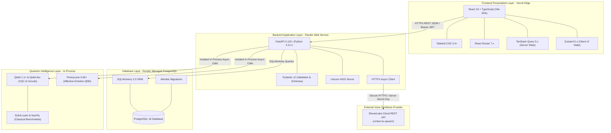

# Bloop — Technology Stack & Decision Matrix Specification

**Document Identifier:** BLOOP-TECH-STACK-V1  
**Project:** Bloop — AI Text-to-Speech & Quantum Intelligence Platform  
**Target Milestone:** Elite Technology Stack & Deployment-First Architecture  
**Status:** Approved Technical Contract  
**Authority:** Bloop Master Prompt, Prompt 01, Prompt 02, and Prompt 03  

---

## 1. Executive Technology Blueprint

The Bloop technology stack is engineered according to three core principles:
1. **Practical Production Excellence:** Every technology is production-tested, stable, well-documented, and actively maintained.
2. **Intermediate-Level Simplicity:** The architecture avoids distributed infrastructure overhead (no microservices, Kafka, Celery, or Kubernetes), deploying cleanly as one FastAPI web service on Render, one PostgreSQL database, and one React SPA on Vercel.
3. **The Decoupled Architecture Invariant:** High-fidelity AI speech synthesis mediated via ElevenLabs operates with 100% independence from the in-process Quantum Intelligence layer (Qiskit & PennyLane).

```
BLOOP
│
├── Frontend (Vercel Edge SPA)
│   ├── React 19.x             # Declarative UI composition & concurrent features
│   ├── TypeScript 5.x         # Strict compile-time static type safety
│   ├── Vite 6.x               # Lightning-fast dev HMR & optimized Rollup bundling
│   ├── Tailwind CSS 3.4+      # Utility-first responsive design tokens
│   ├── React Router 7.x       # Client-side declarative routing & route guards
│   ├── TanStack Query 5.x     # Authoritative server-state caching & mutations
│   └── Zustand 5.x            # Ephemeral client UI & audio player state
│
├── Backend (Render Python Web Service)
│   ├── Python 3.11+           # Modern, high-performance async runtime
│   ├── FastAPI 0.115+         # Async REST routing, OpenAPI schemas & Swagger UI
│   ├── Pydantic v2.9+         # High-speed C-based request/response validation
│   ├── SQLAlchemy 2.0+        # Type-safe relational ORM with async capabilities
│   ├── Alembic 1.13+          # Deterministic, versioned database schema migrations
│   └── HTTPX 0.27+            # Async non-blocking HTTP client for external APIs
│
├── Database (Render Managed PostgreSQL 16)
│   └── PostgreSQL 16          # ACID relational persistence, JSONB, foreign keys
│
├── Text-to-Speech Provider (Isolated Cloud Integration)
│   └── ElevenLabs API         # Commercial REST API for high-fidelity speech synthesis
│
├── Quantum Computing Engine (Isolated In-Process Subsystem)
│   ├── Qiskit 1.1+            # Quantum circuit compilation, OpenQASM 2.0 & VQC
│   ├── Qiskit Aer 0.14+       # High-performance C++ statevector & noisy simulation
│   ├── Qiskit Machine Learning# Variational Quantum Classifier (VQC) algorithms
│   ├── PennyLane 0.36+        # Differentiable quantum neural networks (QNN)
│   └── PennyLane-Qiskit       # Interoperability bridge between PennyLane & Qiskit
│
├── Classical Machine Learning & Data Processing
│   ├── NumPy 1.26+            # Array manipulations & feature vector scaling
│   └── scikit-learn 1.5+      # Classical Logistic Regression for empirical benchmarks
│
├── Testing & Quality Assurance
│   ├── Pytest 8.x             # Python test runner with async support
│   ├── Pytest-Asyncio 0.23+   # Async test execution for FastAPI endpoints
│   ├── Vitest 4.x             # High-speed Vite-native unit testing framework
│   └── React Testing Library  # User-centric DOM testing for UI components
│
└── Cloud Deployment & CI/CD
    ├── GitHub                 # Single monorepo root, version control & actions
    ├── Render Web Service     # Python Uvicorn container web service
    ├── Render PostgreSQL      # Fully managed cloud relational database
    └── Vercel Global Edge     # Static SPA hosting with worldwide CDN caching
```

---

## 2. Visual Architecture Diagram



---

## 3. Comprehensive Technology Decision Matrix

| Technology | Architectural Layer | Primary Purpose | Why Selected | Alternatives Considered | Reason Alternatives Rejected | Development Impact | Production Impact | Deployment Impact | Security Impact | Maintenance Impact |
| :--- | :--- | :--- | :--- | :--- | :--- | :--- | :--- | :--- | :--- | :--- |
| **React 19** | Frontend Framework | UI composition, concurrent rendering, virtual DOM | Industry standard, exceptional declarative reactivity for real-time counters and audio visualizers | Vue 3, Svelte, SolidJS | Smaller specialized ecosystems; fewer enterprise UI component libraries | Fast component authoring; wide community packages | Highly optimized reconciliation; concurrent rendering | Bundles to static assets; zero server compute required | Sanitizes JSX output against XSS automatically | Massive ecosystem; long-term API stability |
| **TypeScript 5.x** | Frontend Language | Static typing, interface contracts | Eliminates type bugs; mirrors backend Pydantic schemas statically | Vanilla JS, Flow | High runtime error risk; cannot statically enforce backend API contracts | Autocompletion, instant type checking, refactoring confidence | Zero runtime footprint (erased at compile time) | Verified via `tsc -b` during CI build | Prevents undefined property access and type leaks | Self-documenting code; eases team scaling |
| **Vite 6.x** | Frontend Build Tool | Dev server, HMR, production Rollup bundler | Sub-50ms HMR, instant startup, pre-configured Rollup build pipeline | Webpack, Turbopack, Parcel | Slower startup; heavy configuration boilerplate; less mature plugins | Instant feedback loop on keystroke changes | Optimized chunk splitting and CSS code splitting | Produces standard `dist/` directory for Vercel | Clean dependency bundling; tree-shakes dead code | Minimal configuration required |
| **Tailwind CSS 3.4+**| Frontend Styling | Utility-first CSS styling, design tokens | Rapid UI authoring, dark/light theme consistency, zero CSS namespace collisions | CSS Modules, Styled Components, Sass | CSS runtime overhead; higher file switching friction | High velocity; consistent spacing and color tokens | Minimal CSS bundle footprint (~15 KB purged) | Native Vite PostCSS integration | No dynamic `eval()` or style injection risks | Highly maintainable utility classes |
| **React Router 7.x** | Frontend Routing | Client-side navigation, protected routes | Declarative nested routing, client-side history, URL query parsing | TanStack Router, Wouter | Less universal; TanStack Router is newer with higher churn | Clean route guards (`ProtectedRoute`); nested layouts | Instant route changes without full page reloads | Requires `vercel.json` SPA rewrite rule | Protects private views before rendering | Standard routing conventions |
| **TanStack Query 5.x**| Frontend Server State | Async server-state management, caching | Automatic request deduplication, background invalidation, optimistic UI | Redux Toolkit, SWR, manual state | High boilerplate; manual cache tracking; out-of-sync bugs | Simplifies data fetching; built-in loading/error states | Prevents redundant network requests to backend | Pure client library; zero deploy overhead | Automatically purges cache on logout | Eliminates hundreds of lines of custom cache code |
| **Zustand 5.x** | Frontend Client State | Ephemeral client/UI state management | Minimalist API (<1 KB), selector subscriptions, zero Context re-render penalties | Redux Toolkit, MobX, Context API | Over-engineered boilerplate; Context causes full-tree lag | Direct hook usage (`usePlayerStore`); zero wrapper boilerplate | High frame-rate audio scrubber and counter updates | Zero deploy footprint | Stores no tokens or secrets; pure UI state | Extremely maintainable |
| **Python 3.11+** | Backend Runtime | Primary application execution runtime | Native home of scientific/quantum libraries; high-speed async performance | Node.js, Go, Rust | No native Qiskit or PennyLane ecosystems; requires RPC bridges | Rich standard library, fast syntax, strong typing | Native C-extensions for NumPy and Qiskit Aer | Supported directly by Render Python runtime | Strong sandboxing; well-patched runtime | Clean syntax and massive scientific ecosystem |
| **FastAPI 0.115+** | Backend Framework | Async REST routing, OpenAPI generation | Async speed, automatic Pydantic validation, native Swagger UI | Django REST, Flask, Express | Heavy monolithic weight; lack of native async; fragmented plugins | Automatic interactive docs (`/docs`); fast test client | High concurrent throughput under async I/O | Standard Uvicorn ASGI deployment | Built-in security dependencies (OAuth2/JWT) | Pydantic v2 speed; low maintenance |
| **Pydantic v2.9+** | Data Validation | Request/response schema validation | Rust-based core (17x faster), strict typing, JSON serialization | Marshmallow, Cerberus, attrs | Substantially slower; lacks native FastAPI integration | Strict compile-time and runtime data validation | Ultra-low CPU overhead during schema parsing | Pure Python package with pre-compiled wheels | Blocks malformed or oversized payloads at perimeter | Single source of truth for API contracts |
| **SQLAlchemy 2.0+** | Persistence ORM | Relational database mapping, SQL abstraction | Type-safe 2.0 syntax, query composition, connection pooling | Django ORM, Peewee, raw SQL | Monolithic tie-in; lacks type safety; high SQL injection risk | Type annotations (`Mapped[...]`); rich query API | Robust connection pooling and transaction safety | Works seamlessly across SQLite and PostgreSQL | Parameterized SQL prevents SQL injection | Industry-standard enterprise longevity |
| **Alembic 1.13+** | Database Migrations | Schema versioning and evolution | Deterministic schema tracking, autogenerate capabilities | Raw SQL scripts, Prisma | Unversioned; error-prone manual production alteration | Automatically detects model changes | Safe rollbacks and structured forward migrations | Executed in Render pre-deploy hook | Audit trail of all database structural changes | Complete schema reproducibility |
| **PostgreSQL 16** | Relational Database | ACID relational persistence | Multi-tenant isolation, JSONB support, powerful indexing | MongoDB, MySQL, SQLite in prod | Lacks referential integrity; weaker JSONB; write locks | Clean relational models; full ACID compliance | Sub-50ms queries with composite B-tree indexes | Managed 1-click database instance on Render | Row-level security capabilities; TLS 1.3 | Industry gold standard |
| **HTTPX 0.27+** | External HTTP Client| Asynchronous external API communication | Native async/await, HTTP/2 support, mockable test transport | Requests, aiohttp | Requests is synchronous (blocks loop); aiohttp has clunky API | Intuitive requests-like syntax with full async | High concurrency without thread-pool starvation | Standard Python wheel | Strictly manages HTTPS/TLS certificates | Actively maintained; standard in FastAPI |
| **ElevenLabs API** | Text-to-Speech Engine| High-fidelity voice synthesis | Commercial-grade voice realism, emotional inflection, multi-locale | AWS Polly, Google Cloud TTS | Less natural vocal quality; robotic cadence | Provider abstraction allows offline simulation | Ultra-realistic audio output for end users | Communicates over secure outbound HTTPS | API keys kept strictly server-side in `.env` | Provider adapter isolates vendor API shifts |
| **Qiskit 1.1+** | Quantum Framework | Circuit construction, OpenQASM 2.0, VQC | Industry-standard quantum SDK; rich documentation; active maintenance | Cirq, Q# | Smaller community; less native ML integration | Authentic quantum computing constructs | Compiles gate sequences to OpenQASM 2.0 | Runs in-process on Render Python worker | Fully sandboxed software simulation | Maintained by IBM Quantum and open community |
| **Qiskit Aer 0.14+** | Quantum Simulator | High-performance statevector & noise simulation | C++ accelerated backend, noise decoherence models | Pure Python sim | Hundreds of times slower; cannot simulate noise | Rapid sub-second execution for $\le 8$ qubits | Low CPU overhead for bounded educational circuits | Pre-compiled binary wheels available for Linux | Purely software; zero hardware risks | Highly optimized simulation engine |
| **PennyLane 0.36+** | Quantum ML Framework| Differentiable QNNs, expectation values | Best-in-class QNN abstractions, affective wire expectations | TensorFlow Quantum | Heavier framework weight; slower iteration speed | Intuitive `@qml.qnode` decorators and PyTorch/NumPy interop | Computes Shannon entropy and affective parameters | Lightweight Python package | Bounded in-process execution | Excellent documentation and active community |
| **scikit-learn 1.5+** | Classical ML | Baseline Logistic Regression model | Standard machine learning benchmarks without deep learning bloat | PyTorch, TensorFlow | Massive multi-gigabyte dependencies; excessive for simple baseline | Simple `.fit()` and `.predict()` APIs | Instant training and inference on small feature sets | Standard Python wheel | Self-contained; zero external network calls | Rock-solid stability |
| **Pytest 8.x** | Backend Testing | Test suite runner and assertion engine | Fixtures, parameterization, async plugins, rich error output | Unittest, Nose | Verbose boilerplate; outdated test runners | Rapid test authoring and clear failure diffs | Guarantees backend regressions are blocked in CI | Executed in CI pipeline before deployment | Validates security and permission rules | Universal Python testing standard |
| **Vitest 4.x** | Frontend Testing | Vite-native unit and component test runner | Shares Vite config, instant execution, Jest compatibility | Jest | Slower startup; requires complex Babel/Webpack transforms | Instant feedback loop; matches Vite build plugins | Validates component behavior before build | Executed during frontend CI pipeline | Catches client-side validation regressions | Zero-configuration Vite companion |
| **Render** | Cloud PaaS Backend | Hosts FastAPI Web Service and PostgreSQL | Automatic TLS, Git-driven CI/CD, managed PostgreSQL, blueprint support | AWS, DigitalOcean, Heroku | Complex IAM/VPC; manual OS patches; expensive PaaS | `render.yaml` infrastructure-as-code | High availability, auto-restarts, zero-downtime | One-click Git push deploys backend & DB | Managed secrets, TLS 1.3, DDoS protection | Zero server infrastructure maintenance |
| **Vercel** | Cloud PaaS Frontend | Hosts React 19 SPA on Edge Network | Sub-100ms global edge delivery, automated preview deploys | Netlify, AWS S3+CloudFront | Slower edge invalidation; complex S3 bucket policies | Automatic PR preview deployments | Instant static asset caching worldwide | Git push triggers automated Vite build and deploy | DDoS mitigation; zero secret exposure | Zero frontend server maintenance |
| **GitHub** | Version Control & CI | Source repository, issue tracking, actions | Universal standard, native integration with Render & Vercel | GitLab, Bitbucket | Less ubiquitous integration with PaaS edge hooks | Unified pull requests, reviews, and version history | Reliable webhook triggers for continuous delivery | Central deployment trigger | Branch protection rules and secret scanning | Universal industry standard |
