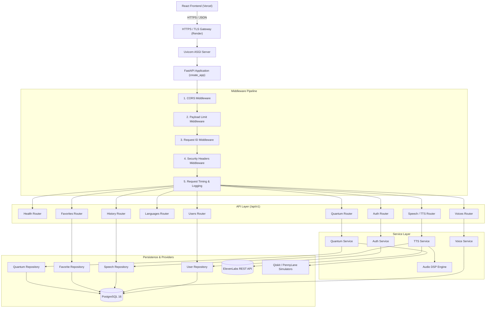
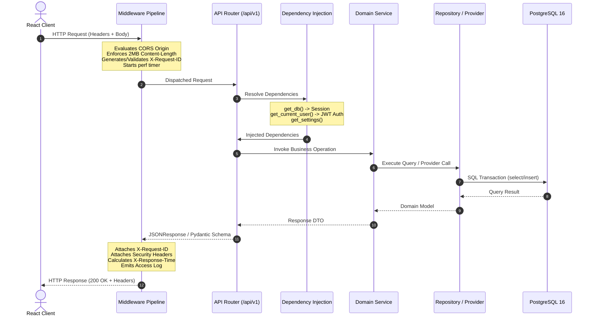

# Bloop Backend Architecture

## 1. Overview

The Bloop backend is built as an intermediate-level, production-grade **FastAPI** application operating on Python 3.12+. It serves as the single authoritative API runtime for the Bloop AI Text-to-Speech & Quantum Intelligence Platform.

Governing Runtime Principles:
- **FastAPI Owns the API Runtime**: Application lifecycle, routing, request parsing, dependency injection, middleware execution, exception handling, and OpenAPI documentation generation.
- **Router ≠ Business Logic**: Route handlers are strictly thin coordination layers delegating to domain services, repositories, and provider adapters.
- **Security Authority**: The backend is the sole security boundary; client claims, text lengths, and ownership are validated server-side.
- **Provider & Quantum Decoupling**: External provider calls (ElevenLabs) and Quantum Computing simulations (Qiskit/PennyLane) are isolated from core API runtime health.

---

## 2. System Architecture Diagram

---

## 3. Request Lifecycle Diagram

---

## 4. Layer Responsibilities & Boundaries

| Layer | Primary Responsibility | Prohibited Actions |
| :--- | :--- | :--- |
| **`app.factory`** | Application assembly, lifespan context, middleware registration | Business logic, direct DB queries |
| **`app.core.middleware`** | Cross-cutting HTTP headers, timing, correlation, security | Database access, user authentication |
| **`app.core.exceptions`** | Exception definitions, sanitized error serialization | Traceback exposure to clients |
| **`app.api.router`** | Route composition under `/api/v1` | Business logic |
| **`app.api.v1.endpoints`** | HTTP contract, parameter validation, DI invocation | SQL queries, raw provider HTTP calls |
| **`app.services`** | Domain business workflows, orchestration | Direct FastAPI route registration |
| **`app.repositories`** | Database queries, SQLAlchemy 2.x persistence | HTTP response creation |
| **`app.providers`** | External vendor adapters (ElevenLabs) | Database access |
| **`app.quantum`** | Quantum circuit simulation & modeling | Core TTS pipeline blocking |
