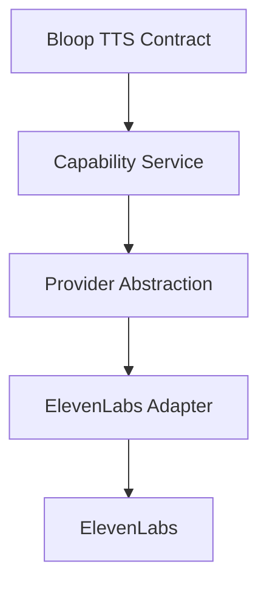

# Bloop Backend Architecture — Capability Mapping & Compatibility Engine

## 1. Overview

The **Capability Mapping Subsystem** manages provider capabilities, voice availability, and multilingual voice-to-language compatibility. It acts as an authoritative pre-synthesis gatekeeper that prevents invalid or incompatible requests from reaching speech synthesis engines.



---

## 2. Relational Capability Models

### 2.1 Provider Capability (`ProviderCapability`)
Decouples vendor-level language support from application-level exposure.

```sql
CREATE TABLE provider_capabilities (
    id SERIAL PRIMARY KEY,
    provider VARCHAR(50) NOT NULL,
    language_code VARCHAR(10) REFERENCES languages(code) ON DELETE CASCADE,
    provider_language_code VARCHAR(50),
    supported BOOLEAN NOT NULL DEFAULT true,
    enabled BOOLEAN NOT NULL DEFAULT true,
    metadata JSON,
    created_at TIMESTAMP WITH TIME ZONE NOT NULL,
    updated_at TIMESTAMP WITH TIME ZONE NOT NULL,
    CONSTRAINT uq_provider_language UNIQUE (provider, language_code)
);
```

### 2.2 Voice-Language Compatibility (`VoiceLanguageCapability`)
Enables dynamic many-to-many (M2M) relationships between voices and languages.

```sql
CREATE TABLE voice_language_capabilities (
    id SERIAL PRIMARY KEY,
    voice_id INTEGER REFERENCES voices(id) ON DELETE CASCADE,
    language_code VARCHAR(10) REFERENCES languages(code) ON DELETE CASCADE,
    supported BOOLEAN NOT NULL DEFAULT true,
    enabled BOOLEAN NOT NULL DEFAULT true,
    metadata JSON,
    created_at TIMESTAMP WITH TIME ZONE NOT NULL,
    CONSTRAINT uq_voice_language UNIQUE (voice_id, language_code)
);
```

---

## 3. Centralized Capability Service (`CapabilityService`)

All capability decisions are centralized in `backend/app/services/capability_service.py` to eliminate duplicated logic:

- `is_language_available(language_code: str) -> bool`: Checks if language is registered and active.
- `is_voice_available(voice_id: str) -> bool`: Checks if voice exists and is enabled.
- `is_voice_compatible_with_language(voice_id: str, language_code: str) -> bool`: Checks primary `language_code` or active `VoiceLanguageCapability` mappings.
- `get_supported_languages_for_voice(voice: Voice) -> List[str]`: Aggregates all compatible language codes.
- `validate_tts_capability(voice_id: str, language_code: str, provider: Optional[str] = None)`: Level 3 pre-synthesis validator.

---

## 4. TTS Validation Hierarchy & Non-Invocation Guarantee

Before any third-party synthesis provider (such as ElevenLabs) or local simulation engine is invoked, requests must traverse three strict validation layers:

```text
1. Layer 1: Pydantic Structural Validation (Types, required fields, payload size <= 10,000 chars)
      ↓
2. Layer 2: Text Processing & Validation Engine (Empty text, whitespace-only, chars <= 2,500)
      ↓
3. Layer 3: Capability & Compatibility Validation (Language active, Voice active, Voice supports Language)
      ↓
4. Provider Invocation (ElevenLabs / MockProvider)
```

| Failure Condition | Error Code | HTTP Status | Provider Called? |
| :--- | :--- | :---: | :---: |
| Missing or inactive language | `INVALID_LANGUAGE` | `422` | **STRICTLY NEVER** |
| Missing or inactive voice | `INVALID_VOICE` | `422` | **STRICTLY NEVER** |
| Voice does not support requested language | `VOICE_LANGUAGE_MISMATCH` | `422` | **STRICTLY NEVER** |
| Provider disabled language | `INVALID_LANGUAGE` | `422` | **STRICTLY NEVER** |
