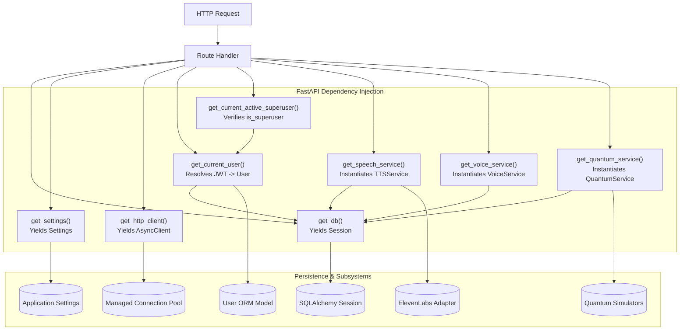

# Backend Dependency Injection

## 1. Overview

Bloop relies on FastAPI's native `Depends()` mechanism to handle cross-cutting concerns, session lifecycles, security resolution, and service provisioning.

Benefits:
- **Zero Global Mutable State**: Every request receives clean, request-scoped sessions.
- **Testability**: Any dependency can be overridden in tests via `app.dependency_overrides[dep] = mock_dep`.
- **Decoupled Architecture**: Routes do not instantiate database connections or service dependencies directly.

---

## 2. Dependency Graph



---

## 3. Core Dependencies

### 3.1 Database Session (`get_db`)
- Manages an isolated SQLAlchemy 2.x `Session` per incoming HTTP request.
- Automatically commits or rolls back on unhandled exceptions:
  ```python
  def get_db() -> Generator[Session, None, None]:
      db = SessionLocal()
      try:
          yield db
      except Exception:
          db.rollback()
          raise
      finally:
          db.close()
  ```

### 3.2 Authentication & Authorization
- `get_current_user`: Decodes JWT Bearer token, verifies active status, and resolves `User` model.
- `get_optional_current_user`: Returns authenticated `User` if token is provided; otherwise returns `None`.
- `get_current_active_superuser`: Asserts that `current_user.is_superuser` is `True`, rejecting others with `403 FORBIDDEN`.

### 3.3 Managed HTTP Client (`get_http_client`)
- Resolves the connection-pooled `httpx.AsyncClient` created during application lifespan.
- Enforces strict connection, read, and write timeouts for outbound provider requests.

### 3.4 Service Factory Dependencies
- `get_speech_service(db=Depends(get_db)) -> TTSService`
- `get_voice_service(db=Depends(get_db)) -> VoiceService`
- `get_quantum_service(db=Depends(get_db)) -> QuantumService`
- `get_auth_service(db=Depends(get_db)) -> AuthService`

---

## 4. Test Overrides Pattern

FastAPI allows clean test isolation by overriding dependencies without altering production code:

```python
from backend.app.db.session import get_db

def test_custom_endpoint(client, test_db_session):
    app.dependency_overrides[get_db] = lambda: test_db_session
    try:
        response = client.get("/api/v1/users/me")
        assert response.status_code == 200
    finally:
        app.dependency_overrides.clear()
```
