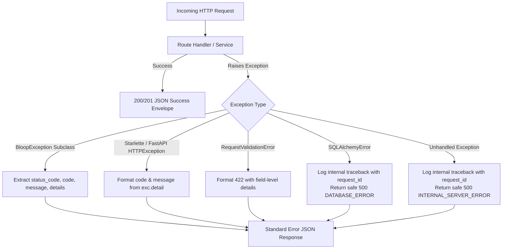

# Backend Error Handling & Exception Architecture

## 1. Overview

Bloop enforces a standardized, centralized exception handling strategy defined in [`backend/app/core/exceptions.py`](file:///c:/Users/DELL/Downloads/Bloop/backend/app/core/exceptions.py).

Guiding Error Principles:
1. **Predictable JSON Envelopes**: All error responses return a uniform contract across all endpoints.
2. **Zero Information Leakage**: Database schemas, raw SQL queries, internal stack traces, and provider secrets are never sent to clients.
3. **Structured Logging**: Unhandled server errors (500) and database errors are logged internally with complete tracebacks tagged with `request_id`.

---

## 2. Error Flow Diagram



---

## 3. Exception Hierarchy

```text
BloopException (Base)
├── ValidationException / ValidationError (422)
├── AuthenticationException / AuthenticationError (401)
├── AuthorizationException / AuthorizationError (403)
├── ResourceNotFoundException / NotFoundError (404)
├── ConflictException (409)
├── RateLimitException / RateLimitError (429)
├── ProviderException / ProviderError (502)
├── DatabaseException (500)
├── QuantumExecutionError (500)
├── ConfigurationError (500)
└── ServiceUnavailableException (503)
```

---

## 4. Standard Response Contracts

### Success Contract
```json
{
  "success": true,
  "data": {
    "id": 1,
    "email": "user@example.com"
  },
  "message": "User profile retrieved successfully."
}
```

### Error Contract
```json
{
  "success": false,
  "error": {
    "code": "VALIDATION_ERROR",
    "message": "Field 'text' must not be empty.",
    "details": {
      "field": "text"
    }
  }
}
```

### Database Error Sanitization Example
When a raw `SQLAlchemyError` occurs (e.g. database disconnect, lock timeout, constraint violation):
- **Internal Log** (stored in log files with `request_id`):
  ```text
  ERROR: Database error [request_id=c14e9f74a01]: (psycopg.OperationalError) connection to server at "postgres.render.com" failed
  [Traceback omitted]
  ```
- **Client Response**:
  ```json
  {
    "success": false,
    "error": {
      "code": "DATABASE_ERROR",
      "message": "A database error occurred. Please try again later.",
      "details": {}
    }
  }
  ```
