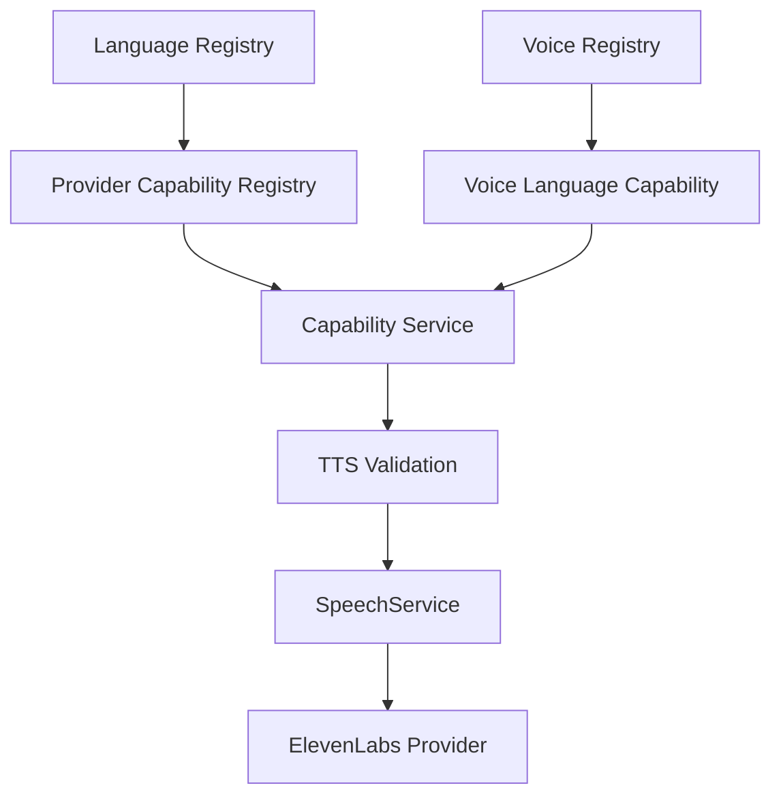

# Bloop Backend Architecture — Language Metadata & Localization Engine

## 1. Overview

The **Language Domain** within Bloop provides standard ISO 639-1 / BCP-47 linguistic metadata, bidirectional text layout hints (`ltr`/`rtl`), and external provider language resolution. It decouples application-level language configuration from external third-party speech vendor conventions.



---

## 2. Core Concepts & Boundaries

Bloop explicitly separates four distinct language concepts:

1. **Language Metadata:** Canonical attributes describing a human language (ISO code, English name, native script display name, text layout direction, and extensible script metadata).
2. **Provider Capability:** Whether a specific TTS provider (e.g. ElevenLabs, AWS Polly, Mock) supports synthesis in that language.
3. **Voice Capability:** Whether a specific voice can articulate speech in that language.
4. **Application Availability:** Whether Bloop administrators have enabled that language for end-user selection.

---

## 3. Language Domain Model

The `Language` model (`backend/app/models/language.py`) is persisted in PostgreSQL with the following schema:

| Column | Type | Constraints | Description |
| :--- | :--- | :--- | :--- |
| `code` | `VARCHAR(10)` | `PRIMARY KEY`, indexed | Standardized BCP-47 locale tag (e.g., `en-US`, `es-ES`, `ja-JP`) |
| `name` | `VARCHAR(100)` | `NOT NULL` | Standard English language display name |
| `native_name` | `VARCHAR(100)` | `NULLABLE` | Display name in native alphabet/script (e.g., `Español`, `हिन्दी`) |
| `direction` | `VARCHAR(5)` | `NOT NULL`, default: `'ltr'` | Layout direction for UI rendering (`'ltr'` or `'rtl'`) |
| `is_active` | `BOOLEAN` | `NOT NULL`, default: `true` | Application-level availability flag |
| `metadata` | `JSON` | `NULLABLE` | Extensible locale, script, and dialect parameters |
| `created_at` | `TIMESTAMP(TZ)`| `NOT NULL` | Timestamp of registration |
| `updated_at` | `TIMESTAMP(TZ)`| `NOT NULL` | Timestamp of last modification |

---

## 4. Provider Language Code Translation

Third-party speech vendors often diverge in locale formatting (e.g., ElevenLabs may utilize `"es"` while Bloop standardizes on `"es-ES"`).

The translation is handled transparently by `LanguageService.resolve_provider_language()`:

```text
Bloop Request ("es-ES")
        ↓
ProviderCapability Lookup (provider="elevenlabs", language_code="es-ES")
        ↓
Matched provider_language_code ("es")
        ↓
Dispatched to ElevenLabs ("es")
```

If no provider override is configured, the Bloop canonical code is passed downstream as the safe default.

---

## 5. Empty Catalog Behavior

If no languages are registered or active:
- `GET /api/v1/languages` returns `200 OK` with `data: []`.
- Synthesizing speech with any language returns `422 Unprocessable Entity` with error code `INVALID_LANGUAGE`.
- No hardcoded fallback languages are fabricated.
