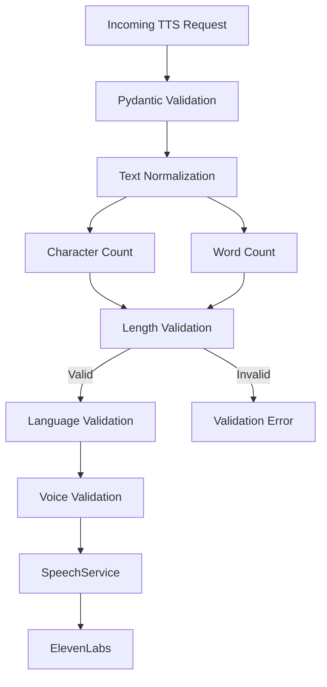

# Bloop Text Processing, Character/Word Counting & Backend Validation Engine

## 1. Executive Summary & Pipeline Overview

The **Bloop Text Processing & Backend Validation Engine** serves as the authoritative gateway between external client requests and downstream speech synthesis services. Positioned directly between the FastAPI REST layer and the `SpeechService` / TTS providers, this engine ensures that all text submitted to Bloop is present, meaningful, normalized, within configured boundaries, and safe for acoustic synthesis.

Crucially, the backend remains the **final authority** for validation. While the React/TypeScript frontend computes local metrics for immediate user feedback, client-reported metrics are never blindly trusted by the backend.

---

## 2. Text Processing & Validation Architecture



---

## 3. The Three Validation Levels

To maintain clean separation of concerns and avoid monolithic validation logic, Bloop segregates validation into three distinct levels:

| Level | Responsible Layer | Rules Enforced | Failure Code | HTTP Status |
| :--- | :--- | :--- | :--- | :--- |
| **Level 1 — Request Structure** | Pydantic v2 Schema (`TTSRequest`) | Required fields, field types, schema shape, basic transport length boundaries (`max_length=10000`). | `VALIDATION_ERROR` | `422 Unprocessable Entity` |
| **Level 2 — Text Validation** | `TextValidator` & `TextProcessor` | Presence, empty check, whitespace-only rejection, conservative normalization, authoritative character count, word count, `MAX_TEXT_CHARACTERS` enforcement (default: 2500). | `TEXT_EMPTY`, `TEXT_TOO_LONG` | `422 Unprocessable Entity` |
| **Level 3 — Domain Validation** | `TTSService` & Service Layer | State-dependent checks: voice exists in registry, voice is active, voice supports requested language, user authorization, rate limit compliance. | `RESOURCE_NOT_FOUND`, `INVALID_VOICE`, `VOICE_LANGUAGE_MISMATCH` | `404 Not Found` / `422` / `403` |

---

## 4. Counting & Normalization Semantics

### 4.1 Conservative Normalization Rules
1. **Line Ending Unification:** Converts CRLF (`\r\n`) and CR (`\r`) to standard Unix line feeds (`\n`).
2. **Surrounding Whitespace Stripping:** Strips leading and trailing whitespace from the full text string (`text.strip()`).
3. **Control Code Filtering:** Safely strips non-printable ASCII control characters (`\x00-\x08`, `\x0b`, `\x0c`, `\x0e-\x1f`, `\x7f`) using a linear $O(n)$ regex pass. Valid formatting whitespace—specifically horizontal tab (`\t`) and newline (`\n`)—is strictly preserved.
4. **Structural Whitespace Preservation:** Internal repeated spaces, indentation, and paragraph breaks (`\n\n`) are preserved faithfully to respect intended speech pacing.
5. **No Semantic Alterations:** The engine never performs automatic spelling correction, grammar rewriting, translation, or punctuation mutation.

### 4.2 Authoritative Character Counting
- Calculated via `len(normalized_text)`.
- Spaces, tabs, newlines, punctuation, numbers, and symbols are counted.
- Multilingual Unicode codepoints (CJK, Arabic, Cyrillic, accented characters, emoji) count as individual Python string characters.

### 4.3 Authoritative Word Counting
- Calculated using deterministic whitespace tokenization: `len(normalized_text.split())`.
- Consecutive spaces, tabs, and newlines do not generate phantom words.
- `"Hello   Bloop"` yields 2 words.
- Punctuation-attached words (`"Hello, World!"`) yield 2 words.
- Whitespace-only input yields 0 words.

### 4.4 Speaking Duration Estimation
- Based on standard conversational pacing of 150 words per minute (2.5 words/second):
  $$\text{duration} = \max\left(\frac{\text{word\_count}}{2.5}, 0.5\right) \text{ seconds}$$
- Non-empty text consisting solely of punctuation/symbols defaults to 0.5 seconds.
- Empty text yields 0.0 seconds.

---

## 5. Centralized Configuration

Limits are centrally controlled through environment configuration in `backend/app/core/config.py`:

```python
MIN_TEXT_CHARACTERS: int = 1      # Configurable via MIN_TEXT_CHARACTERS / MIN_TEXT_LENGTH
MAX_TEXT_CHARACTERS: int = 2500   # Configurable via MAX_TEXT_CHARACTERS / MAX_TEXT_LENGTH
```

---

## 6. Provider Protection & Security Guarantees

1. **Provider Non-Invocation Guarantee:** The TTS provider (ElevenLabs or simulation) is **never called** when text validation fails. Tests explicitly verify with mock spies that `generate_speech()` is never reached on invalid, empty, or oversized input.
2. **ReDoS Immunity:** No complex or nested regular expressions are used. Character and word counting use deterministic $O(n)$ string methods, preventing catastrophic backtracking.
3. **Control Character Neutralization:** Malicious null bytes and terminal control codes are filtered before reaching audio generation.
4. **Error Sanitization:** Validation errors return standard envelopes containing only safe metrics (`max_characters`, `actual_characters`) without exposing internal tracebacks or system state.
