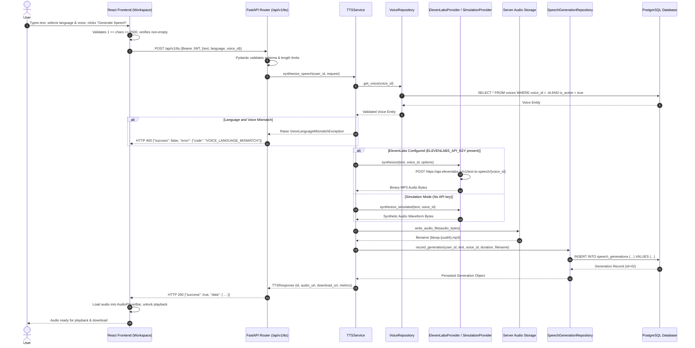
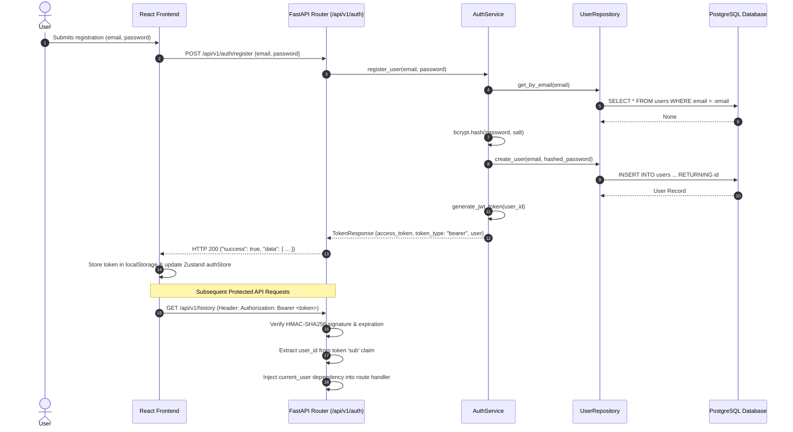
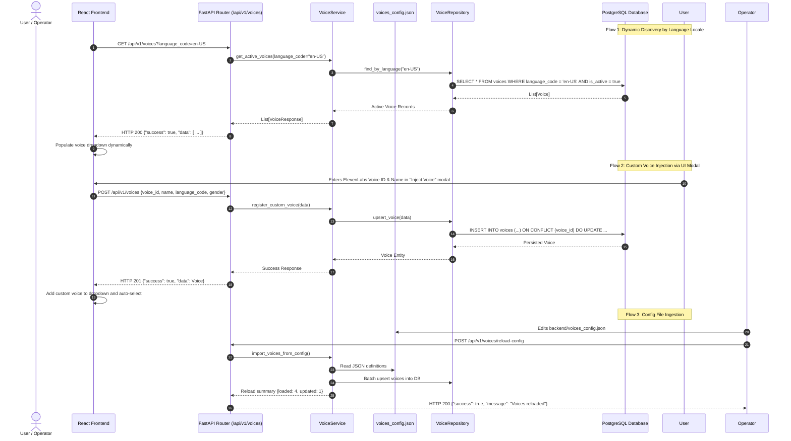
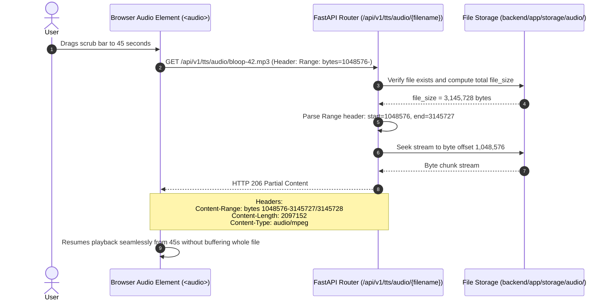
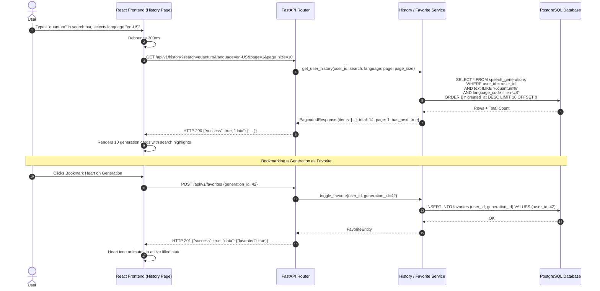
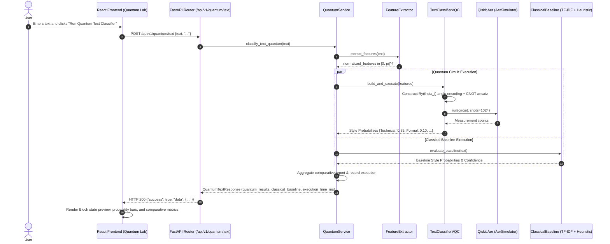
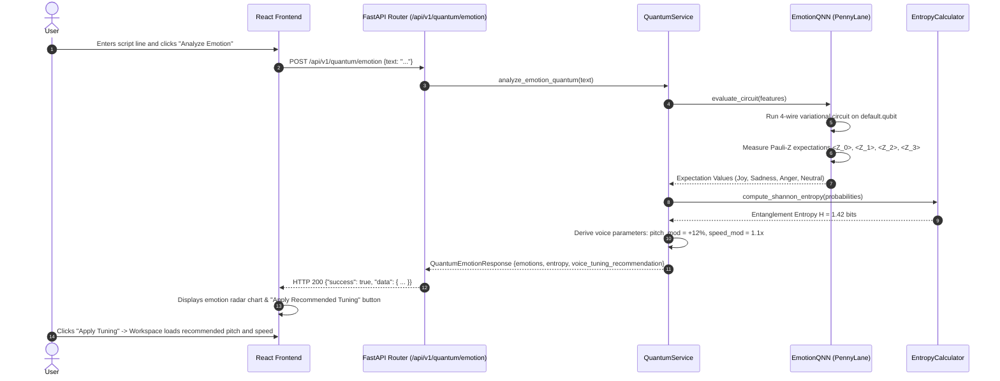
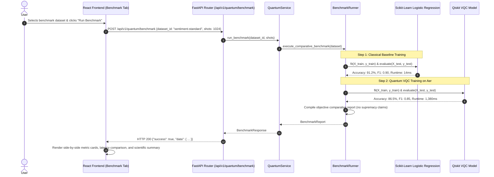

# Bloop — System Data Flow Specifications

**Document Identifier:** BLOOP-DATAFLOW-V1  
**Project:** Bloop — AI Text-to-Speech & Quantum Intelligence Platform  
**Target Milestone:** Intermediate-Level Architecture  
**Status:** Approved Technical Design  
**Authority:** Bloop Master Prompt & Prompt 02

---

## 1. Overview

This document specifies the end-to-end data flows and interaction sequence diagrams for all primary operations in Bloop. Each sequence diagram models the exact communication contracts between the User, React Frontend, FastAPI Router, Application Services, Repositories, Database, and External/Simulation Providers.

---

## 2. End-to-End Speech Synthesis Data Flow

---

## 3. User Authentication & JWT Authorization Data Flow

---

## 4. Dynamic Voice Ingestion & Discovery Data Flow

---

## 5. Audio Streaming & HTTP 206 Partial Content Range Flow

---

## 6. History, Search, Filter & Bookmarking Data Flow

---

## 7. Quantum Text Classification (VQC) Data Flow

---

## 8. Quantum Emotion QNN & Speech Tuning Data Flow

---

## 9. Classical vs. Quantum Empirical Benchmark Data Flow

