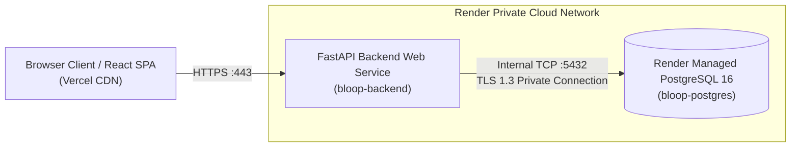

# Bloop Production PostgreSQL Deployment & Operations Guide

**Document Identifier:** BLOOP-DB-DEPLOY-007  
**Status:** Approved Operational Standard  
**Target Platform:** Render Managed PostgreSQL 16  

---

## 1. Production Database Architecture

In production, Bloop utilizes **Render Managed PostgreSQL 16**:
- **Engine:** PostgreSQL 16.x with SSL/TLS 1.3 encryption-in-transit.
- **Network Topology:** Communicates over Render's private virtual network (`dpg-xxx.render.com:5432`) via internal connection string, avoiding public internet exposure.
- **Storage Tier:** High-performance SSD block storage with automated daily snapshots and point-in-time recovery.



---

## 2. Declarative Blueprint (`render.yaml`) Database Binding

The database instance and web service connection are declared natively in `render.yaml`:

```yaml
services:
  - type: web
    name: bloop-backend
    runtime: python
    buildCommand: "pip install -r backend/requirements.txt && alembic upgrade head"
    startCommand: "uvicorn backend.app.main:app --host 0.0.0.0 --port $PORT"
    healthCheckPath: /api/v1/health
    envVars:
      - key: DATABASE_URL
        fromDatabase:
          name: bloop-postgres
          property: connectionString

databases:
  - name: bloop-postgres
    databaseName: bloop_db
    user: bloop_user
    plan: free
```

---

## 3. Migration Execution During Deployment

Render automatically executes migrations during the build phase:
```bash
pip install -r backend/requirements.txt && alembic upgrade head
```

### Safety Advantages:
1. **Atomic Pre-Boot Migration:** Schema changes are applied **before** the new Uvicorn server processes boot and begin serving traffic.
2. **Failed Migration Abort:** If a migration fails (e.g. constraint violation or syntax error), the Render build step fails immediately. The previous stable container continues serving traffic without downtime.
3. **Health Check Gate:** Following migration and server start, Render tests `/api/v1/health`. Only when an HTTP 200 OK is received does traffic switch over.

---

## 4. Backup & Disaster Recovery Strategy

1. **Automated Snapshots:** Render Managed PostgreSQL captures automated daily snapshots with 7-day retention on standard plans.
2. **Manual Point-in-Time Dumps:** Prior to major application upgrades or schema transformations:
   ```bash
   pg_dump -h $DB_HOST -U $DB_USER -d bloop_db -F c -b -v -f "bloop_backup_$(date +%Y%m%d_%H%M%S).dump"
   ```
3. **Restoration Runbook:** In the event of catastrophic failure or corrupt state:
   ```bash
   pg_restore -h $DB_HOST -U $DB_USER -d bloop_db -v "bloop_backup_YYYYMMDD_HHMMSS.dump"
   ```
