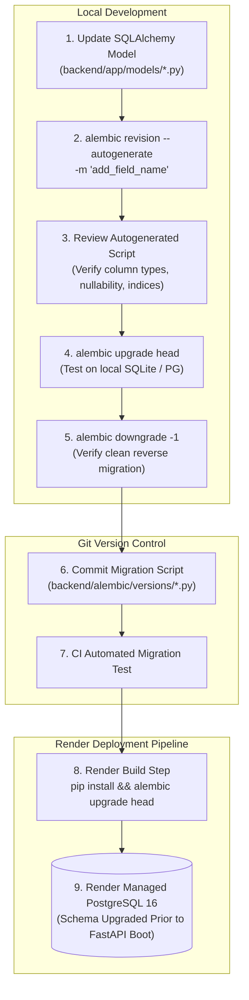

# Bloop Database Migrations & Alembic Runbook

**Document Identifier:** BLOOP-DB-MIG-007  
**Status:** Approved Operational Standard  
**Tooling:** Alembic + SQLAlchemy 2.x  

---

## 1. Migration Philosophy & Authority

> **Alembic is the sole authority for modifying relational schema.**

Manual database schema alterations (`ALTER TABLE` executed directly via psql) are strictly prohibited in production and staging environments. All schema evolutions must be tracked in version-controlled migration revisions.

---

## 2. Migration Flow Architecture



---

## 3. Standard Developer Migration Commands

All migration commands are executed from the repository root:

### 3.1 Applying Migrations
Apply all unapplied migrations up to latest revision:
```bash
alembic upgrade head
```

### 3.2 Generating a New Revision
Autogenerate a new revision based on model modifications:
```bash
alembic revision --autogenerate -m "add_custom_field_to_voices"
```

### 3.3 Inspecting Migration History
Display current active revision and migration history:
```bash
alembic current
alembic history --verbose
```

### 3.4 Rolling Back a Migration
Revert the most recent migration step:
```bash
alembic downgrade -1
```

---

## 4. Migration Safety & Review Checklist

Before committing an autogenerated revision, verify:
- [ ] **No Destructive Drops:** Ensure Alembic did not inadvertently generate table drops due to unimported models.
- [ ] **Nullable Transitions:** Adding a non-nullable column to an existing table with rows must provide a `server_default`.
- [ ] **Locking & Blocking:** Heavy index creations on high-volume production tables should use concurrent index creation in PostgreSQL if feasible.
- [ ] **Clean Downgrade:** Verify that `downgrade()` reverses every step in `upgrade()` in exact reverse order.
- [ ] **No Seed Data in Migrations:** Migrations handle schema structure only; baseline data belongs in dedicated seed scripts (`init_db.py`).
