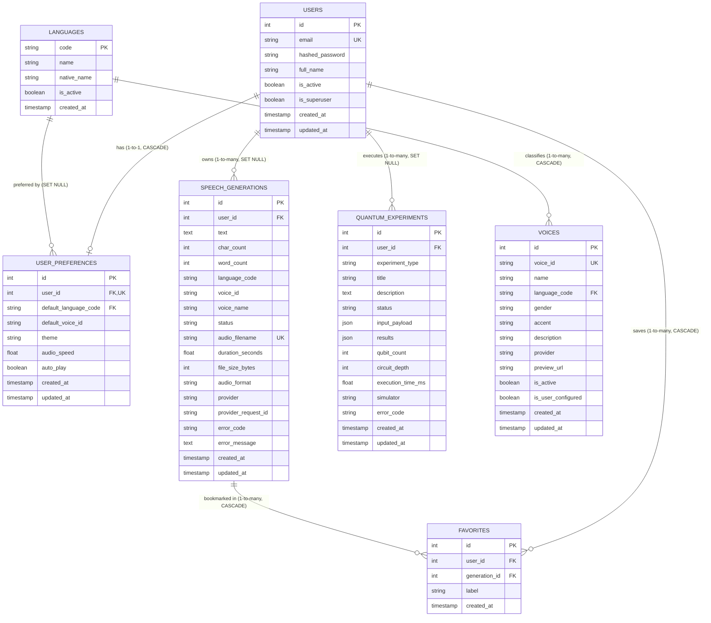

# Bloop Relational Entity Relationships & ER Diagram

**Document Identifier:** BLOOP-DB-REL-007  
**Status:** Approved Technical Standard  
**Target Engine:** PostgreSQL 16 (Render Managed)  

---

## 1. Entity-Relationship (ER) Diagram

---

## 2. Foreign Key & Deletion Cascade Policies

| Source Table | Foreign Key Column | Target Table.Column | On Delete Action | Rationale |
| :--- | :--- | :--- | :--- | :--- |
| `user_preferences` | `user_id` | `users.id` | **CASCADE** | A preference record has no lifecycle outside its user owner. |
| `user_preferences` | `default_language_code`| `languages.code` | **SET NULL** | If a language code is disabled, retain the preference record with null. |
| `voices` | `language_code` | `languages.code` | **CASCADE** | Dynamic voices registered under a language depend on that language. |
| `speech_generations`| `user_id` | `users.id` | **SET NULL** | Retains anonymous generation history and audio metrics even if user deletes account. |
| `favorites` | `user_id` | `users.id` | **CASCADE** | If a user is deleted, all their bookmarks must be purged. |
| `favorites` | `generation_id` | `speech_generations.id` | **CASCADE** | If a generation is deleted from disk and DB, its favorite bookmarks are purged. |
| `quantum_experiments`| `user_id` | `users.id` | **SET NULL** | Scientific logs and benchmark telemetry are preserved anonymously. |

---

## 3. Ownership & Authorization Invariant

Bloop database relationships strictly enforce tenancy isolation:
1. **No Cross-User Queries:** Repositories filter records using `WHERE user_id = :authenticated_user_id`.
2. **Favoriting Authorization:** A user cannot favorite another user's generation unless explicitly made public.
3. **Compound Deletions:** Deleting a generation automatically triggers an atomic cascade delete of associated favorites.
