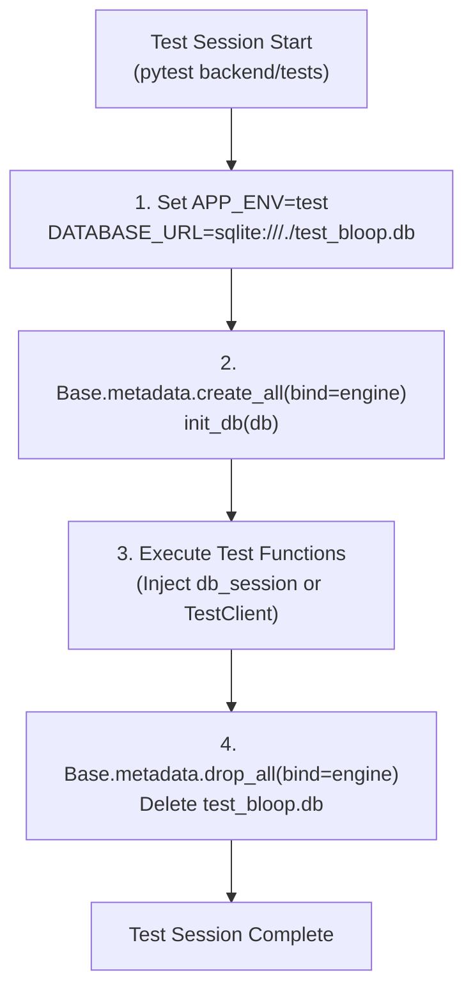

# Bloop Database Testing Strategy & Test Isolation

**Document Identifier:** BLOOP-DB-TEST-007  
**Status:** Approved Testing Standard  
**Tooling:** pytest, pytest-asyncio, SQLite In-Memory / Isolated File  

---

## 1. Database Testing Invariants

1. **Complete Production Isolation:** Automated tests must **NEVER** touch, connect to, or execute against production or staging databases.
2. **Automated Fail-Fast Guardrail:** `backend/app/core/config.py` enforces a safety invariant: if `APP_ENV=test` and `DATABASE_URL` contains production hostnames (`render.com`, `dpg-`, `prod-db`), execution terminates immediately with a fatal `ValueError`.
3. **Deterministic Reset:** Every test suite execution runs against a freshly initialized test schema with deterministic teardown.

---

## 2. Pytest Database Fixture Architecture

Database tests leverage fixtures defined in `backend/tests/conftest.py`:



### Key Fixtures:
- **`setup_test_db` (scope="session", autouse=True):** Builds all 7 tables in `test_bloop.db`, seeds standard baseline languages, and purges the file upon test suite conclusion.
- **`db_session` (scope="function"):** Yields an isolated `SessionLocal` instance for individual unit tests with guaranteed closure upon test completion.
- **`client` (scope="function"):** Provides a FastAPI `TestClient(app)` with database dependency overrides.

---

## 3. Database Test Cases Checklist

All relational constraints and behaviors are verified in `backend/tests/unit/test_database.py`:

| Domain | Tested Invariant | Verified Behavior |
| :--- | :--- | :--- |
| **Users** | Password Hash Invariant | Raw password never saved; bcrypt hash verified. |
| **Users** | Email Uniqueness | Duplicate email raises `IntegrityError`. |
| **Preferences** | Cascade Deletion | Deleting `User` cascades and deletes `UserPreference`. |
| **Languages** | Primary Key Integrity | Unique `code` PK verified. |
| **Voices** | Dynamic Registration | Can register custom voices; duplicate `voice_id` fails. |
| **Speech** | Lifecycle & Audio Reference | Status transitions and file size persisted; zero binary audio. |
| **Favorites** | Uniqueness per User/Gen | Duplicate bookmark raises `IntegrityError`. |
| **Quantum** | Decoupled Persistence | JSON payloads and results persist independently of TTS. |
| **Session** | Automatic Rollback | `get_db` automatically executes `db.rollback()` on exceptions. |

---

## 4. Running Database Tests

```bash
# Run database unit tests exclusively
pytest backend/tests/unit/test_database.py -v

# Run full backend test suite including database tests
pytest backend/tests
```
