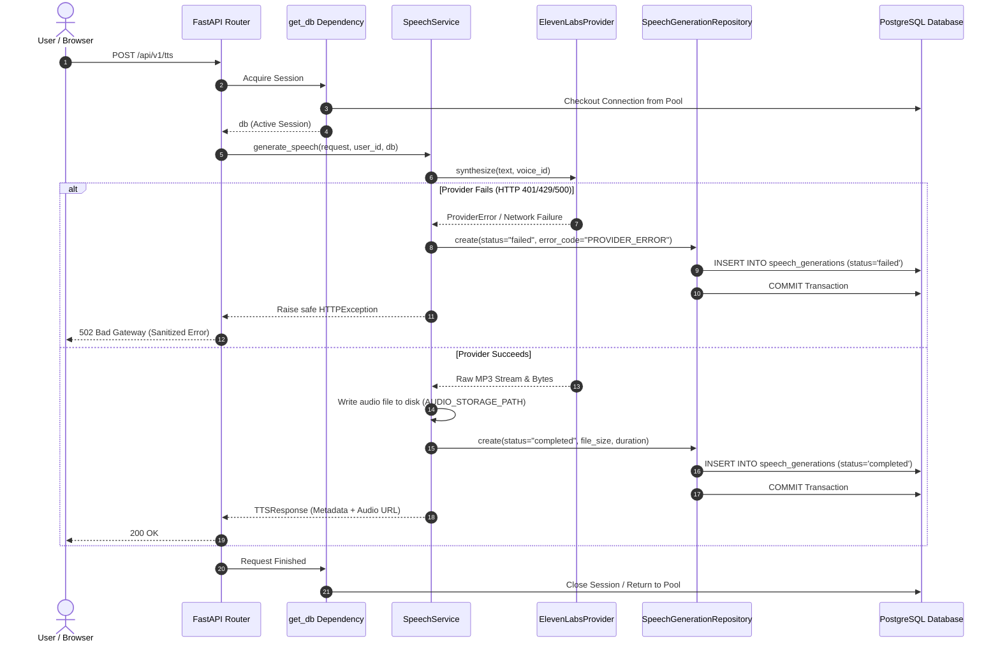

# Bloop Database Transaction Boundaries & Consistency Policy

**Document Identifier:** BLOOP-DB-TX-007  
**Status:** Approved Technical Standard  
**Target Architecture:** FastAPI + SQLAlchemy 2.x Session Scoping  

---

## 1. Transaction Boundary Philosophy

Bloop establishes strict transactional boundaries:
1. **One Request, One Session:** Every HTTP request acquires an isolated `Session` through the `get_db` dependency.
2. **Deterministic Boundaries:** The Service layer orchestrates domain operations and determines when a transaction commits.
3. **Automatic Error Rollback:** The `get_db` generator captures unhandled exceptions and automatically executes `db.rollback()` before returning the socket to the pool.
4. **No Hidden Ambient Commits:** Commits occur explicitly in repositories and services; no autocommit mode is permitted.

---

## 2. Request Lifecycle & Transaction Sequence

---

## 3. ElevenLabs Failure Consistency Rule

A critical architectural invariant:
> **Never persist a `completed` speech record if the external provider call failed or the audio file could not be written to disk.**

### Handled Scenarios:
- **Provider Refusal (Quota / Invalid Voice):** Mark generation as `failed` with sanitized `error_code` (e.g. `QUOTA_EXCEEDED`, `VOICE_NOT_FOUND`). No audio file is referenced.
- **Disk Write Error:** If disk space fails during streaming write, rollback the database transaction immediately so orphaned records are not created.
- **Zero Credential Leaks:** Even on catastrophic provider errors, raw HTTP request headers (`xi-api-key`), JWT tokens, or credentials must never be written to `error_message` columns.

---

## 4. Quantum vs TTS Transaction Isolation

Quantum computing operations are strictly partitioned from speech synthesis transactions:
- Quantum benchmark runs or circuit simulations execute independently in `QuantumService`.
- If an out-of-memory or timeout error occurs in Qiskit simulation (`QUANTUM_MAX_EXECUTION_TIME=30s`), it is caught in `QuantumService`, logged as a `failed` `QuantumExperiment`, and committed without interrupting any ongoing speech generations or user sessions.
