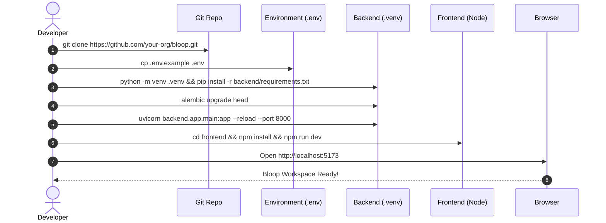

# Bloop — Local Development Environment Setup Guide

**Document Identifier:** BLOOP-DEV-SETUP-V1  
**Project:** Bloop — AI Text-to-Speech & Quantum Intelligence Platform  
**Target Milestone:** Seamless Local Developer Experience  
**Status:** Approved Technical Guide  
**Authority:** Bloop Master Prompt & Prompt 03  

---

## 1. Prerequisites

Before setting up Bloop locally, ensure your machine has the following dependencies installed:

| Requirement | Minimum Version | Recommended Version | Verification Command |
| :--- | :--- | :--- | :--- |
| **Git** | 2.40+ | Latest | `git --version` |
| **Python** | 3.11.0 | 3.11.9 or 3.12.x | `python --version` |
| **Node.js** | 20.0.0 LTS | 20.x or 22.x LTS | `node --version` |
| **npm** | 10.0.0 | Latest | `npm --version` |

---

## 2. Step-by-Step Local Setup Workflow



---

## 3. Step 1: Clone the Repository

Clone the monorepo from GitHub and navigate to the project root:

```bash
git clone https://github.com/your-org/bloop.git
cd bloop
```

---

## 4. Step 2: Configure Environment Variables

Create your local `.env` configuration from the provided template:

```bash
# On Linux / macOS / Git Bash
cp .env.example .env

# On Windows PowerShell
Copy-Item .env.example .env
```

### Key Local Settings in `.env`:
- `ENVIRONMENT=development`
- `DATABASE_URL=sqlite:///./bloop.db` (Default SQLite database for zero-config local development)
- `ELEVENLABS_API_KEY=` (Leave empty to use the built-in offline synthetic waveform provider)
- `BACKEND_CORS_ORIGINS=http://localhost:5173,http://localhost:3000`

---

## 5. Step 3: Backend Environment Setup

Create an isolated Python virtual environment, install dependencies, run database migrations, and launch the development server.

### 5.1 Create & Activate Virtual Environment

**On Windows (PowerShell):**
```powershell
python -m venv .venv
.\.venv\Scripts\Activate.ps1
```

**On Linux / macOS:**
```bash
python3 -m venv .venv
source .venv/bin/activate
```

### 5.2 Install Python Dependencies

```bash
pip install --upgrade pip
pip install -r backend/requirements.txt
```

*(Optional: Install developer and testing tools)*
```bash
pip install -r backend/requirements-dev.txt
```

### 5.3 Run Database Migrations

Initialize the local SQLite database schema using Alembic:

```bash
alembic upgrade head
```

This creates the local `bloop.db` SQLite database with all required tables (`users`, `voices`, `languages`, `speech_generations`, `favorites`, `user_preferences`, `quantum_experiments`).

### 5.4 Start the FastAPI Backend Server

```bash
uvicorn backend.app.main:app --reload --host 127.0.0.1 --port 8000
```

Verify backend health:
- **Health Check:** Open `http://localhost:8000/api/v1/health` (should return `"status": "healthy"`).
- **Interactive Swagger Docs:** Open `http://localhost:8000/docs`.

---

## 6. Step 4: Frontend Setup & Execution

In a separate terminal window, set up and launch the React 19 Single Page Application.

### 6.1 Install Node Dependencies

```bash
cd frontend
npm install
```

### 6.2 Configure Frontend Environment

Verify `frontend/.env` exists or create it:

```bash
# Inside frontend/
echo "VITE_API_BASE_URL=http://localhost:8000" > .env
```

### 6.3 Start the Vite Development Server

```bash
npm run dev
```

The Vite dev server will start instantly, typically at:
```
  VITE v6.2.0  ready in 180 ms

  ➜  Local:   http://localhost:5173/
  ➜  Network: use --host to expose
```

Open `http://localhost:5173` in your browser to interact with Bloop.

---

## 7. Step 5: Running Automated Test Suites

Bloop includes complete automated test coverage for both backend and frontend.

### 7.1 Run Backend Tests (Pytest)

From the project root:

```bash
# Run all backend unit and integration tests
pytest backend/tests -v
```

### 7.2 Run Frontend Tests (Vitest)

From the `frontend/` directory:

```bash
cd frontend
npm test
```

---

## 8. Troubleshooting Common Local Issues

| Issue | Root Cause | Resolution |
| :--- | :--- | :--- |
| **Port 8000 already in use** | Another process is occupying port 8000. | Start Uvicorn on another port (`--port 8001`) and update `VITE_API_BASE_URL=http://localhost:8001` in `frontend/.env`. |
| **Alembic: `Target database is not up to date`** | Migration revision mismatch. | Run `alembic upgrade head` to apply all pending revisions. |
| **CORS error in browser console** | Frontend origin missing from `BACKEND_CORS_ORIGINS`. | Ensure your frontend URL (`http://localhost:5173`) is listed in `.env` under `BACKEND_CORS_ORIGINS`. |
| **Qiskit Aer binary wheel error** | Python version incompatibility (e.g. using Python 3.13 before pre-built wheels exist). | Ensure your virtual environment is using Python 3.11 or 3.12 (`python --version`). |
| **ElevenLabs audio generates tones instead of voice** | `ELEVENLABS_API_KEY` is not configured. | This is expected behavior! Bloop defaults to `SimulationTTSProvider` for offline development. Add a valid key to `.env` to enable live speech. |
