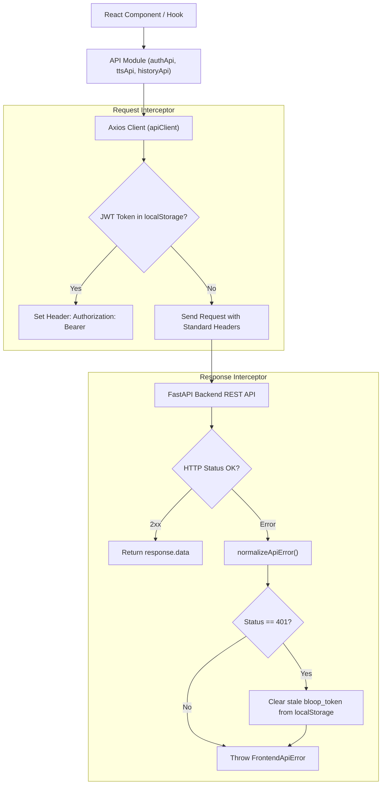
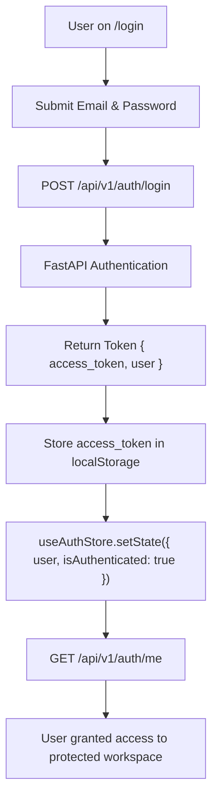
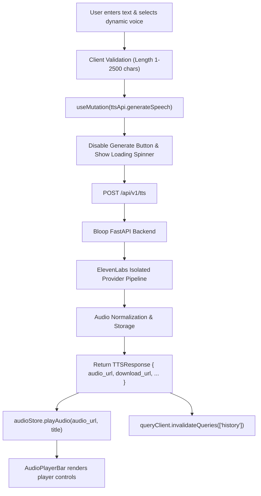

# API Client Architecture & Error Normalization

## 1. API Client Overview

Bloop's frontend communicates with the FastAPI backend through a centralized **Axios** client (`src/api/client.ts`) configured with strict interceptors for authentication, session lifecycle, and standardized error normalization.



---

## 2. API Contract & Response Envelopes

Every JSON endpoint conforms to the established Bloop REST contract:

### Success Envelope
```json
{
  "success": true,
  "data": { ... },
  "message": "Optional human-readable confirmation"
}
```

### Error Envelope
```json
{
  "success": false,
  "error": {
    "code": "ERROR_CODE",
    "message": "Human-readable explanation of error",
    "details": { ... }
  }
}
```

---

## 3. Normalized Error Model (`FrontendApiError`)

Raw Axios error objects and network exceptions are transformed into instances of `FrontendApiError`:

```typescript
export class FrontendApiError extends Error {
  public readonly code: string;
  public readonly status?: number;
  public readonly details?: unknown;
  public readonly timestamp: string;

  // Predicate helpers for clean UI logic:
  public isAuthError(): boolean;
  public isForbidden(): boolean;
  public isNotFound(): boolean;
  public isConflict(): boolean;
  public isValidationError(): boolean;
  public isRateLimit(): boolean;
  public isServerError(): boolean;
  public isNetworkError(): boolean;
}
```

### HTTP Status Code Mapping
| Status Code | Default User-Friendly Message | UI Behavior |
|---|---|---|
| **400 Bad Request** | The request could not be processed due to invalid parameters. | Inline field feedback |
| **401 Unauthorized** | Your session has expired or you are not signed in. | Token purged; redirect to `/login` |
| **403 Forbidden** | You do not have permission to perform this action. | Alert banner; action blocked |
| **404 Not Found** | The requested resource could not be found. | Render 404 or empty state |
| **409 Conflict** | This operation conflicts with an existing resource. | Warning banner (e.g. duplicate favorite) |
| **422 Validation Error** | Validation failed. Please check your inputs and try again. | Form field validation messages |
| **429 Rate Limit** | You have reached the current request limit. Please try again later. | Alert message; disable submission temporarily |
| **500 Internal Error** | A backend server error occurred. Please try again shortly. | General error banner; retry button |
| **503 Unavailable** | The speech generation service is temporarily unavailable. | Retry prompt without losing draft text |

---

## 4. Authentication Flow



---

## 5. TTS Speech Generation Data Flow



---

## 6. Frontend Security Policies

1. **No Sensitive Tokens in Logs**: Logging sensitive passwords, raw speech text, or JWT tokens in console outputs is strictly prohibited.
2. **Untrusted Content Protection**: User speech content is rendered strictly via standard React text nodes. `dangerouslySetInnerHTML` is never used for user-submitted content.
3. **Audio URL Validation**: Only relative URLs or backend URLs matching `appConfig.apiBaseUrl` are passed to media players.
