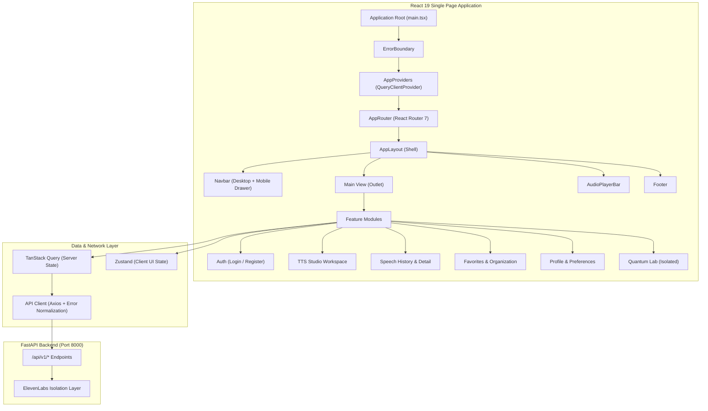

# Bloop Frontend Architecture

## 1. System Overview

Bloop's frontend is a high-performance, single-page application built on **React 19**, **TypeScript**, and **Vite**, styled with **Tailwind CSS**. It serves as an intelligent voice synthesis workspace paired with an isolated Quantum Intelligence laboratory.



---

## 2. Architectural Principles

1. **Strict Feature Boundaries**:
   Features own their UI components, specialized hooks, queries, and mutations. Shared components remain minimal and domain-agnostic in `components/ui/` and `components/common/`.
2. **Strict Server vs. Client State Delineation**:
   Server entities (user profiles, user preferences, voices, languages, speech generations, favorites, quantum experiments) are managed exclusively by **TanStack Query**. Local UI states (active audio playback bar, mobile drawer toggle, modal visibility, draft textarea length) are managed by **Zustand** or local component state.
3. **Zero Secrets in Frontend**:
   Only variables prefixed with `VITE_` and documented in `.env.example` may be accessed via `src/app/config.ts`. Backend secrets, database URLs, JWT signing keys, and ElevenLabs API credentials are strictly prohibited from the client bundle.
4. **Provider Isolation**:
   The frontend never communicates with third-party speech engines (ElevenLabs) directly. All audio synthesis, analysis, and streaming flows route through the Bloop FastAPI backend.
5. **Dynamic Voice Architecture**:
   The frontend never hardcodes ElevenLabs voice IDs or catalogs. Voices are fetched dynamically via `/api/v1/voices`. If the backend returns an empty list (`[]`), the frontend gracefully renders an empty catalog state.
6. **Accessible & Responsive by Default**:
   All interactive primitives adhere to WCAG 2.1 AA standards: semantic markup, ARIA roles, visible focus outlines, keyboard navigation, and responsive layouts across mobile, tablet, laptop, and desktop.

---

## 3. Directory Layout

```text
frontend/
├── public/                     # Static assets and favicon
├── src/
│   ├── app/                    # Application bootstrap & global wiring
│   │   ├── App.tsx             # Root component with ErrorBoundary
│   │   ├── config.ts           # Centralized frozen runtime config & security audit
│   │   ├── index.ts            # App barrel export
│   │   ├── providers.tsx       # TanStack Query & context providers
│   │   └── router.tsx          # Route hierarchy with ProtectedRoute guards
│   ├── assets/                 # SVGs and static brand graphics
│   ├── components/             # Reusable UI primitives and layout
│   │   ├── common/             # AppLayout, Navbar, Footer, AudioPlayerBar, ErrorBoundary
│   │   ├── feedback/           # AlertBanner, notifications
│   │   ├── forms/              # FormField, form controls
│   │   ├── quantum/            # Quantum visualization components
│   │   ├── tts/                # Workspace text area, voice selectors, audio player
│   │   └── ui/                 # Core design primitives (Button, Input, Textarea, Modal, etc.)
│   ├── layouts/                # AppLayout shell wrapper
│   ├── lib/
│   │   ├── api/                # API client, FrontendApiError, normalization
│   │   └── queryClient.ts      # Configured TanStack QueryClient
│   ├── pages/                  # Route view components
│   │   ├── WorkspacePage.tsx   # Core speech generation studio
│   │   ├── HistoryPage.tsx     # Paginated search and filter history
│   │   ├── HistoryDetailPage.tsx # Generation metadata inspection
│   │   ├── FavoritesPage.tsx   # Saved bookmarks and organization
│   │   ├── DashboardPage.tsx   # Usage metrics & quick actions
│   │   ├── ProfilePage.tsx     # Account settings
│   │   ├── PreferencesPage.tsx # Audio and theme preferences
│   │   ├── LoginPage.tsx       # Sign in
│   │   ├── RegisterPage.tsx    # Sign up
│   │   ├── NotFoundPage.tsx    # Accessible 404 catch-all
│   │   └── quantum/            # Quantum Laboratory views
│   ├── routes/                 # ProtectedRoute guards
│   ├── stores/                 # Scoped Zustand client stores (auth, workspace, audio)
│   ├── test/                   # Vitest infrastructure, mocks, fixtures, and tests
│   ├── types/                  # Standardized API contracts and domain types
│   ├── index.css               # Tailwind directives, fonts, glassmorphism utilities
│   └── main.tsx                # React 19 root bootstrap
├── tailwind.config.js          # Bloop & Quantum color palette tokens
├── tsconfig.json               # Strict TypeScript configuration
├── vercel.json                 # SPA fallback rewrite rules
└── vite.config.ts              # Vite 6 configuration + Vitest setup
```
