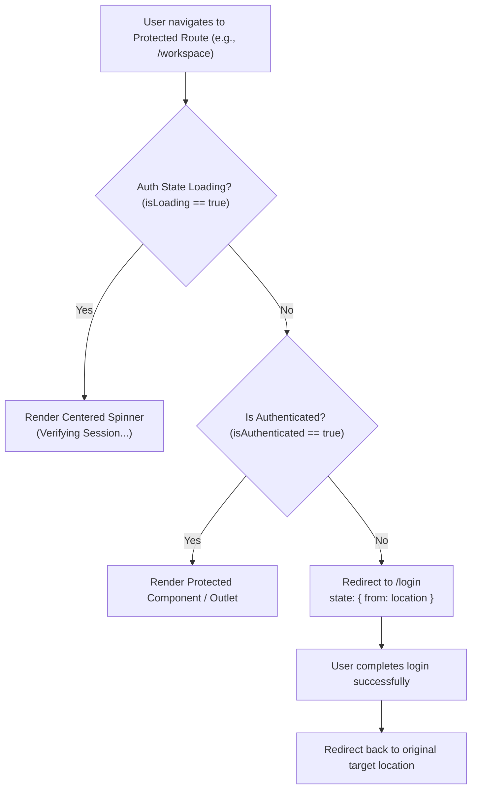

# Frontend Routing Architecture

## 1. Route Hierarchy

Bloop uses **React Router 7** to establish a clear route structure divided into public and protected segments.

```text
/                              → Redirects to /workspace
/app                           → Redirects to /workspace

Public Routes:
├── /login                     → User Login
└── /register                  → User Registration

Protected Routes (Requires Valid JWT Session):
├── /workspace                 → Primary Text-to-Speech Studio
├── /history                   → Speech Generation History (Search, Filter, Date Range)
├── /history/:id               → Detailed Generation Metadata View
├── /favorites                 → Saved Speech Generations & Bookmarks
├── /dashboard                 → Analytics, Generation Counters, Quick Launch
├── /profile                   → User Account & Profile Settings
├── /preferences               → Audio Playback & Theme Preferences
│
└── /quantum                   → Quantum Intelligence Overview
    ├── /quantum/text          → Quantum Text Style Classification
    ├── /quantum/emotion       → Quantum Hybrid QNN Emotion Analysis
    ├── /quantum/semantic      → Quantum Kernel Semantic Similarity
    ├── /quantum/circuits      → Interactive Quantum Circuit Lab
    └── /quantum/benchmark     → Classical vs. Quantum Performance Benchmark

Catch-All Fallback:
└── *                          → Accessible 404 NotFoundPage
```

---

## 2. Route Guard Architecture (`ProtectedRoute`)

The `ProtectedRoute` component intercepts navigation attempts to protected URLs:



### Key Guard Features:
- **Zero Premature Redirects**: Evaluates `isLoading` from `useAuthStore` prior to redirection, avoiding screen flicker or accidental logouts during app bootstrap.
- **Return Path Preservation**: Passes the target `location` in the router state so `LoginPage` can redirect users back to where they originally intended to go.
- **Client-Side UX Only**: Serves solely as a navigation facilitator; authoritative authorization remains strictly enforced on the FastAPI backend.

---

## 3. 404 Not-Found Handling

Any unmatched path renders `<NotFoundPage />`. This view:
- Informs the user that the requested URL does not exist or has relocated.
- Avoids exposing technical routing traces, server paths, or internals.
- Provides prominent call-to-action buttons ("Go to Workspace", "Dashboard").

---

## 4. Vercel SPA Routing Configuration

To ensure deep links (such as directly refreshing `https://bloop.ai/history?page=2`) do not trigger an HTTP 404 from static host servers, `frontend/vercel.json` provides canonical single-page application URL rewriting:

```json
{
  "rewrites": [
    {
      "source": "/(.*)",
      "destination": "/index.html"
    }
  ]
}
```
This guarantees that all route paths resolve to `index.html` where React Router hydrates and renders the matching route.
