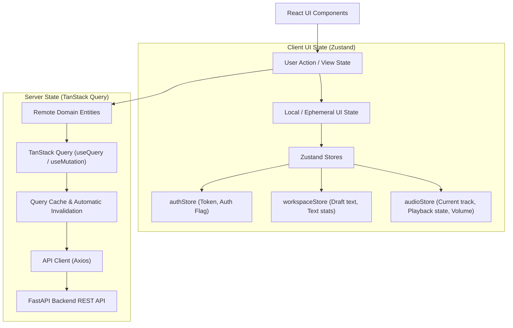
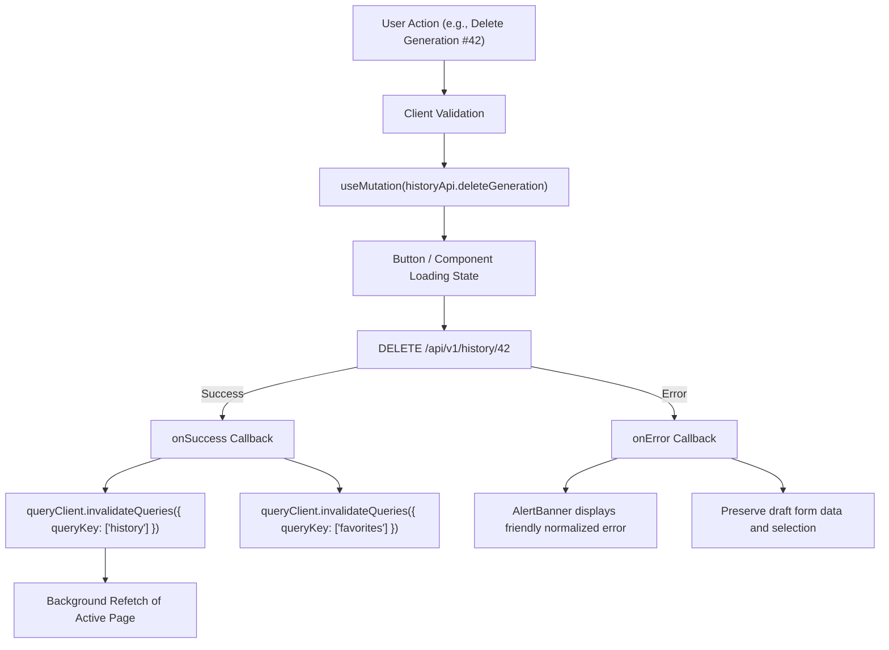

# Frontend State Management Architecture

## 1. State Architecture Overview

Bloop enforces a strict architectural boundary between **Server State** and **Client UI State**.



---

## 2. Server State vs. Client State Delineation

### TanStack Query (Server State)
Used for all asynchronous remote data fetched from the backend:
- **User Profile & Account Data** (`/api/v1/users/me`)
- **User Preferences** (`/api/v1/users/me/preferences`)
- **Languages Catalog** (`/api/v1/languages`)
- **Dynamic Voices Catalog** (`/api/v1/voices`)
- **Speech Generation History** (`/api/v1/history`)
- **Favorites & Bookmarks** (`/api/v1/favorites`)
- **Quantum Experiment History & Results** (`/api/v1/quantum/*`)

### Zustand (Client UI State Only)
Used strictly for local or cross-component ephemeral UI interaction state:
- **`authStore`**: Stores JWT token in `localStorage`, tracks `isAuthenticated` and `isLoading` for UI route guards.
- **`workspaceStore`**: Tracks active textarea draft text, word count, character count, and draft text resets.
- **`audioStore`**: Tracks current playback URL, play/pause status, seek position, audio playback rate, and volume.

---

## 3. Why Server State is Not Duplicated in Zustand

Duplicating server entities into Zustand stores is an anti-pattern that leads to severe application bugs:
1. **Cache Desynchronization**: If generation records exist in both TanStack Query and Zustand, mutations (such as deleting or favoriting a generation) require manual synchronization in multiple places.
2. **Race Conditions**: Parallel network responses can overwrite local store data with stale snapshots.
3. **Loss of Built-in Query Primitives**: TanStack Query provides battle-tested refetching, background revalidation (`staleTime`), garbage collection (`gcTime`), request deduplication, and window focus handling out of the box.

---

## 4. Query Key Architecture

To prevent arbitrary string keys and cache collisions, query keys follow a structured hierarchy:

```typescript
export const queryKeys = {
  profile: ['profile'] as const,
  preferences: ['preferences'] as const,
  languages: ['languages'] as const,
  voices: (filters?: Record<string, any>) => ['voices', filters] as const,
  history: (params?: Record<string, any>) => ['history', params] as const,
  generationDetail: (id: number) => ['history', id] as const,
  favorites: (params?: Record<string, any>) => ['favorites', params] as const,
  quantumHistory: ['quantum', 'history'] as const,
};
```

---

## 5. Mutation & Cache Invalidation Lifecycle


