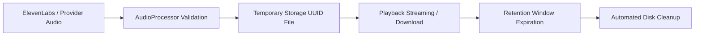
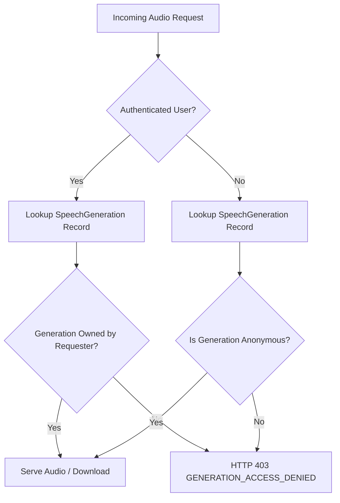

# Audio Processing, Delivery & Lifecycle Architecture

This document describes the audio processing, RFC 7233 partial content range streaming, temporary disk storage, and ownership authorization layer of the **Bloop** speech platform.

---

## 1. Storage Architecture

Bloop enforces a strict separation between metadata persistence and audio payload delivery:

- **PostgreSQL Database**: Persists lightweight domain metadata (`SpeechGeneration`), including timestamps, user ownership, duration, character metrics, voice IDs, and audio filenames. Large binary audio objects are **never stored directly inside PostgreSQL**.
- **Temporary Server Storage**: Binary audio files are buffered in `backend/app/storage/audio/` using random UUID filenames (`{uuid4}.mp3`).
- **Render Ephemeral Disk Friendliness**: Storage paths are treated as temporary buffers. The system does not assume permanent local disk persistence and includes automated pruning of stale assets.



---

## 2. Audio Processing & Raw Validation

Before an audio stream is persisted or served, `AudioProcessor` validates:

1. **Payload Length**: Checks minimum length (16 bytes) and maximum memory threshold (25 MB).
2. **Textual Document Rejection**: Detects whether an external provider erroneously returned an HTML error page or JSON message with binary content-type.
3. **Magic Byte Signature Inspection**:
   - **MP3**: Detects `ID3v2` container tags (`b"ID3"`) or MPEG audio frame sync (`0xFF` followed by 3 high bits set `0xE0`).
   - **WAV**: Verifies RIFF container header (`b"RIFF....WAVE"`).
   - **OGG**: Verifies Ogg container sync (`b"OggS"`).
4. **MIME & Extension Normalization**: Resolves canonical MIME types (`audio/mpeg`, `audio/wav`, `audio/ogg`).

If validation fails, the system raises `AudioGenerationInvalidException` (`AUDIO_GENERATION_INVALID`, HTTP 422) and prevents corrupted files from ever reaching client browsers.

---

## 3. RFC 7233 Range Streaming (Seeking & Scrubbing)

The streaming endpoint supports standard HTTP Range requests (RFC 7233), enabling browser audio players to seek, scrub, pause, and resume audio playback without downloading the entire file upfront.

### Supported Routes:
- `GET /api/v1/tts/{generation_id}/audio`
- `GET /api/v1/tts/audio/{identifier}`

### Streaming Behavior:
- **Full Stream (HTTP 200 OK)**:
  ```http
  HTTP/1.1 200 OK
  Content-Type: audio/mpeg
  Accept-Ranges: bytes
  Content-Length: 524288
  ```
- **Partial Content Stream (HTTP 206 Partial Content)**:
  When client browser sends:
  ```http
  Range: bytes=0-1023
  ```
  Backend responds with:
  ```http
  HTTP/1.1 206 Partial Content
  Content-Type: audio/mpeg
  Content-Range: bytes 0-1023/524288
  Accept-Ranges: bytes
  Content-Length: 1024
  ```

---

## 4. User Ownership Access Control

Every speech generation record maintains an explicit `user_id` foreign key.



- **Legitimate Owner Access**: Authenticated users can stream and download their own generations freely.
- **Cross-User Protection**: If User B requests audio generated by User A, the server returns `HTTP 403 Forbidden` (`GENERATION_ACCESS_DENIED`). Knowing the integer ID or filename does **not** grant access.
- **Path Traversal Protection**: Identifiers and filenames are sanitized through `os.path.basename` and confined to `settings.AUDIO_STORAGE_PATH`, preventing `../` directory traversal attacks.

---

## 5. Temporary Asset Lifecycle & Cleanup

To prevent storage exhaustion in containerized environments (such as Render):
- `AudioDeliveryService.cleanup_expired_audio(max_age_hours=24)` prunes files older than 24 hours.
- Orphaned files from failed database transactions are pruned immediately via `delete_audio_file`.
