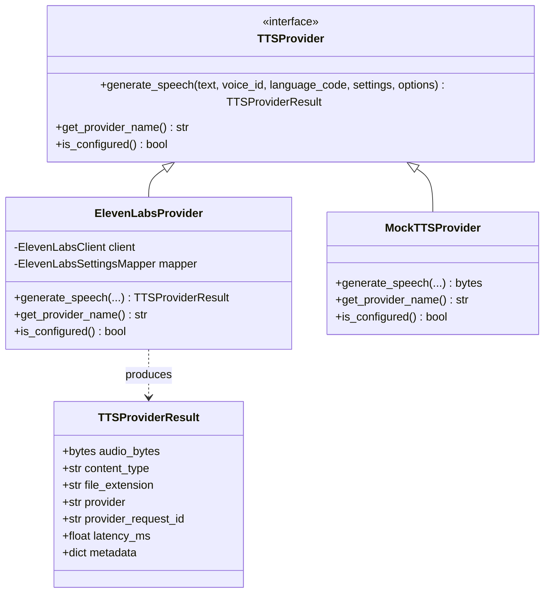

# TTS Provider Architecture

## 1. Abstraction Design Principles

Bloop's TTS provider layer prevents vendor lock-in and isolates external SDKs through two core abstractions:
1. `TTSProvider` (Abstract Base Class)
2. `TTSProviderResult` (Normalized Value Object)

---

## 2. Decoupled Voice & Provider Resolution

Application endpoints and services communicate using Bloop's dynamic voice identifier (e.g. `voice_id="normal-female"`).
- `Voice.provider`: identifies the backing synthesis adapter (`"elevenlabs"`, `"simulation"`).
- `Voice.provider_voice_id`: stores the vendor-specific identifier (e.g. raw ElevenLabs voice ID) privately in the database, isolated from public frontend exposure.
- `SpeechService` checks provider availability dynamically without requiring application restarts or voice catalog hardcoding.

---

## 3. Extensibility for Future Providers

To introduce a new provider (e.g. Google Cloud TTS or Amazon Polly):
1. Subclass `TTSProvider`.
2. Implement `generate_speech()` returning `TTSProviderResult`.
3. Register the provider in `SpeechService`.
No changes are required in API routers, database schemas, Pydantic contracts, frontend components, or quantum modulation pipelines.
