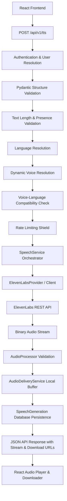

# Speech Generation API & Orchestration Architecture

This document describes the design, execution lifecycle, validation layers, provider integration, and metadata persistence of the **Bloop Text-to-Speech (TTS)** engine.

---

## 1. System Overview

Bloop provides a centralized, modular speech-generation pipeline designed to ingest text, resolve dynamic voices and locale compatibilities, dispatch requests to modern speech providers (primarily **ElevenLabs** or offline simulations), sanitize and validate raw audio streams, buffer assets safely in temporary storage, and record generation metadata in PostgreSQL.



---

## 2. API Endpoint Specification

### `POST /api/v1/tts`

Primary speech-synthesis endpoint. Delegates orchestration to `SpeechService` without exposing provider credentials, internal filesystem paths, or proprietary SDK objects.

#### Request Contract
```json
{
  "text": "The quantum statevector has collapsed into acoustic resonance.",
  "language": "en-US",
  "voice_id": "dynamic-voice-id",
  "speed": 1.0,
  "pitch": 1.0,
  "emotion": "Neutral",
  "settings": {
    "stability": 0.5,
    "similarity_boost": 0.75,
    "use_speaker_boost": true
  }
}
```

#### Response Contract
```json
{
  "success": true,
  "data": {
    "generation_id": 42,
    "audio_url": "/api/v1/tts/audio/33be2f3fb7714cef9bf92d4fd4f2cbfd.mp3",
    "download_url": "/api/v1/tts/download/33be2f3fb7714cef9bf92d4fd4f2cbfd.mp3",
    "text": "The quantum statevector has collapsed into acoustic resonance.",
    "char_count": 63,
    "word_count": 8,
    "language": "en-US",
    "voice_id": "dynamic-voice-id",
    "voice_name": "Studio Master Voice",
    "duration_seconds": 4.1,
    "provider": "elevenlabs",
    "is_simulation": false,
    "emotion": "Neutral",
    "content_type": "audio/mpeg",
    "audio_format": "mp3",
    "quantum_metrics": null
  },
  "message": "Audio generated successfully."
}
```

---

## 3. Authoritative Request Processing Pipeline

Requests pass through strict sequential stages before synthesis:

1. **HTTP Ingestion**: Receives incoming JSON payload over HTTPS.
2. **Authentication**: Extracts and verifies JWT bearer token via `get_optional_current_user`. If present, links ownership to `user.id`.
3. **Pydantic Validation**: Ensures types, ranges (`speed` in `[0.5, 2.0]`, `pitch` in `[0.5, 1.5]`), and required fields.
4. **Text Presence Validation**: Rejects empty strings or whitespace-only inputs with `TEXT_EMPTY` (HTTP 422).
5. **Text Normalization**: Strips dangerous control characters while preserving multilingual Unicode integrity.
6. **Boundary Enforcement**: Authoritatively checks bounds against `MIN_TEXT_CHARACTERS` (1) and `MAX_TEXT_CHARACTERS` (2500). Rejects oversized payloads with `TEXT_TOO_LONG` (HTTP 422).
7. **Language Resolution**: Verifies requested language against enabled ISO catalog (`LanguageRepository`). Rejects unsupported locales with `INVALID_LANGUAGE` (HTTP 422).
8. **Voice Resolution**: Queries dynamic `VoiceRepository`. Rejects non-existent or inactive voices with `INVALID_VOICE` (HTTP 422).
9. **Voice-Language Compatibility**: Queries `CapabilityService` to ensure voice supports the requested locale. Rejects mismatches with `VOICE_LANGUAGE_MISMATCH` (HTTP 422).
10. **Rate Limiting**: Sliding-window rate limiter ensures clients do not exceed allocated requests per minute (HTTP 429).
11. **Provider Resolution & Invocation**:
    - If `voice.provider == "elevenlabs"` and API key is present, calls `ElevenLabsProvider`.
    - If offline/dev mode, gracefully falls back to deterministic neural simulation provider.
12. **Audio Processing**: `AudioProcessor` validates binary stream, detects magic bytes, checks for HTML/JSON error documents, and calculates metadata.
13. **Audio Delivery Storage**: `AudioDeliveryService` safely writes bytes to temporary disk storage using cryptographically secure UUID filenames.
14. **Metadata Persistence**: Records generation row in `SpeechGeneration` with `status="completed"`. If provider or audio fails, logs and records `status="failed"`.

---

## 4. Failure Consistency Strategy

| Failure Scenario | Processing State | Persistence Action | Client Status | Disk Cleanliness |
| :--- | :--- | :--- | :--- | :--- |
| **Request validation fails** (empty text, invalid voice) | Pre-execution | No database record created | 422 Unprocessable Entity | No files created |
| **Provider failure** (timeout, 5xx, rate limit) | Execution | Records `SpeechGeneration` with `status="failed"`, `error_code`, `error_message` | 502 Bad Gateway / 500 | No audio file created |
| **Corrupt / Invalid audio bytes** | Validation | Records `SpeechGeneration` with `status="failed"`, `error_code="AUDIO_GENERATION_INVALID"` | 422 Unprocessable Entity | No audio file buffered |
| **Database failure after audio write** | Persistence | Transaction rolled back, temporary audio file immediately unlinked from disk | 500 Internal Server Error | Zero orphaned disk files |

---

## 5. Dynamic Voice Rule Invariant

In strict adherence to Bloop architectural standards:
- **No hardcoded real production voice IDs** exist in backend application code, schemas, or migrations.
- Voices are registered and managed dynamically via `/api/v1/voices` or `voices_config.json`.
- Automated test suites use synthetic test strings (`normal-female`, `test-voice-id`).
